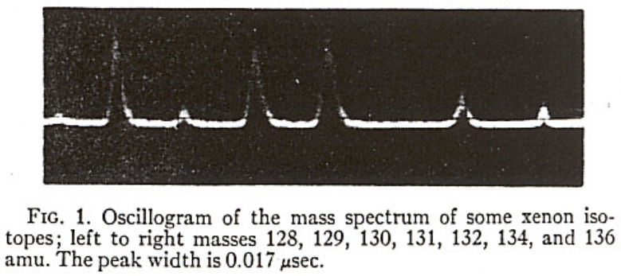

# Time of Flight Mass Spectrometer with Improved Resolution
`W. C. Wiley and I. H. Mclaren`
- Bendix Aviation Corporation Research Laboratories, Detroit, Michigan 1955

## Introduction
Paper describes improved mass resolution achieved by a new ion gun in a nonmagnetic TOF mass spectrometer.

## General Description
- Most straightforward TOF spectrometer (ion souce and collector situated at opposite ends of an evacuated tube).
- Ions are formed in the ionization region of the source, usually by electron bombardment.
- They are then accelerated out of the source towards the collector either by one or by a series of constant electric fields.
- Fields are applied 
    - continuously
    - pulshed on at the end of ion formation
        - If the accelerating pulse lasts until all ions have left the source - all ions receive the same `energy`.
        - If, with a single constant accelerating field, the pulse cuts of before any of the ions leave the source, all ions essentially receive the same `momentum`.
    - In either case the velocity of the ions in the free flight path is a function of $\frac{q}{m}$.
    - So when ions reach the collector they are separated into bunches corresponding to $\frac{q}{m}$.
    - If charge is same 
        -  Lightest group reaches the detector first and is followed by group of successively heavier mass.
    - Thus each source pulse results in a mass spectrum which can easily be displayed by connecting the **ion collector** to the **vertical plate of an oscilloscope**. 
    - An expanded portion of such a spectrum is shown in Fig 1.
    - 

    `My Plot`
    - This is also an interesting finding
    - Using the following parameters 
        - Number of particles - 50,000
        - charge (-1)
        - mass - arithmatic sequence - 1 to 5 with step size 1
        - source position - sphere distribution (23,80,80) radius (1) filled
        - Azimuth (0) , Elevation (0)
        - KE (3)
        - Lens 1,2,3,4 and flight tube voltage (300 V) 
        - Pusher Voltage -50 V
    - I got the following plot of the `Counts` vs `Time-of-Flight`
    - 

## Advantages and Disadvantages

### Advantages
- **Speed** 
    - With practical parameter values a complete spectrum can be obtained every few `microseconds`
    - So one can study how the relative intensities of different ions vary when source condition changes rapidly.
    - **Example** 
        - One could find appearance potentials and identify radicals quickly by measuring the spectrum as a function of the easily controllable energy of the ion-producing electron beam. (For this application not only the speed of response but also the existence of a field free source region during ionization is required.)

- **Recording** 
    - Entire mass spectrum can be recorded for each accelerating pulse.
    - Thus possible to measure relative intensities accurately even though source conditions might vary unpredictably (provided that the variation affects each mass in the same way).
    - `For other mass spectrometers` elaborate  controlls are required to prevent source changes.

- **Accuracy**
    - Its accuracy depends on electronics circuits rather than on extremely accurate mechanical allignment and on the production of highly uniform, stable magnetic fields.
    - This freedom simplifies construction.
    - And getting rid of the need for a **critical magnetic field** removes the size and shape restriction that might have caused the evacuated chamber to be so small that it would be affected by stray elecric fields produced by dirt of corroded inner surface.

- **Information**
    - As the ion formation process itself has a rather low duty cycle `(0.1 to 10%)` it would seem that the ion currents should have low intensity compared to the conventional `deflection type mass spectrometer`. However there are two factors that increase the magnitude of the ion signals to preserve the amount of information about the **mass spectrum** which can be obtained per unit time 
        - **First**
            - A conventional instrument whether operated in the normal manner "with a recorder" or "fast scanning system and an oscilloscope display", ordinarily detects one mass peak at a time. The ion beams of other masses are lost.
            - In contrast, the `Time-of-Flight` spectrometer with a oscilloscope display records all the mass peaks which are formed by the source and loses only those stray ions which emerge from the source at an angle which causes them to miss the ion detector.
            - A conventional mass spectrometer, scanning from mass 1 to mass 100 in 10μs can display mass peaks which contains ions formed only during an average time of **0.1μs** for each peak.
            - A Time-of-Flight mass spectrometer, displaying a complete spectrum within 10μs can produce peaks each of which contains ions formed over a period of **1μs**, since few of the ions will be lost from the ionization region in that time.
            - But if only one mass peak is of interest or if a detection instrument is fitted with photographic plates or multiple ion detectors then these statements don't apply.
        - **Second**
            - The absence of narrow slits in the ion source and ion detector of a time-of-flight mass spectrometer.
            - This allows one dimension of the ion beam to be much larger than is possible in a conventional instrument, which, in turn, allows a more effective utilization of any given electron beam in producing useful ions.

### Disadvantages
- **Resolution**
    - Main disadvantange of nonmagnetic TOF spectrometers has been their limited resolution.
    - Although the instument is not designed for high resolution, but they should atleast searate adjacent mass units sufficiently well to permit accurate relative intensity measurements. 
    - Using a single field source `Wolff and Stephens`, according to their preliminary report, had completely separated adjacent masses only up to about **20 amu**. 
    - `Katzenstein and Friedland`, using a multiple field source, obtained satisfactory resolution to approximately **75 amu**, although adjacent masses appear to  overlap at this value.
    - With the new ion source, adjacent mass units well beyond **100 amu** are completely separated and useful resolution can be obtained to atleast **300 amu**.

## Resolution of the TOF Spectrometer
- If all ions were formed in a plane parallel to the source electrodes and with zero initial velocity the flight time would be the same for all ions which had the same $\frac{q}{m}$, and the resolution would be limited only by the detecing equipment.
- In practice, the resolving power of a TOF spectrometer depends on its **ability to reduce the time spread caused by the ever-present initial space and initial kinetic energy distribution.**

- A convineant measure of the resolution is the largest mass **M**, for which adjacent masses are completely separated.
    - The mass for which the time spread for ions of the same mass just equals the time between adjacent masses. (Such a criterion is desired when abundance measurements are considered proportional to the area of the mass peaks)
    - The mass for which there is no interference between adjacent mass peaks. This is approximately twice that giving no inteference between adjacent peak areas. (Such criterion is used if peak heights are used instead)

- The ability of the spectrometer to resolve masses despite the initial space distribution is called `space resolution`.
- It's reduction of the time spread introduced by the initial kinetic energy distribution is called `energy resolution`.

### Space Resolution
- The initial space distribution can be considered a deviation from the initial position (measured from the exit of the ionization region) about its average, `s₀`, so that $s_{max}=s_0 + \frac{1}{2}Δs$ and $s_{min}=s_0 + \frac{1}{2}Δs$.
- The space resolution problem is to reduce the time spread , $ΔT_{Δs}$.
- This can be done by
    - making $Δs$ small compared with $s₀$ 
    - space focusing, gives each ion a velocity dependent on $s$ (as well as on $\frac{q}{m}$) in such a way to minimize $ΔT_{Δs}$

### Energy Resolution
- The maximum time spread introduced by initial velocities, $ΔT_{θ}$, is the difference in flight times between a pair of identical ions formed at the same $s$ position with the same maximum initial speed, but with oppositely directed velocities.

- The value of $ΔT_{θ}$ can be reduced by
    - increasing the ratio of the ion's total energy to it's initial energy
    - employing two types of energy focusing
        - (i) involves adjusting the parameters available in the new type of electron gun.
        - (ii) introduces a time lag between the creation of the ions and their acceleration. During this time lag, some of the ions move to new source positions which have the proper fight times to correct for the initial velocity.

- Space resolution and energy resolution place opposite requirements on several system parameters. Therefore the best over-all resolution is a compromise between space and energy resolution.

## Improved Ion Source

### Description and Comparison with Single Field Source
- The new ion source contains two accelerating regions.
- At all times the second accelerating region $d$, has an electric field, $E_d$.
- The region D is field free.
- While the ions are being formed the source backing plate is at the same voltage as that of the first grid (No $E$ field).
- Ions are accelerated out of the source towards the collector when a positive pulse is applied to the source backing plate to produce the electric field $E_s$. (This pulse lasts until all ions have left the first grid region.)

- The double-field source introduces two new parameters, $d$, and $\frac{E_d}{E_s}$. (Not available in single-field source)
    - This makes the double-field source easier to adjust
    - gives it higher resolution
    - makes it much easier to operate because only a fraction of the total voltage is pulsed.

### Flight Time
- While moving through the source the energy of any ion will increase.
- If the initially a ny ion have energy $U_0$ then the final energy of the ion is 
$$U = U_0 + qsE_s +qdE_d \quad (1)$$

- Under this condition the time of flight is
$$T(U_0,s) = T_s + T_d + T_D \quad (2)$$

where 
$$
\begin{align*}
T_s &= 1.02 \frac{(2m)^{\frac{1}{2}}}{qE_s}[(U_0 +qsE_s)^{\frac{1}{2}}±(U_0)^{\frac{1}{2}}] \quad &(2a) \\
T_d &= 1.02 \frac{(2m)^{\frac{1}{2}}}{qE_d}[U^{\frac{1}{2}} - (U_0 + qsE_s)^{\frac{1}{2}} ] \quad &(2b) \\
T_D &= 1.02 \frac{(2m)^{\frac{1}{2}}D}{2U^{\frac{1}{2}}} \quad &(2c) 
\end{align*}
$$
- The +(-) sign in $T_s$ corresponds to initial velocities directed respectively away from (towards) the collector

- **Table I** Units and typical parameter values for new TOF spectrometer. 

    | Distance (cm)          | Electric-field (volts/cm) | $ \textbf{q} $ Energies (eV)                    | Mass (amu) time (µsec)                |
    |------------------------|----------------------------|-------------------------------------------|---------------------------------------|
    | $$ D = 40 $$           |                            | $$ U_t = 1600 $$                          | $$ T(0, s_0) = 0.76 \, m^{1/2} $$     |
    | $$ d = 1.2 $$          | $$ E_z = 320 $$            | $$ q s_0 E_z = 64 $$                      | $$ T_z = 0.035 \, m^{1/2} $$          |
    | $$ s_0 = 0.2 $$        | $$ E_d = 1280 $$           | $$ q d E_d = 1536 $$                      | $$ T_d = 0.035 \, m^{1/2} $$          |
    | $$ \Delta s = 0.2 $$   |                            | $$ U_0 = 0.09 $$                          | $$ T_D = 0.69 \, m^{1/2} $$           |

- In the nonmagnetic TOF spectrometers previously reported, T was approximated by T_D, which is not a valid approximation as most of the time spread resulting from variation in initial energy occurs in the source.

- **Example** 
    - For the values of `Table I`, $T_s$ changes approximately $0.0026m^{\frac{1}{2}}$ μs for inital energies from 0 to 0.09 eV. For the same range $T_D$ changes only $0.00002m^{\frac{1}{2}}$ μs

- With $U_0=0$ and $s=s_0$ 
    - we define $$
    \begin{align*}
    U_t &= qs_0E_s +qdE_d \quad &(3a) \\  k_0 &= (s_0E_s +dE_d)/s_0E_s \quad &(3b)
    \end{align*}$$ 

- Then 
$$T(0,s_0) = 1.02\left(\frac{m}{2U_t}\right)^{\frac{1}{2}}\left(2k_0^{\frac{1}{2}}s_0 + \frac{2k_0^{\frac{1}{2}}}{k_0^{\frac{1}{2}}+1}d + D\right) \quad (4)$$

### Space Resolution
- An ion initially closer to the detector (and thus for smaller $s$ value) acquires less energy and is then eventually overtaken by ions which have larger initial $s$ values.
- To find the position at which ions whose initial $s$ values were $s = s_0 ± \frac{1}{2}δs$ pass each other, we set $$\left(\frac{dT}{ds}\right)_{0,s_0}=0$$.
- Using (2) for $T$ by substitution from (3) we obtain $$D = 2s_0k_0^{\frac{3}{2}}\left(1- \frac{1}{k_0 + k_0^{\frac{1}{2}}}\frac{d}{s_0}\right) \quad (5)$$
- This focus condition is same for all ions and is independent of the total energy of the system.
- If we fix $s_0,d$, and $D$, we get unique value of $\frac{E_d}{E_s}$ from (5).
- Thus for double-field system the space focus is obtained by simply adjusting $\frac{E_d}{E_s}$.
- Incontrast the focus condition for the single field  $(d=0,k_0=1)$ is the purely geometric condition, $D=2s_0$.

- But the focus condition $\left(\frac{dT}{ds}\right)_{0,s_0}=0$, indicates that $T(0,s_0)$ has either a minimum, maximum or a point of inflection at $s=s_0$.
- The point of inflection occurs when $\left(\frac{d^2T}{ds^2}\right)_{0,s_0}=0$ which in addition to the focus condition requires that $$\frac{d}{s_0} = \left(\frac{k_0-3}{k_0}\right)\frac{D}{2s_0} \quad (6)$$
    - If $\frac{d}{s_0}>\left(\frac{k_0-3}{k_0}\right)\frac{D}{2s_0}$ $\rightarrow$ $T(0,s_0)$ is a `minimum` point.
    - If $\frac{d}{s_0}<\left(\frac{k_0-3}{k_0}\right)\frac{D}{2s_0}$ $\rightarrow$ $T(0,s_0)$ is a `maximum` point.
    - If $k_0 ≤ 3$, then $T(0,s_0)$ is always a minimum point so that for the single field source $(d=0, k_0=1)$, the point $T(0,s_0)$ is a `minimum`.
    - However for the parameter values usually chosen for best resolution with double-field operation, $T(0,s_0)$ is a `maximum`.

- By using Taylor expansion of $T(0,s) $ about $s_0$, we may show that $ΔT_{Δs}$, the change in flight time corresponding to small change $Δs$ in $s$ about $s_0$, is given by 
$$ΔT_{Δs} = ∑_{n=1}^{∞}\frac{1}{n!}\left(\frac{d^nT}{ds^n}(0,s)\right)_{s_0}(Δs)^n \quad (7)$$
- The measure of **space resolution** $M_s$ is **the maximum value of** $m$ **for which** $ΔT_{Δs}≤T_{m+1}-T_m$.
- The time separation of adjacent masses is obtained from eq. (2) or (4) as $$T_{m+1}-T_m= \left[\left(1+ \frac{1}{m}\right)^{\frac{1}{2}}-1\right]T_m≈\frac{T_m}{2m} \quad (8) $$
- The first term (n=1) in eq (7) is made zero by (5), and if $T(0,s_0)$ is either a minimum or maximum point, $ΔT_{Δs}$ can be eavluated from equation (7) with $Δs → \frac{Δs}{2}$ (maximum deviation of $s$ from $s_0$). The successive terms are complicated but can be simplified by the use of approximations without introducing appreciable error. Only the first non-zero term of the series will be used.
- If $k_0 ≫ 1$ and $k_0 ≫ \frac{d}{s_0}$ equation (4), (7), and (8) give $$M_s ≈ 16k_0\left(\frac{s_0}{Δs}\right)^2 \quad (9)$$
- For the parameter values of Table I, $k_0 = 25$ and $Δs/s_0 = 1$, so that $M_s = 400 amu$.
- From (9) we can see that space resolution can be made adequate if $s_0$ is somewhat larger than $Δs$. This is dependent on $D$ being large since $\frac{D}{s_0}$ determines $k_0$ from equation (5).
- Increasing $d$, as this increases $k_0$, improves space resolution. Further as $\frac{d}{s_0}$ becomes large (→k_0) the value of M_s is considerably ;arger than that given by equation (9).

### Energy Resolution
- The double-field system brings the ions to their maximum energies in about 5% of their flight time.
- The single-field source takes about 50% of the flight time.
- Thus the disturbing effect of $U_0$ is reduced because $U_0$ is a smaller precentage, on average, of the energy which determines the velocity at each point.

- To study the effect of initial velocities, it is convenient to consider two ions formed at the same initial position s, with equal but oppositely directed speeds.
- Now the ion moving away from the collector gets decelerated due to $E_s$, stops, and then gets accelerated coming back to $s$ with the same speed. But this introduces a time lag as compared to the motion of the ion that moves towards the collector from the begining. (All other aspects of their movement is same)
- The time spread, $ΔT_θ$, introduced by the initial energies is the "turn-around" time (i.e., twice the deceleration time) of an ion having the maximum initial energy being considered,
$$ΔT_θ=1.02\frac{2v_0m}{qE_s}= 1.02\frac{2(2mU_0)^{\frac{1}{2}}}{qE_s} \quad (10)$$ 
- If we consider only the effects of initial energy, the maximum resolvable mass, $M_θ$, is that for which the energy time spread, $ΔT_θ$, equals the time between adjacent mass peaks, $\frac{T}{2m}$ (i.e., $M_θ = \frac{T}{2ΔT_θ}$)
- If we substitute the value of $\frac{D}{s_0}$ from the focus condition (eq. (5)), $M_θ$ is given by
$$M_θ=\frac{1}{4}\left(\frac{U_t}{U_0}\right)^{\frac{1}{2}}\left(\frac{k_0 + 1}{k_0^{\frac{1}{2}}}- \frac{k_0^{\frac{1}{2}}-1}{k_0+k_0^{\frac{1}{2}}}\frac{d}{s_0}\right)\quad (11)$$
- For the typical values of Table I the bracketed quantity is 4.4 and $M_θ=147$ amu. 
- In general $M_θ$ is increased by increasing $D$ and/or decreasing $s_0$ and $d$.
- In the focused single-field system ($d=0, k_0=1, D=2s_0$) the bracketed quantity is 2. In addition to the improvement factor of 2.2 the double-field system has the advantage of requiring a much smaller puled voltage.

### Overall Resolution
- The maximum resolvable mass, $M$, depends on the initial space and energy distribution functions.
- Although the exact evaluation is very difficult we can get an upper and lower bounds on the value of $M$ from the preceding discussion.
    - $M$ will be smaller that either of $M_s$ and $M_θ$
    - $M$ will be at least as large as the value, $M_{s,θ}$, obtained by assuming the total time spread to be the sum of the energy and time spread
    $$\frac{1}{M_{s,θ}}=\frac{1}{M_s}+\frac{1}{M_θ} \quad (12)$$
    - For the values of Table I $M_s=400$ and $M_θ=147$ so that $M_{s,θ}=108. Thus the maximum resolvable mass lies between 108 and 147 amu.
    - If we assume the smaller value, the mass 100 amu has a total time spread of 100/108=0.926 times the time spacing (0.038 μs) between masses 100 and 101.
    - Hence, mass 100 has a time spread of 0.036 μs of which 0.01 μs (0.038×100/400) is due to initial space distribution and 0.026 μs is due to initial energy distribution.
    - Higher masses may be resolved by using a longer free flight path and higher energy as well as by the use of time lag focusing (discussed later).

