# This is my logbook for my data recording for Resolution calculation

## Part 1
---
- For all the simulation in this part I use the structure 
    - Number of particles - 50,000
    - charge (-1)
    - mass -  single value - 10
    - source position - spherical distribution - center(23,80,80) radius(1)
    - Azimuth (0) , Elevation (0)
    - KE (3)
    - Lens 1,2,3,4 and flight tube voltage (300 V)
    - Magnetic Field - 50 G

### TOF101.txt
- pusher voltage -01V
- The histogram is given as 


- And for the Gaussian fit the fit parametes and Resolution is 
```text
Mean (μ): 3.1197, Standard Deviation (σ): 0.0544 for TOF_101
Resolution: M₀ = 28.6608 for TOF_101
```

---

### TOF102.txt
- pusher voltage -02V
- The histogram is given as 

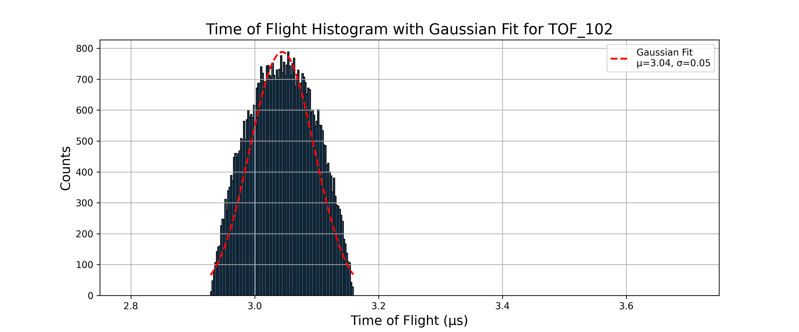

- And for the Gaussian fit the fit parametes and Resolution is 
```text
Mean (μ): 3.0443, Standard Deviation (σ): 0.0518 for TOF_102
Resolution: M₀ = 29.3761 for TOF_102
```

---

### TOF103.txt
- pusher voltage -03V
- The histogram is given as 

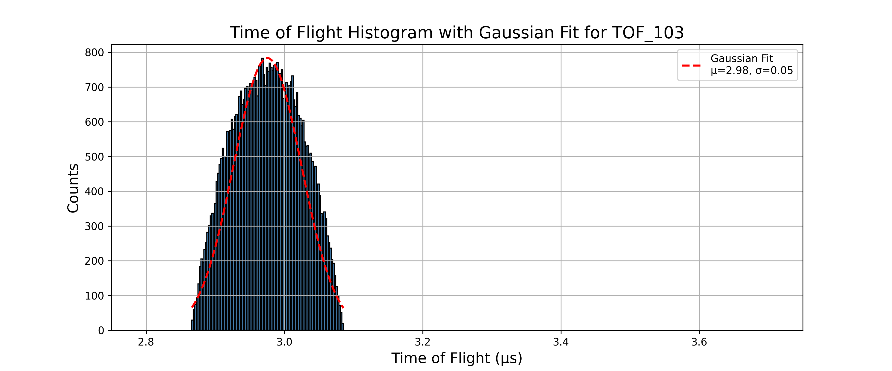

- And for the Gaussian fit the fit parametes and Resolution is 
```text
Mean (μ): 2.9756, Standard Deviation (σ): 0.0490 for TOF_103
Resolution: M₀ = 30.3371 for TOF_103
```

---

### TOF104.txt
- pusher voltage -04V
- The histogram is given as 

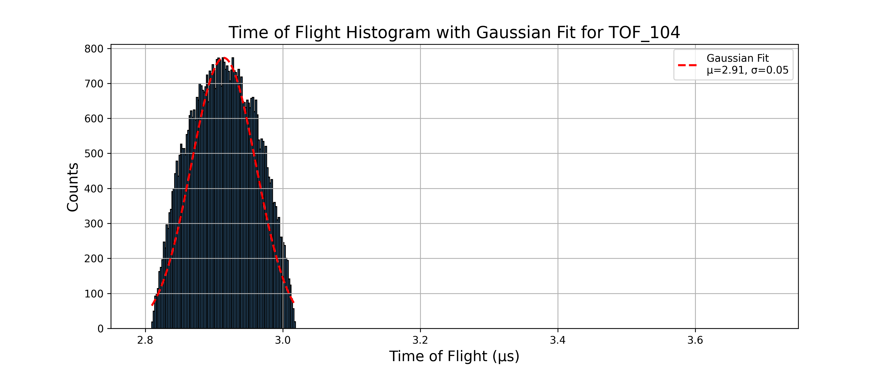

- And for the Gaussian fit the fit parametes and Resolution is 
```text
Mean (μ): 2.9140, Standard Deviation (σ): 0.0470 for TOF_104
Resolution: M₀ = 31.0245 for TOF_104
```

---

### TOF105.txt
- pusher voltage -05V
- The histogram is given as 

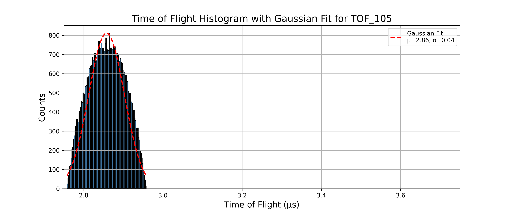

- And for the Gaussian fit the fit parametes and Resolution is 
```text
Mean (μ): 2.8578, Standard Deviation (σ): 0.0449 for TOF_105
Resolution: M₀ = 31.8180 for TOF_105
```

---

### TOF110.txt
- pusher voltage -10V
- The histogram is given as 


- And for the Gaussian fit the fit parametes and Resolution is 
```text
Mean (μ): 2.6361, Standard Deviation (σ): 0.0366 for TOF_110
Resolution: M₀ = 36.0146 for TOF_110
```

---

### TOF120.txt
- pusher voltage -20V
- The histogram is given as 


- And for the Gaussian fit the fit parametes and Resolution is 
```text
Mean (μ): 2.3611, Standard Deviation (σ): 0.0268 for TOF_120
Resolution: M₀ = 43.9865 for TOF_120
```

---

### TOF130.txt
- pusher voltage -30V
- The histogram is given as 


- And for the Gaussian fit the fit parametes and Resolution is 
```text
Mean (μ): 2.1905, Standard Deviation (σ): 0.0197 for TOF_130
Resolution: M₀ = 55.6685 for TOF_130
```

---

### TOF140.txt
- pusher voltage -40V
- The histogram is given as 


- And for the Gaussian fit the fit parametes and Resolution is 
```text
Mean (μ): 2.0766, Standard Deviation (σ): 0.0161 for TOF_140
Resolution: M₀ = 64.3914 for TOF_140
```

---

### TOF150.txt
- pusher voltage -50V
- The histogram is given as 


- And for the Gaussian fit the fit parametes and Resolution is 
```text
Mean (μ): 1.9882, Standard Deviation (σ): 0.0141 for TOF_150
Resolution: M₀ = 70.4470 for TOF_150
```

---

### TOF160.txt
- pusher voltage -60V
- The histogram is given as 


- And for the Gaussian fit the fit parametes and Resolution is 
```text
Mean (μ): 1.9161, Standard Deviation (σ): 0.0125 for TOF_160
Resolution: M₀ = 76.4432 for TOF_160
```

---

## Part 2
---
- For all the simulation in this part I use the structure 
    - Number of particles - 50,000
    - charge (-1)
    - mass -  single value - 10
    - source position - spherical distribution - center(23,80,80) radius(1)
    - Azimuth (0) , Elevation (0)
    - KE (3)
    - Lens 1,2,3,4 and flight tube voltage (100 V)
    - Magnetic Field - 50 G

### TOF201.txt
- pusher voltage -01V
- The histogram is given as 

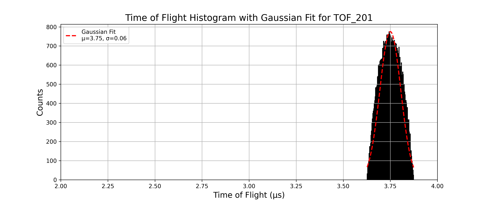

- And for the Gaussian fit the fit parametes and Resolution is 
```text
Mean (μ): 3.7501, Standard Deviation (σ): 0.0556 for TOF_201
Resolution: M₀ = 33.7364 for TOF_201
```

---

### TOF202.txt
- pusher voltage -02V
- The histogram is given as 

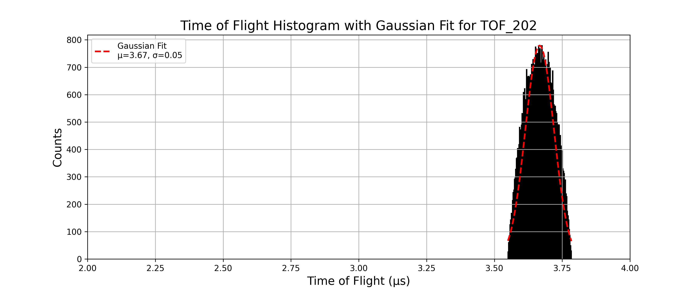

- And for the Gaussian fit the fit parametes and Resolution is 
```text
Mean (μ): 3.6668, Standard Deviation (σ): 0.0527 for TOF_202
Resolution: M₀ = 34.7915 for TOF_202
```

---

## Part 3
---
- For all the simulation in this part I use the structure 
    - Number of particles - 50,000
    - charge (-1)
    - mass -  single value - 10
    - source position - spherical distribution - center(23,80,80) radius(1)
    - Azimuth (0) , Elevation (0)
    - KE (3)
    - Lens 1,2,3,4 and flight tube voltage (00 V)
    - Magnetic Field - 50 G

### TOF301.txt
- pusher voltage -01V
- The histogram is given as 

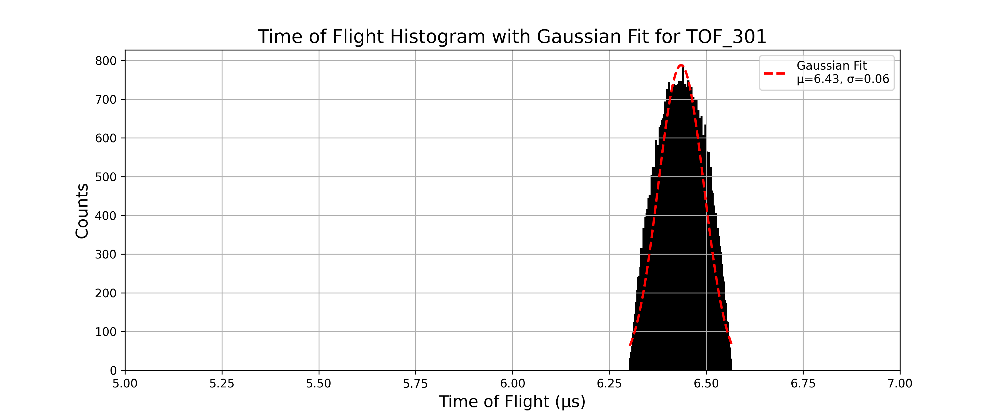

- And for the Gaussian fit the fit parametes and Resolution is 
```text
Mean (μ): 6.4350, Standard Deviation (σ): 0.0588 for TOF_301
Resolution: M₀ = 54.6770 for TOF_301
```

---

### TOF302.txt
- pusher voltage -02V
- The histogram is given as 


- And for the Gaussian fit the fit parametes and Resolution is 
```text
Mean (μ): 6.2176, Standard Deviation (σ): 0.0561 for TOF_302
Resolution: M₀ = 55.3840 for TOF_302
```

---

### TOF305.txt
- pusher voltage -05V
- The histogram is given as 

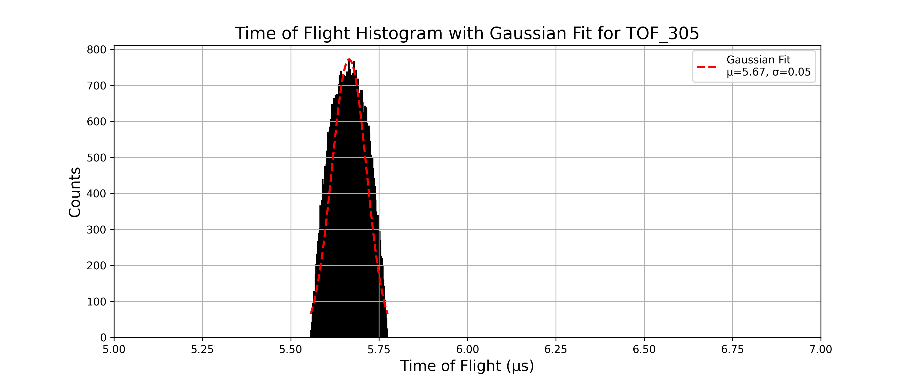

- And for the Gaussian fit the fit parametes and Resolution is 
```text
Mean (μ): 5.6653, Standard Deviation (σ): 0.0489 for TOF_305
Resolution: M₀ = 57.9298 for TOF_305
```

---

### TOF310.txt
- pusher voltage -10V
- The histogram is given as 

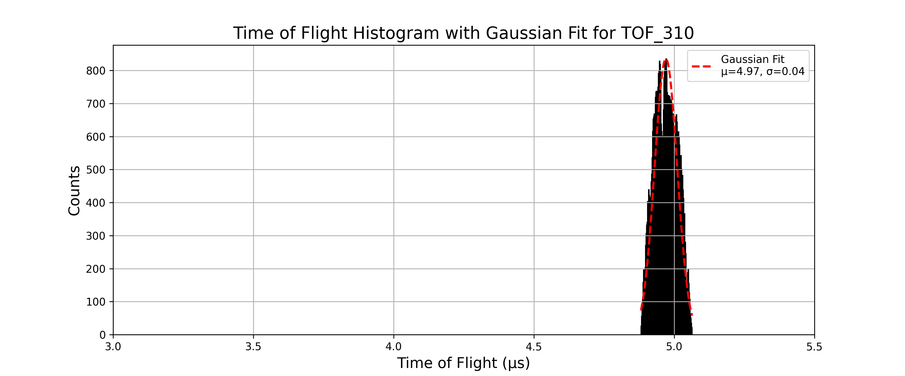

- And for the Gaussian fit the fit parametes and Resolution is 
```text
Mean (μ): 4.9703, Standard Deviation (σ): 0.0403 for TOF_310
Resolution: M₀ = 61.6311 for TOF_310
```

---

### TOF320.txt
- pusher voltage -20V
- The histogram is given as 

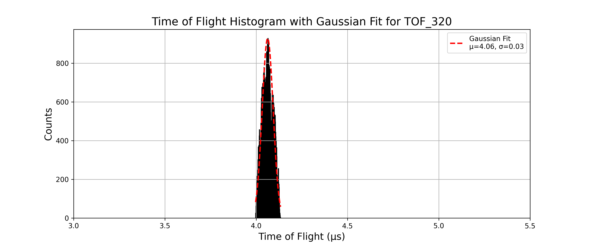

- And for the Gaussian fit the fit parametes and Resolution is 
```text
Mean (μ): 4.0627, Standard Deviation (σ): 0.0300 for TOF_320
Resolution: M₀ = 67.6792 for TOF_320
```

---

### TOF330.txt
- pusher voltage -30V
- The histogram is given as 

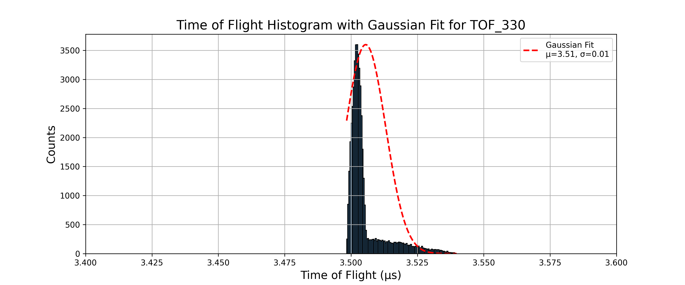

- And for the Gaussian fit the fit parametes and Resolution is 
```text
Mean (μ): 3.5055, Standard Deviation (σ): 0.0075 for TOF_330
Resolution: M₀ = 232.2784 for TOF_330
```

---

### TOF340.txt
- pusher voltage -40V
- The histogram is given as 

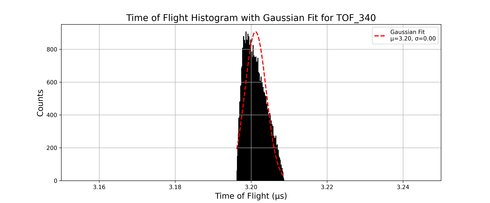

- And for the Gaussian fit the fit parametes and Resolution is 
```text
Mean (μ): 3.2012, Standard Deviation (σ): 0.0028 for TOF_340
Resolution: M₀ = 570.5683 for TOF_340
```

---

### TOF350.txt
- pusher voltage -50V
- The histogram is given as 

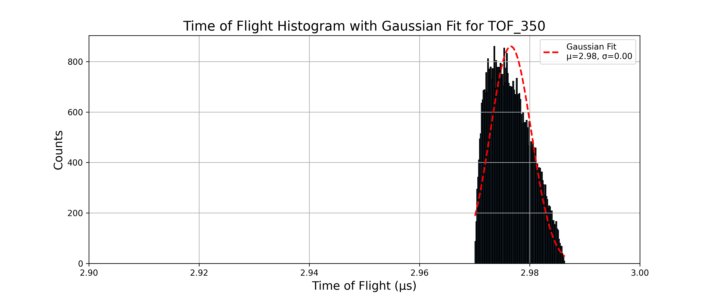

- And for the Gaussian fit the fit parametes and Resolution is 
```text
Mean (μ): 2.9766, Standard Deviation (σ): 0.0037 for TOF_350
Resolution: M₀ = 399.3458 for TOF_350
```

---

### TOF360.txt
- pusher voltage -60V
- The histogram is given as 

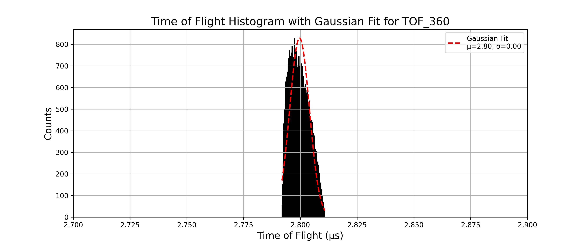

- And for the Gaussian fit the fit parametes and Resolution is 
```text
Mean (μ): 2.7997, Standard Deviation (σ): 0.0043 for TOF_360
Resolution: M₀ = 322.4526 for TOF_360
```

---

### TOF370.txt
- pusher voltage -70V
- The histogram is given as 

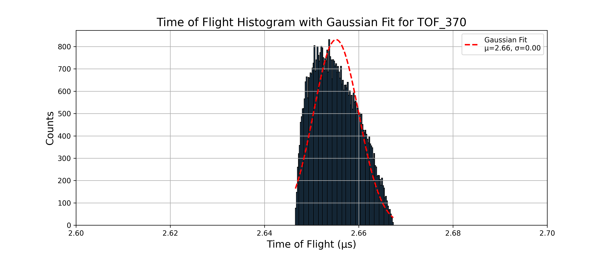

- And for the Gaussian fit the fit parametes and Resolution is 
```text
Mean (μ): 2.6552, Standard Deviation (σ): 0.0048 for TOF_370
Resolution: M₀ = 277.3566 for TOF_370
```

---

### TOF380.txt
- pusher voltage -80V
- The histogram is given as 

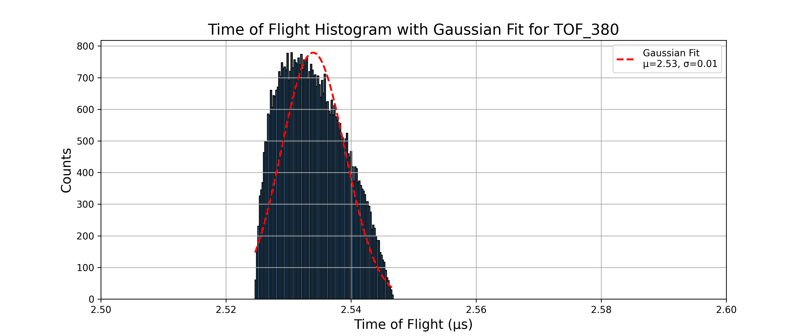

- And for the Gaussian fit the fit parametes and Resolution is 
```text
Mean (μ): 2.5339, Standard Deviation (σ): 0.0051 for TOF_380
Resolution: M₀ = 249.4695 for TOF_380
```

---

### TOF390.txt
- pusher voltage -90V
- The histogram is given as 

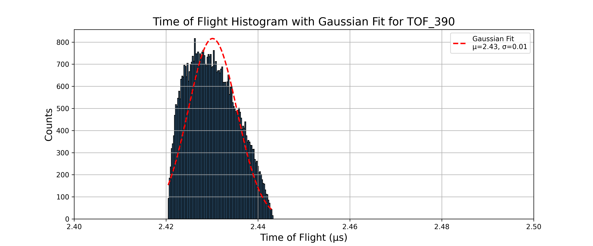

- And for the Gaussian fit the fit parametes and Resolution is 
```text
Mean (μ): 2.4301, Standard Deviation (σ): 0.0053 for TOF_390
Resolution: M₀ = 230.1245 for TOF_390
```

---