# This is my logbook for my data recording for Resolution calculation

## Part 1
---
- For all the simulation in this part I use the structure 
    - Number of particles - 50,000
    - charge (-1)
    - mass -  single value - 10
    - source position - spherical distribution - center(23,80,80) radius(1)
    - Azimuth (0) , Elevation (0)
    - KE (3)
    - Lens 1,2,3,4 and flight tube voltage (300 V)
    - Magnetic Field - 50 G

### TOF101.txt
- pusher voltage -01V
- The histogram is given as 


- And for the Gaussian fit the fit parametes and Resolution is 
```text
Mean (μ): 3.1197, Standard Deviation (σ): 0.0544 for TOF_101
Resolution: M₀ = 28.6608 for TOF_101
```

---

### TOF102.txt
- pusher voltage -02V
- The histogram is given as 


- And for the Gaussian fit the fit parametes and Resolution is 
```text
Mean (μ): 3.0443, Standard Deviation (σ): 0.0518 for TOF_102
Resolution: M₀ = 29.3761 for TOF_102
```

---

### TOF103.txt
- pusher voltage -03V
- The histogram is given as 


- And for the Gaussian fit the fit parametes and Resolution is 
```text
Mean (μ): 2.9756, Standard Deviation (σ): 0.0490 for TOF_103
Resolution: M₀ = 30.3371 for TOF_103
```

---

### TOF104.txt
- pusher voltage -04V
- The histogram is given as 


- And for the Gaussian fit the fit parametes and Resolution is 
```text
Mean (μ): 2.9140, Standard Deviation (σ): 0.0470 for TOF_104
Resolution: M₀ = 31.0245 for TOF_104
```

---

### TOF105.txt
- pusher voltage -05V
- The histogram is given as 


- And for the Gaussian fit the fit parametes and Resolution is 
```text
Mean (μ): 2.8578, Standard Deviation (σ): 0.0449 for TOF_105
Resolution: M₀ = 31.8180 for TOF_105
```

---

### TOF110.txt
- pusher voltage -10V
- The histogram is given as 


- And for the Gaussian fit the fit parametes and Resolution is 
```text
Mean (μ): 2.6361, Standard Deviation (σ): 0.0366 for TOF_110
Resolution: M₀ = 36.0146 for TOF_110
```

---

### TOF120.txt
- pusher voltage -20V
- The histogram is given as 


- And for the Gaussian fit the fit parametes and Resolution is 
```text
Mean (μ): 2.3611, Standard Deviation (σ): 0.0268 for TOF_120
Resolution: M₀ = 43.9865 for TOF_120
```

---

### TOF130.txt
- pusher voltage -30V
- The histogram is given as 


- And for the Gaussian fit the fit parametes and Resolution is 
```text
Mean (μ): 2.1905, Standard Deviation (σ): 0.0197 for TOF_130
Resolution: M₀ = 55.6685 for TOF_130
```

---

### TOF140.txt
- pusher voltage -40V
- The histogram is given as 


- And for the Gaussian fit the fit parametes and Resolution is 
```text
Mean (μ): 2.0766, Standard Deviation (σ): 0.0161 for TOF_140
Resolution: M₀ = 64.3914 for TOF_140
```

---

### TOF150.txt
- pusher voltage -50V
- The histogram is given as 


- And for the Gaussian fit the fit parametes and Resolution is 
```text
Mean (μ): 1.9882, Standard Deviation (σ): 0.0141 for TOF_150
Resolution: M₀ = 70.4470 for TOF_150
```

---

### TOF160.txt
- pusher voltage -60V
- The histogram is given as 


- And for the Gaussian fit the fit parametes and Resolution is 
```text
Mean (μ): 1.9161, Standard Deviation (σ): 0.0125 for TOF_160
Resolution: M₀ = 76.4432 for TOF_160
```

---

## Part 2
---
- For all the simulation in this part I use the structure 
    - Number of particles - 50,000
    - charge (-1)
    - mass -  single value - 10
    - source position - spherical distribution - center(23,80,80) radius(1)
    - Azimuth (0) , Elevation (0)
    - KE (3)
    - Lens 1,2,3,4 and flight tube voltage (100 V)
    - Magnetic Field - 50 G

### TOF201.txt
- pusher voltage -01V
- The histogram is given as 


- And for the Gaussian fit the fit parametes and Resolution is 
```text
Mean (μ): 3.7501, Standard Deviation (σ): 0.0556 for TOF_201
Resolution: M₀ = 33.7364 for TOF_201
```

---

### TOF202.txt
- pusher voltage -02V
- The histogram is given as 


- And for the Gaussian fit the fit parametes and Resolution is 
```text
Mean (μ): 3.6668, Standard Deviation (σ): 0.0527 for TOF_202
Resolution: M₀ = 34.7915 for TOF_202
```

---

## Part 3
---
- For all the simulation in this part I use the structure 
    - Number of particles - 50,000
    - charge (-1)
    - mass -  single value - 10
    - source position - spherical distribution - center(23,80,80) radius(1)
    - Azimuth (0) , Elevation (0)
    - KE (3)
    - Lens 1,2,3,4 and flight tube voltage (00 V)
    - Magnetic Field - 50 G

### TOF301.txt
- pusher voltage -01V
- The histogram is given as 


- And for the Gaussian fit the fit parametes and Resolution is 
```text
Mean (μ): 6.4350, Standard Deviation (σ): 0.0588 for TOF_301
Resolution: M₀ = 54.6770 for TOF_301
```

---

### TOF302.txt
- pusher voltage -02V
- The histogram is given as 


- And for the Gaussian fit the fit parametes and Resolution is 
```text
Mean (μ): 6.2176, Standard Deviation (σ): 0.0561 for TOF_302
Resolution: M₀ = 55.3840 for TOF_302
```

---

### TOF305.txt
- pusher voltage -05V
- The histogram is given as 


- And for the Gaussian fit the fit parametes and Resolution is 
```text
Mean (μ): 5.6653, Standard Deviation (σ): 0.0489 for TOF_305
Resolution: M₀ = 57.9298 for TOF_305
```

---

### TOF310.txt
- pusher voltage -10V
- The histogram is given as 


- And for the Gaussian fit the fit parametes and Resolution is 
```text
Mean (μ): 4.9703, Standard Deviation (σ): 0.0403 for TOF_310
Resolution: M₀ = 61.6311 for TOF_310
```

---

### TOF320.txt
- pusher voltage -20V
- The histogram is given as 


- And for the Gaussian fit the fit parametes and Resolution is 
```text
Mean (μ): 4.0627, Standard Deviation (σ): 0.0300 for TOF_320
Resolution: M₀ = 67.6792 for TOF_320
```

---

### TOF330.txt
- pusher voltage -30V
- The histogram is given as 


- And for the Gaussian fit the fit parametes and Resolution is 
```text
Mean (μ): 3.5055, Standard Deviation (σ): 0.0075 for TOF_330
Resolution: M₀ = 232.2784 for TOF_330
```

---

### TOF340.txt
- pusher voltage -40V
- The histogram is given as 


- And for the Gaussian fit the fit parametes and Resolution is 
```text
Mean (μ): 3.2012, Standard Deviation (σ): 0.0028 for TOF_340
Resolution: M₀ = 570.5683 for TOF_340
```

---

### TOF350.txt
- pusher voltage -50V
- The histogram is given as 


- And for the Gaussian fit the fit parametes and Resolution is 
```text
Mean (μ): 2.9766, Standard Deviation (σ): 0.0037 for TOF_350
Resolution: M₀ = 399.3458 for TOF_350
```

---

### TOF360.txt
- pusher voltage -60V
- The histogram is given as 


- And for the Gaussian fit the fit parametes and Resolution is 
```text
Mean (μ): 2.7997, Standard Deviation (σ): 0.0043 for TOF_360
Resolution: M₀ = 322.4526 for TOF_360
```

---

### TOF370.txt
- pusher voltage -70V
- The histogram is given as 


- And for the Gaussian fit the fit parametes and Resolution is 
```text
Mean (μ): 2.6552, Standard Deviation (σ): 0.0048 for TOF_370
Resolution: M₀ = 277.3566 for TOF_370
```

---

### TOF380.txt
- pusher voltage -80V
- The histogram is given as 


- And for the Gaussian fit the fit parametes and Resolution is 
```text
Mean (μ): 2.5339, Standard Deviation (σ): 0.0051 for TOF_380
Resolution: M₀ = 249.4695 for TOF_380
```

---

### TOF390.txt
- pusher voltage -90V
- The histogram is given as 


- And for the Gaussian fit the fit parametes and Resolution is 
```text
Mean (μ): 2.4301, Standard Deviation (σ): 0.0053 for TOF_390
Resolution: M₀ = 230.1245 for TOF_390
```

---

## Part 4
---
- For all the simulation in this part I use the structure 
    - Number of particles - 10,000
    - charge (-1)
    - mass -  single value - 5
    - source position - spherical distribution - center(23,80,80) radius(1)
    - Azimuth (0) , Elevation (0)
    - KE (3)
    - Lens 1,2,3,4 and flight tube voltage (00 V)
    - Magnetic Field - 50 G

### TOF410.txt
- pusher voltage -10V
- The histogram is given as 

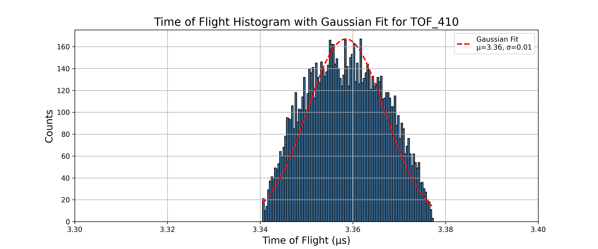

- And for the Gaussian fit the fit parametes and Resolution is 
```text
Mean (μ): 3.3585, Standard Deviation (σ): 0.0084 for TOF_410
Resolution: M₀ = 200.4527 for TOF_410
```

---

### TOF420.txt
- pusher voltage -20V
- The histogram is given as 


- And for the Gaussian fit the fit parametes and Resolution is 
```text
Mean (μ): 2.8272, Standard Deviation (σ): 0.0023 for TOF_420
Resolution: M₀ = 608.6528 for TOF_420
```

---

### TOF421.txt
- pusher voltage -21V
- The histogram is given as 


- And for the Gaussian fit the fit parametes and Resolution is 
```text
Mean (μ): 2.7894, Standard Deviation (σ): 0.0021 for TOF_421
Resolution: M₀ = 677.9655 for TOF_421
```

---

### TOF422.txt
- pusher voltage -22V
- The histogram is given as 


- And for the Gaussian fit the fit parametes and Resolution is 
```text
Mean (μ): 2.7535, Standard Deviation (σ): 0.0019 for TOF_422
Resolution: M₀ = 738.5214 for TOF_422
```

---

### TOF423.txt
- pusher voltage -23V
- The histogram is given as 


- And for the Gaussian fit the fit parametes and Resolution is 
```text
Mean (μ): 2.7191, Standard Deviation (σ): 0.0017 for TOF_423
Resolution: M₀ = 804.4702 for TOF_423
```

---

### TOF424.txt
- pusher voltage -24V
- The histogram is given as 


- And for the Gaussian fit the fit parametes and Resolution is 
```text
Mean (μ): 2.6862, Standard Deviation (σ): 0.0016 for TOF_424
Resolution: M₀ = 843.7715 for TOF_424
```

---

### TOF425.txt
- pusher voltage -25V
- The histogram is given as 


- And for the Gaussian fit the fit parametes and Resolution is 
```text
Mean (μ): 2.6549, Standard Deviation (σ): 0.0015 for TOF_425
Resolution: M₀ = 869.7935 for TOF_425
```

---

### TOF426.txt
- pusher voltage -26V
- The histogram is given as 


- And for the Gaussian fit the fit parametes and Resolution is 
```text
Mean (μ): 2.6248, Standard Deviation (σ): 0.0015 for TOF_426
Resolution: M₀ = 879.3759 for TOF_426
```

---

### TOF427.txt
- pusher voltage -27V
- The histogram is given as 


- And for the Gaussian fit the fit parametes and Resolution is 
```text
Mean (μ): 2.5960, Standard Deviation (σ): 0.0015 for TOF_427
Resolution: M₀ = 855.2658 for TOF_427
```

---

### TOF428.txt
- pusher voltage -28V
- The histogram is given as 


- And for the Gaussian fit the fit parametes and Resolution is 
```text
Mean (μ): 2.5683, Standard Deviation (σ): 0.0015 for TOF_428
Resolution: M₀ = 829.6655 for TOF_428
```

---

### TOF429.txt
- pusher voltage -29V
- The histogram is given as 


- And for the Gaussian fit the fit parametes and Resolution is 
```text
Mean (μ): 2.5416, Standard Deviation (σ): 0.0016 for TOF_429
Resolution: M₀ = 786.9454 for TOF_429
```

---

### TOF430.txt
- pusher voltage -30V
- The histogram is given as 


- And for the Gaussian fit the fit parametes and Resolution is 
```text
Mean (μ): 2.5160, Standard Deviation (σ): 0.0017 for TOF_430
Resolution: M₀ = 747.5100 for TOF_430
```

---

### TOF431.txt
- pusher voltage -31V
- The histogram is given as 


- And for the Gaussian fit the fit parametes and Resolution is 
```text
Mean (μ): 2.4912, Standard Deviation (σ): 0.0018 for TOF_431
Resolution: M₀ = 703.3694 for TOF_431
```

---

### TOF432.txt
- pusher voltage -32V
- The histogram is given as 


- And for the Gaussian fit the fit parametes and Resolution is 
```text
Mean (μ): 2.4674, Standard Deviation (σ): 0.0019 for TOF_432
Resolution: M₀ = 665.8420 for TOF_432
```

---

### TOF433.txt
- pusher voltage -33V
- The histogram is given as 


- And for the Gaussian fit the fit parametes and Resolution is 
```text
Mean (μ): 2.4443, Standard Deviation (σ): 0.0019 for TOF_433
Resolution: M₀ = 630.0221 for TOF_433
```

---

### TOF434.txt
- pusher voltage -34V
- The histogram is given as 


- And for the Gaussian fit the fit parametes and Resolution is 
```text
Mean (μ): 2.4220, Standard Deviation (σ): 0.0020 for TOF_434
Resolution: M₀ = 602.3372 for TOF_434
```

---

### TOF435.txt
- pusher voltage -35V
- The histogram is given as 


- And for the Gaussian fit the fit parametes and Resolution is 
```text
Mean (μ): 2.4004, Standard Deviation (σ): 0.0021 for TOF_435
Resolution: M₀ = 561.7344 for TOF_435
```

---

### TOF436.txt
- pusher voltage -36V
- The histogram is given as 


- And for the Gaussian fit the fit parametes and Resolution is 
```text
Mean (μ): 2.3796, Standard Deviation (σ): 0.0022 for TOF_436
Resolution: M₀ = 541.2152 for TOF_436
```

---

### TOF437.txt
- pusher voltage -37V
- The histogram is given as 


- And for the Gaussian fit the fit parametes and Resolution is 
```text
Mean (μ): 2.3594, Standard Deviation (σ): 0.0023 for TOF_437
Resolution: M₀ = 515.9305 for TOF_437
```

---

### TOF438.txt
- pusher voltage -38V
- The histogram is given as 


- And for the Gaussian fit the fit parametes and Resolution is 
```text
Mean (μ): 2.3398, Standard Deviation (σ): 0.0024 for TOF_438
Resolution: M₀ = 491.5023 for TOF_438
```

---

### TOF439.txt
- pusher voltage -39V
- The histogram is given as 


- And for the Gaussian fit the fit parametes and Resolution is 
```text
Mean (μ): 2.3207, Standard Deviation (σ): 0.0025 for TOF_439
Resolution: M₀ = 469.8987 for TOF_439
```

---

### TOF440.txt
- pusher voltage -40V
- The histogram is given as 


- And for the Gaussian fit the fit parametes and Resolution is 
```text
Mean (μ): 2.3023, Standard Deviation (σ): 0.0025 for TOF_440
Resolution: M₀ = 454.1571 for TOF_440
```

---

The resolution vs pusher voltage plot for this setup is

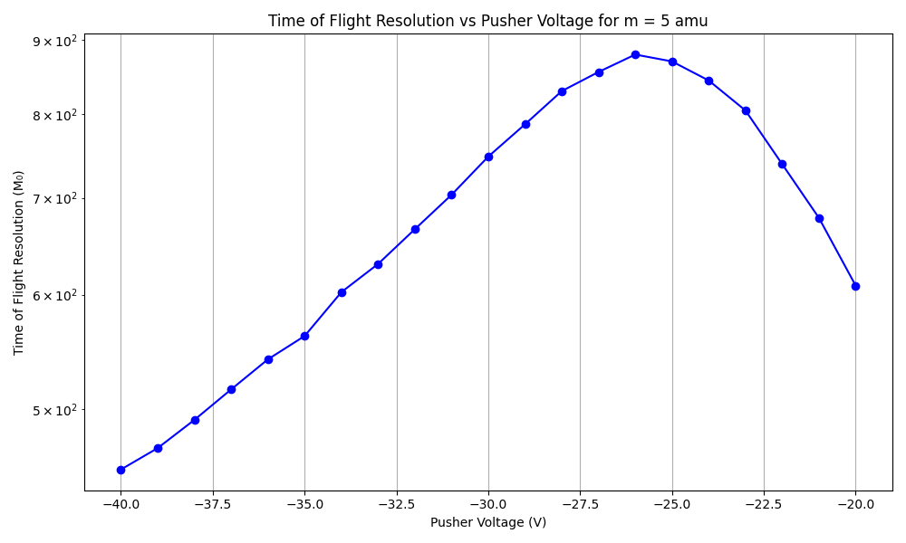


## Part 5
---
- For all the simulation in this part I use the structure 
    - Number of particles - 10,000
    - charge (-1)
    - mass -  single value - 15
    - source position - spherical distribution - center(23,80,80) radius(1)
    - Azimuth (0) , Elevation (0)
    - KE (3)
    - Lens 1,2,3,4 and flight tube voltage (00 V)
    - Magnetic Field - 50 G


### TOF_50040.txt
- pusher voltage: -40V
- The histogram is given as:

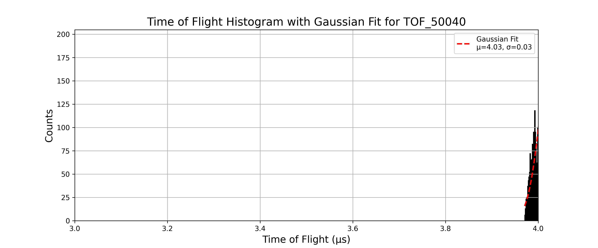

- Gaussian fit parameters and resolution:

```text
Mean (μ): 4.0324, Standard Deviation (σ): 0.0275 for TOF_50040
Resolution: M₀ = 73.3915 for TOF_50040
```
---

### TOF_50050.txt
- pusher voltage: -50V
- The histogram is given as:

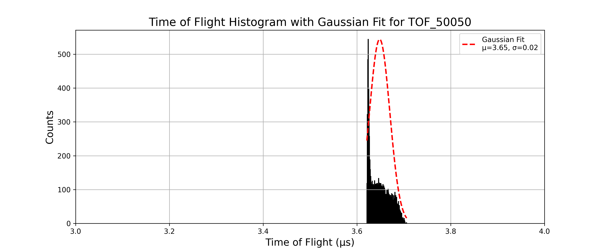

- Gaussian fit parameters and resolution:

```text
Mean (μ): 3.6484, Standard Deviation (σ): 0.0216 for TOF_50050
Resolution: M₀ = 84.3529 for TOF_50050
```
---

### TOF_50051.txt
- pusher voltage: -51V
- The histogram is given as:

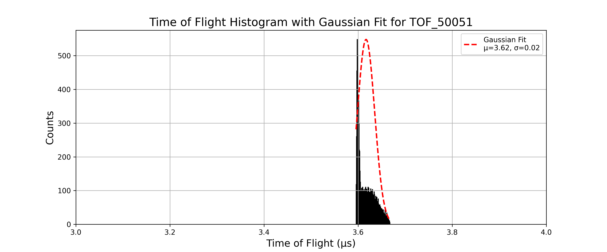

- Gaussian fit parameters and resolution:

```text
Mean (μ): 3.6168, Standard Deviation (σ): 0.0184 for TOF_50051
Resolution: M₀ = 98.3202 for TOF_50051
```
---

### TOF_50052.txt
- pusher voltage: -52V
- The histogram is given as:


- Gaussian fit parameters and resolution:

```text
Mean (μ): 3.5871, Standard Deviation (σ): 0.0157 for TOF_50052
Resolution: M₀ = 114.4004 for TOF_50052
```
---

### TOF_50053.txt
- pusher voltage: -53V
- The histogram is given as:


- Gaussian fit parameters and resolution:

```text
Mean (μ): 3.5592, Standard Deviation (σ): 0.0123 for TOF_50053
Resolution: M₀ = 144.2760 for TOF_50053
```
---

### TOF_50054.txt
- pusher voltage: -54V
- The histogram is given as:

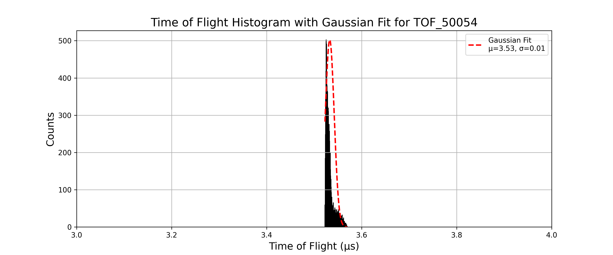

- Gaussian fit parameters and resolution:

```text
Mean (μ): 3.5328, Standard Deviation (σ): 0.0094 for TOF_50054
Resolution: M₀ = 188.7909 for TOF_50054
```
---

### TOF_50055.txt
- pusher voltage: -55V
- The histogram is given as:


- Gaussian fit parameters and resolution:

```text
Mean (μ): 3.5083, Standard Deviation (σ): 0.0070 for TOF_50055
Resolution: M₀ = 251.5495 for TOF_50055
```
---

### TOF_50056.txt
- pusher voltage: -56V
- The histogram is given as:

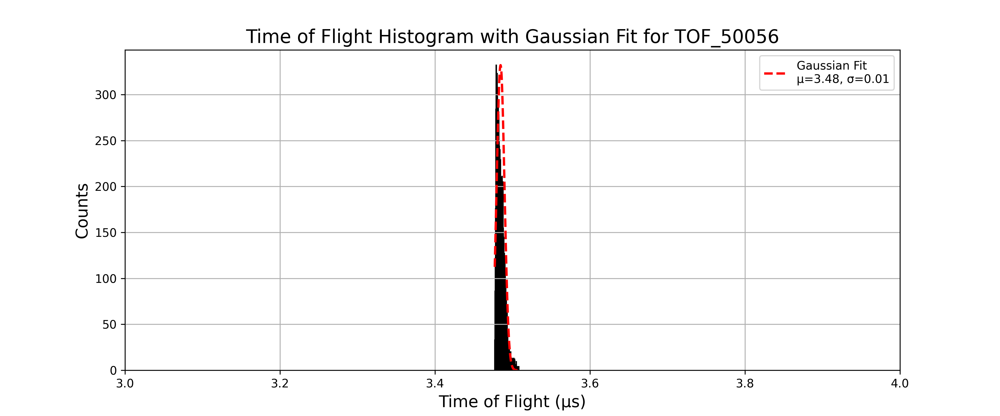

- Gaussian fit parameters and resolution:

```text
Mean (μ): 3.4846, Standard Deviation (σ): 0.0051 for TOF_50056
Resolution: M₀ = 342.8113 for TOF_50056
```
---

### TOF_50057.txt
- pusher voltage: -57V
- The histogram is given as:


- Gaussian fit parameters and resolution:

```text
Mean (μ): 3.4626, Standard Deviation (σ): 0.0045 for TOF_50057
Resolution: M₀ = 384.5350 for TOF_50057
```
---

### TOF_50058.txt
- pusher voltage: -58V
- The histogram is given as:

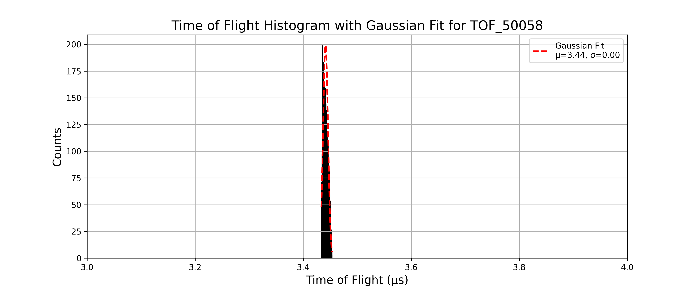

- Gaussian fit parameters and resolution:

```text
Mean (μ): 3.4414, Standard Deviation (σ): 0.0046 for TOF_50058
Resolution: M₀ = 375.5634 for TOF_50058
```
---

### TOF_50059.txt
- pusher voltage: -59V
- The histogram is given as:

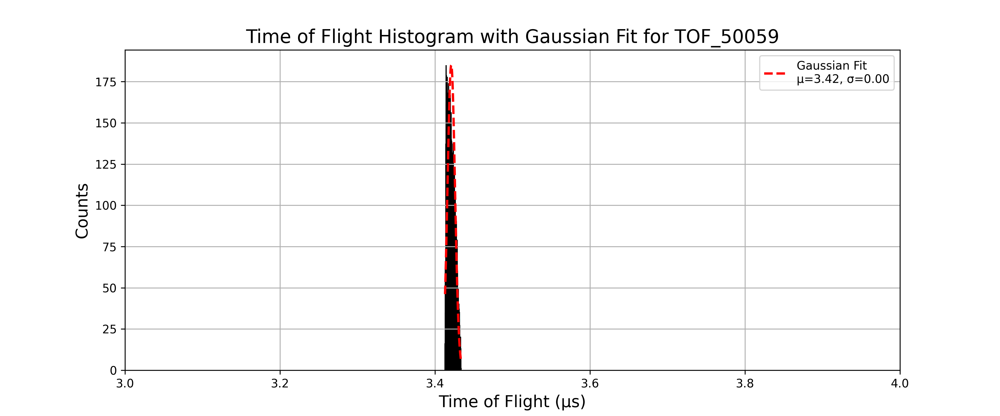

- Gaussian fit parameters and resolution:

```text
Mean (μ): 3.4210, Standard Deviation (σ): 0.0048 for TOF_50059
Resolution: M₀ = 356.6714 for TOF_50059
```
---

### TOF_50060.txt
- pusher voltage: -60V
- The histogram is given as:


- Gaussian fit parameters and resolution:

```text
Mean (μ): 3.4013, Standard Deviation (σ): 0.0049 for TOF_50060
Resolution: M₀ = 345.7805 for TOF_50060
```
---

### TOF_50061.txt
- pusher voltage: -61V
- The histogram is given as:

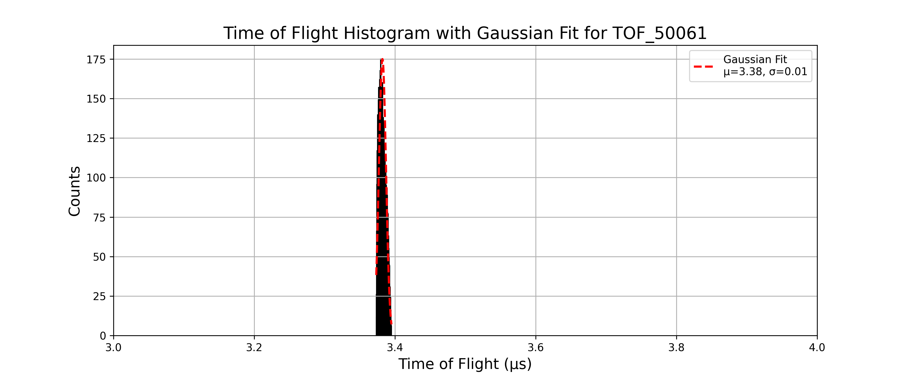

- Gaussian fit parameters and resolution:

```text
Mean (μ): 3.3822, Standard Deviation (σ): 0.0051 for TOF_50061
Resolution: M₀ = 334.5131 for TOF_50061
```
---

### TOF_50062.txt
- pusher voltage: -62V
- The histogram is given as:

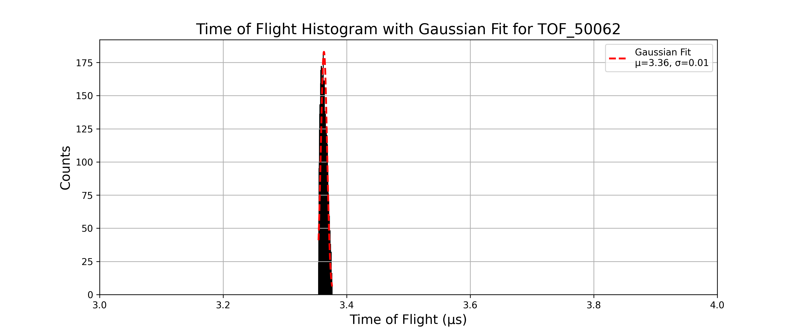

- Gaussian fit parameters and resolution:

```text
Mean (μ): 3.3632, Standard Deviation (σ): 0.0050 for TOF_50062
Resolution: M₀ = 333.3564 for TOF_50062
```
---

### TOF_50063.txt
- pusher voltage: -63V
- The histogram is given as:

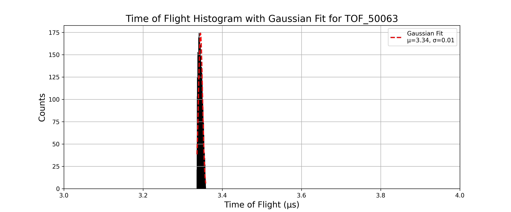

- Gaussian fit parameters and resolution:

```text
Mean (μ): 3.3447, Standard Deviation (σ): 0.0051 for TOF_50063
Resolution: M₀ = 326.5689 for TOF_50063
```
---

### TOF_50064.txt
- pusher voltage: -64V
- The histogram is given as:


- Gaussian fit parameters and resolution:

```text
Mean (μ): 3.3267, Standard Deviation (σ): 0.0052 for TOF_50064
Resolution: M₀ = 319.4306 for TOF_50064
```
---

### TOF_50065.txt
- pusher voltage: -65V
- The histogram is given as:


- Gaussian fit parameters and resolution:

```text
Mean (μ): 3.3088, Standard Deviation (σ): 0.0052 for TOF_50065
Resolution: M₀ = 320.2183 for TOF_50065
```
---

### TOF_50066.txt
- pusher voltage: -66V
- The histogram is given as:


- Gaussian fit parameters and resolution:

```text
Mean (μ): 3.2912, Standard Deviation (σ): 0.0052 for TOF_50066
Resolution: M₀ = 313.7719 for TOF_50066
```
---

### TOF_50067.txt
- pusher voltage: -67V
- The histogram is given as:

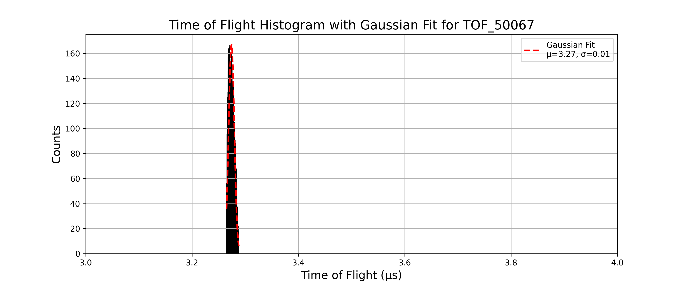

- Gaussian fit parameters and resolution:

```text
Mean (μ): 3.2742, Standard Deviation (σ): 0.0053 for TOF_50067
Resolution: M₀ = 308.3793 for TOF_50067
```
---

### TOF_50068.txt
- pusher voltage: -68V
- The histogram is given as:


- Gaussian fit parameters and resolution:

```text
Mean (μ): 3.2573, Standard Deviation (σ): 0.0053 for TOF_50068
Resolution: M₀ = 304.7798 for TOF_50068
```
---

### TOF_50069.txt
- pusher voltage: -69V
- The histogram is given as:

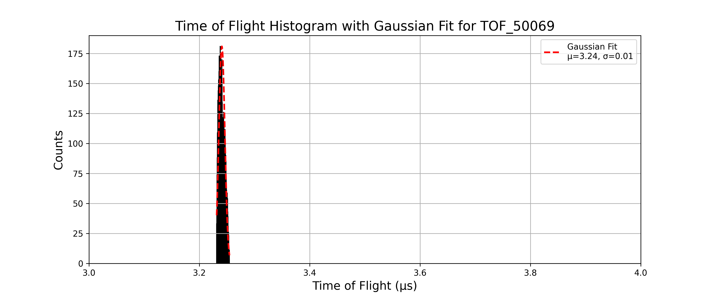

- Gaussian fit parameters and resolution:

```text
Mean (μ): 3.2407, Standard Deviation (σ): 0.0054 for TOF_50069
Resolution: M₀ = 299.0490 for TOF_50069
```
---

### TOF_50070.txt
- pusher voltage: -70V
- The histogram is given as:

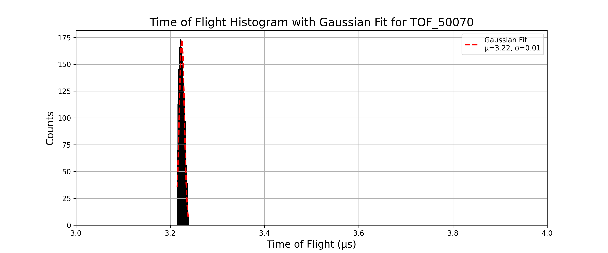

- Gaussian fit parameters and resolution:

```text
Mean (μ): 3.2246, Standard Deviation (σ): 0.0054 for TOF_50070
Resolution: M₀ = 298.2709 for TOF_50070
```
---

### TOF_50080.txt
- pusher voltage: -80V
- The histogram is given as:

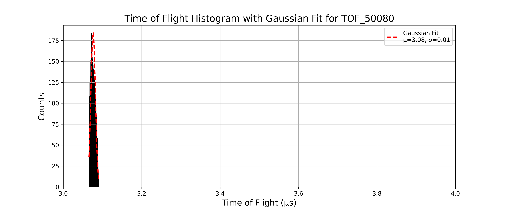

- Gaussian fit parameters and resolution:

```text
Mean (μ): 3.0762, Standard Deviation (σ): 0.0058 for TOF_50080
Resolution: M₀ = 265.0913 for TOF_50080
```
---

The resolution vs pusher voltage plot for this setup is:

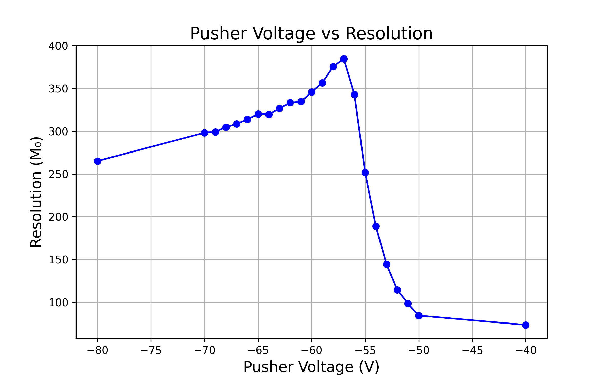


## Part 6
---
- For all the simulation in this part I use the structure 
    - Number of particles - 10,000
    - charge (-1)
    - mass -  single value - 20
    - source position - spherical distribution - center(23,80,80) radius(1)
    - Azimuth (0) , Elevation (0)
    - KE (3)
    - Lens 1,2,3,4 and flight tube voltage (00 V)
    - Magnetic Field - 50 G