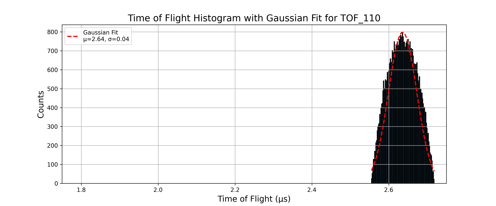
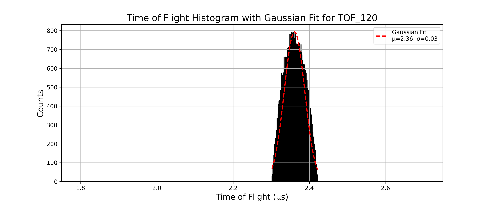
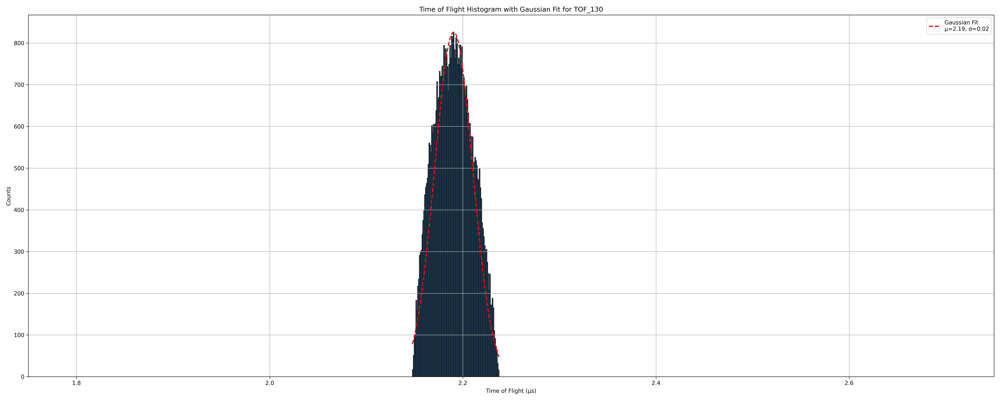
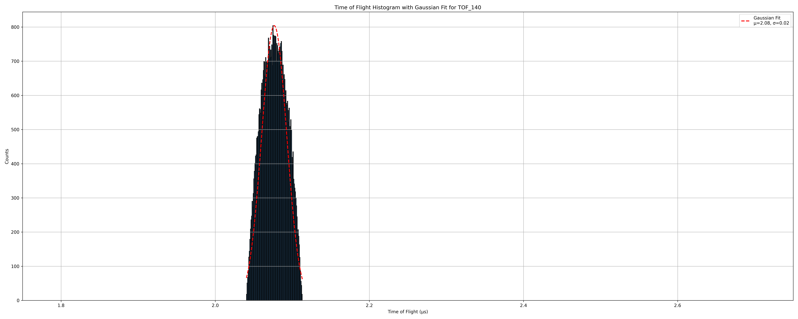
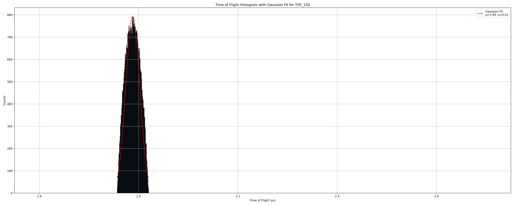
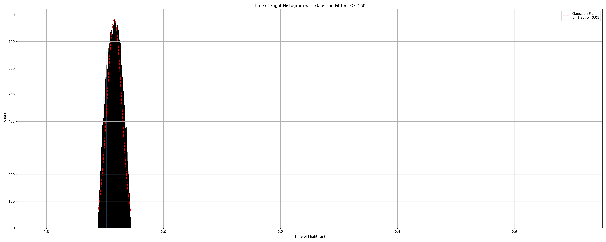

# This is my logbook for my data recording for Resolution calculation

## Part 1
---
- For all the simulation in this part I use the structure 
    - Number of particles - 50,000
    - charge (-1)
    - mass -  single value - 10
    - source position - spherical distribution - center(23,80,80) radius(1)
    - Azimuth (0) , Elevation (0)
    - KE (3)
    - Lens 1,2,3,4 and flight tube voltage (300 V)

### TOF110.txt
- pusher voltage -10V
- The histogram is given as 



- And for the Gaussian fit the fit parametes and Resolution is 
```text

```

---

### TOF120.txt
- pusher voltage -20V
- The histogram is given as 



- And for the Gaussian fit the fit parametes and Resolution is 
```text
Mean (μ): 2.3611, Standard Deviation (σ): 0.0268 for TOF_120
Resolution: M₀ = 87.9729 for TOF_120
```

---

### TOF130.txt
- pusher voltage -30V
- The histogram is given as 



- And for the Gaussian fit the fit parametes and Resolution is 
```text
Mean (μ): 2.1905, Standard Deviation (σ): 0.0197 for TOF_130
Resolution: M₀ = 111.3371 for TOF_130
```

---

### TOF140.txt
- pusher voltage -40V
- The histogram is given as 



- And for the Gaussian fit the fit parametes and Resolution is 
```text
Mean (μ): 2.0766, Standard Deviation (σ): 0.0161 for TOF_140
Resolution: M₀ = 128.7827 for TOF_140
```

---

### TOF150.txt
- pusher voltage -50V
- The histogram is given as 



- And for the Gaussian fit the fit parametes and Resolution is 
```text
Mean (μ): 1.9882, Standard Deviation (σ): 0.0141 for TOF_150
Resolution: M₀ = 140.8940 for TOF_150
```

---

### TOF160.txt
- pusher voltage -60V
- The histogram is given as 



- And for the Gaussian fit the fit parametes and Resolution is 
```text
Mean (μ): 1.9161, Standard Deviation (σ): 0.0125 for TOF_160
Resolution: M₀ = 152.8865 for TOF_160
```

---

