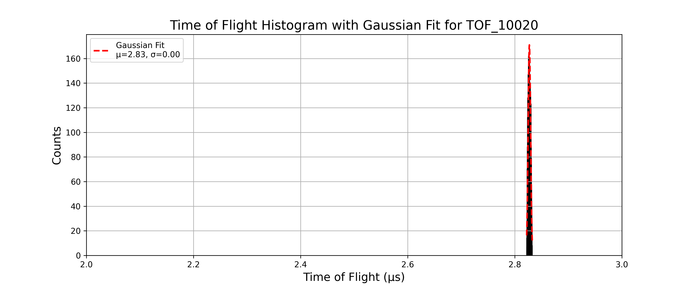
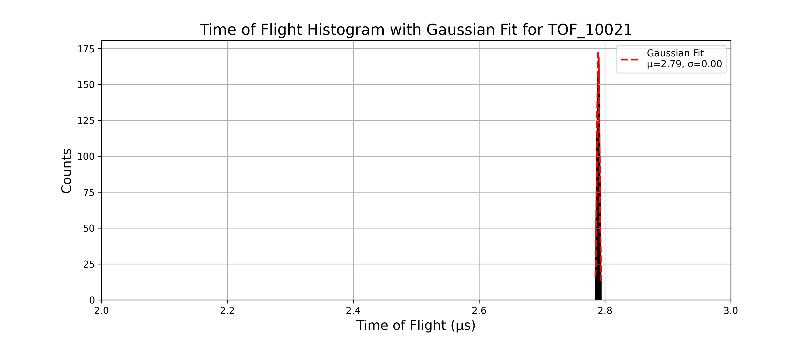
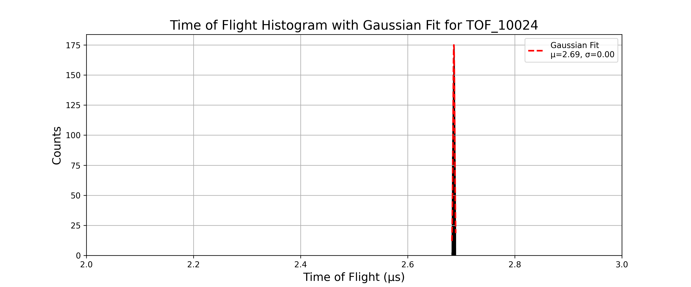
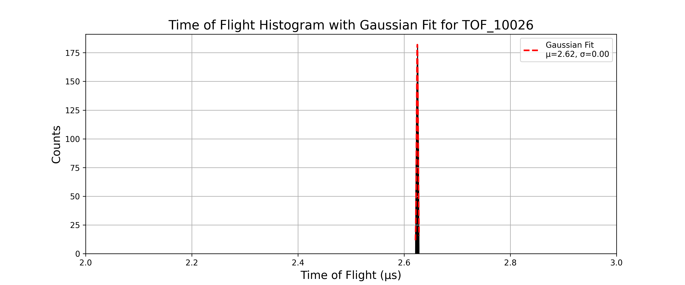
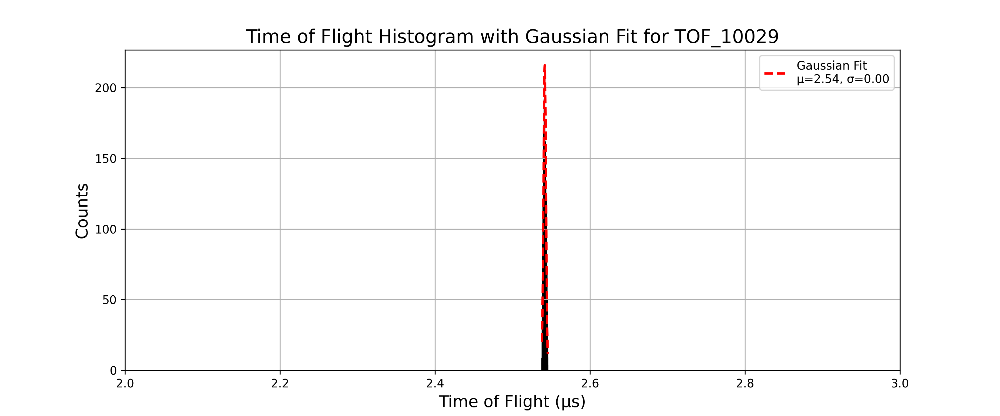
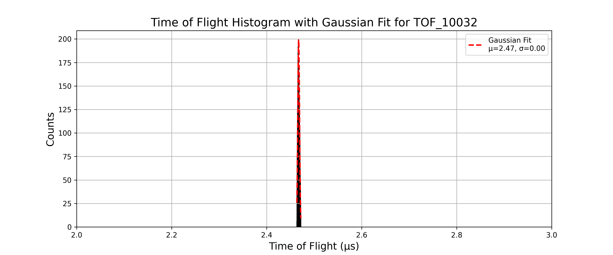
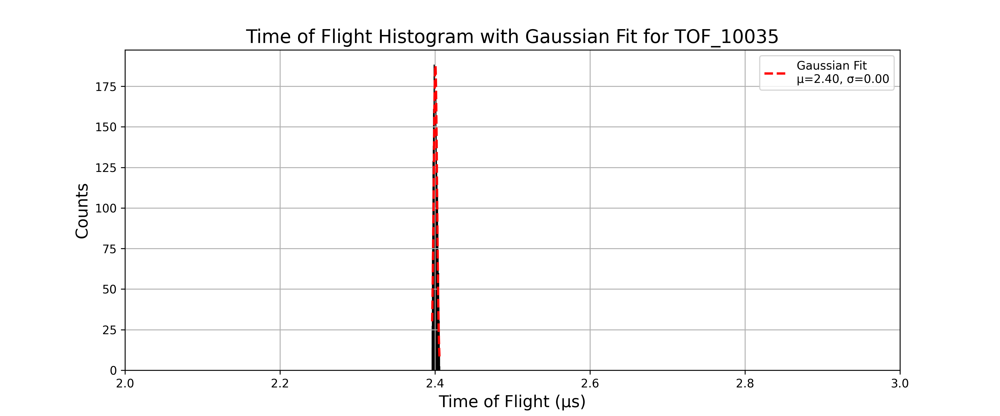
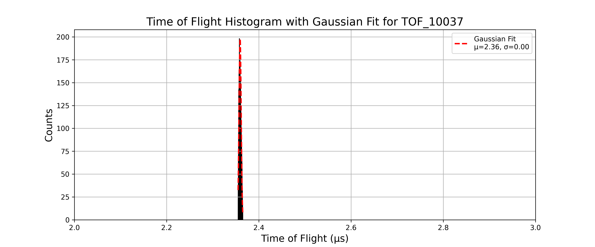
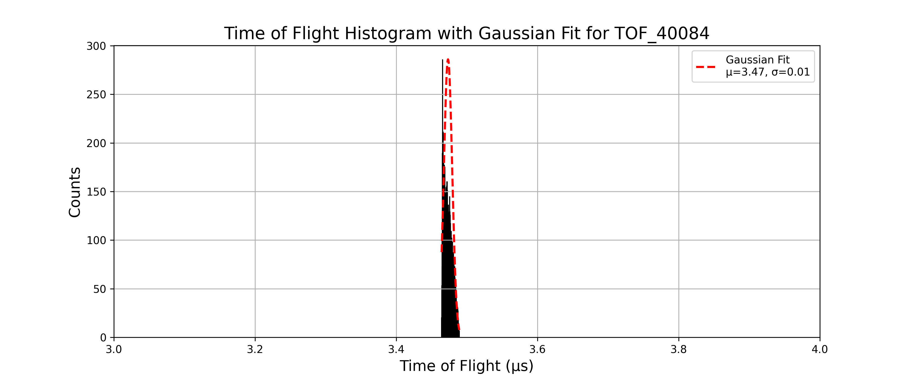
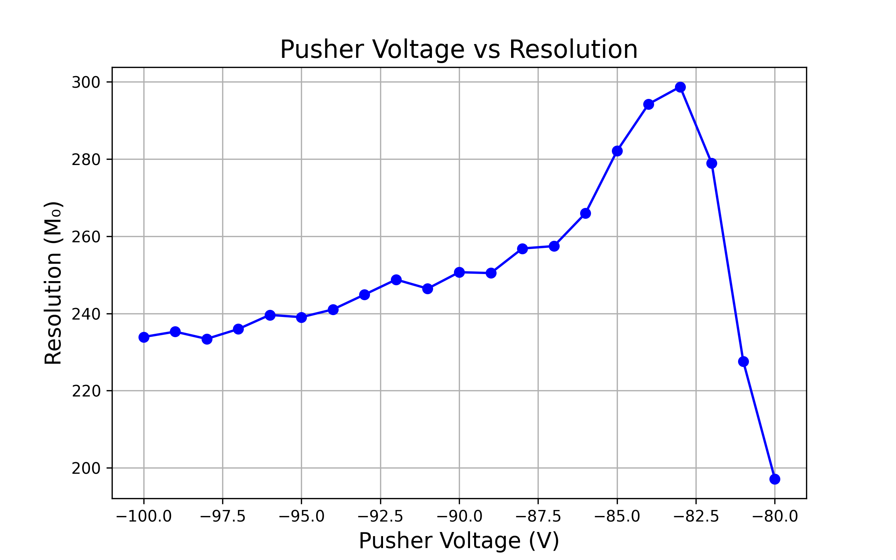

# Logbook for Space Resolution as different mass values and differnet Pusher Voltages

## The maximum Resolution and the corresponding Pusher Voltage for each mass value
---
```text
Mass (amu)  $(M₀)_{max}$    Pusher Voltage(V)
5           879.3759        -26V
10          892.7769        -33V.
15          384.5350        -57V.
20          298.6782        -83V.
```         
---

Which looks like 


## Part 1
---
- For all the simulation in this part I use the structure 
    - Number of particles: 10,000  
    - Charge: -1  
    - Mass: 5 (single value)  
    - Source position: spherical distribution — center (23, 80, 80), radius = 1  
    - Azimuth: 0°, Elevation: 0°  
    - Kinetic Energy (KE): 3 eV  
    - Lens 1,2,3,4 and flight tube voltages: 0 V  
    - Magnetic Field: 50 G
    
### TOF_10020.txt
- pusher voltage: -20V
- The histogram is given as:



- Gaussian fit parameters and resolution:

```text
Mean (μ): 2.8272, Standard Deviation (σ): 0.0023 for TOF_10020
Resolution: M₀ = 608.6528 for TOF_10020
```
---

### TOF_10021.txt
- pusher voltage: -21V
- The histogram is given as:



- Gaussian fit parameters and resolution:

```text
Mean (μ): 2.7894, Standard Deviation (σ): 0.0021 for TOF_10021
Resolution: M₀ = 677.9655 for TOF_10021
```
---

### TOF_10022.txt
- pusher voltage: -22V
- The histogram is given as:


- Gaussian fit parameters and resolution:

```text
Mean (μ): 2.7535, Standard Deviation (σ): 0.0019 for TOF_10022
Resolution: M₀ = 738.5214 for TOF_10022
```
---

### TOF_10023.txt
- pusher voltage: -23V
- The histogram is given as:


- Gaussian fit parameters and resolution:

```text
Mean (μ): 2.7191, Standard Deviation (σ): 0.0017 for TOF_10023
Resolution: M₀ = 804.4702 for TOF_10023
```
---

### TOF_10024.txt
- pusher voltage: -24V
- The histogram is given as:



- Gaussian fit parameters and resolution:

```text
Mean (μ): 2.6862, Standard Deviation (σ): 0.0016 for TOF_10024
Resolution: M₀ = 843.7715 for TOF_10024
```
---

### TOF_10025.txt
- pusher voltage: -25V
- The histogram is given as:


- Gaussian fit parameters and resolution:

```text
Mean (μ): 2.6549, Standard Deviation (σ): 0.0015 for TOF_10025
Resolution: M₀ = 869.7935 for TOF_10025
```
---

### TOF_10026.txt
- pusher voltage: -26V
- The histogram is given as:



- Gaussian fit parameters and resolution:

```text
Mean (μ): 2.6248, Standard Deviation (σ): 0.0015 for TOF_10026
Resolution: M₀ = 879.3759 for TOF_10026
```
---

### TOF_10027.txt
- pusher voltage: -27V
- The histogram is given as:


- Gaussian fit parameters and resolution:

```text
Mean (μ): 2.5960, Standard Deviation (σ): 0.0015 for TOF_10027
Resolution: M₀ = 855.2658 for TOF_10027
```
---

### TOF_10028.txt
- pusher voltage: -28V
- The histogram is given as:


- Gaussian fit parameters and resolution:

```text
Mean (μ): 2.5683, Standard Deviation (σ): 0.0015 for TOF_10028
Resolution: M₀ = 829.6655 for TOF_10028
```
---

### TOF_10029.txt
- pusher voltage: -29V
- The histogram is given as:



- Gaussian fit parameters and resolution:

```text
Mean (μ): 2.5416, Standard Deviation (σ): 0.0016 for TOF_10029
Resolution: M₀ = 786.9454 for TOF_10029
```
---

### TOF_10030.txt
- pusher voltage: -30V
- The histogram is given as:


- Gaussian fit parameters and resolution:

```text
Mean (μ): 2.5160, Standard Deviation (σ): 0.0017 for TOF_10030
Resolution: M₀ = 747.5100 for TOF_10030
```
---

### TOF_10031.txt
- pusher voltage: -31V
- The histogram is given as:


- Gaussian fit parameters and resolution:

```text
Mean (μ): 2.4912, Standard Deviation (σ): 0.0018 for TOF_10031
Resolution: M₀ = 703.3694 for TOF_10031
```
---

### TOF_10032.txt
- pusher voltage: -32V
- The histogram is given as:



- Gaussian fit parameters and resolution:

```text
Mean (μ): 2.4674, Standard Deviation (σ): 0.0019 for TOF_10032
Resolution: M₀ = 665.8420 for TOF_10032
```
---

### TOF_10033.txt
- pusher voltage: -33V
- The histogram is given as:


- Gaussian fit parameters and resolution:

```text
Mean (μ): 2.4443, Standard Deviation (σ): 0.0019 for TOF_10033
Resolution: M₀ = 630.0221 for TOF_10033
```
---

### TOF_10034.txt
- pusher voltage: -34V
- The histogram is given as:


- Gaussian fit parameters and resolution:

```text
Mean (μ): 2.4220, Standard Deviation (σ): 0.0020 for TOF_10034
Resolution: M₀ = 602.3372 for TOF_10034
```
---

### TOF_10035.txt
- pusher voltage: -35V
- The histogram is given as:



- Gaussian fit parameters and resolution:

```text
Mean (μ): 2.4004, Standard Deviation (σ): 0.0021 for TOF_10035
Resolution: M₀ = 561.7344 for TOF_10035
```
---

### TOF_10036.txt
- pusher voltage: -36V
- The histogram is given as:


- Gaussian fit parameters and resolution:

```text
Mean (μ): 2.3796, Standard Deviation (σ): 0.0022 for TOF_10036
Resolution: M₀ = 541.2152 for TOF_10036
```
---

### TOF_10037.txt
- pusher voltage: -37V
- The histogram is given as:



- Gaussian fit parameters and resolution:

```text
Mean (μ): 2.3594, Standard Deviation (σ): 0.0023 for TOF_10037
Resolution: M₀ = 515.9305 for TOF_10037
```
---

### TOF_10038.txt
- pusher voltage: -38V
- The histogram is given as:


- Gaussian fit parameters and resolution:

```text
Mean (μ): 2.3398, Standard Deviation (σ): 0.0024 for TOF_10038
Resolution: M₀ = 491.5023 for TOF_10038
```
---

### TOF_10039.txt
- pusher voltage: -39V
- The histogram is given as:


- Gaussian fit parameters and resolution:

```text
Mean (μ): 2.3207, Standard Deviation (σ): 0.0025 for TOF_10039
Resolution: M₀ = 469.8987 for TOF_10039
```
---

### TOF_10040.txt
- pusher voltage: -40V
- The histogram is given as:


- Gaussian fit parameters and resolution:

```text
Mean (μ): 2.3023, Standard Deviation (σ): 0.0025 for TOF_10040
Resolution: M₀ = 454.1571 for TOF_10040
```
---

The resolution vs pusher voltage plot for this setup is:


The maximum resolution 879.3759 occurs at pusher voltage -26V.

---


## Part 2
---
- For all the simulation in this part I use the structure 
    - Number of particles: 10,000  
    - Charge: -1  
    - Mass: 10 (single value)  
    - Source position: spherical distribution — center (23, 80, 80), radius = 1  
    - Azimuth: 0°, Elevation: 0°  
    - Kinetic Energy (KE): 3 eV  
    - Lens 1,2,3,4 and flight tube voltages: 0 V  
    - Magnetic Field: 50 G
    
### TOF_20030.txt
- pusher voltage: -30V
- The histogram is given as:


- Gaussian fit parameters and resolution:

```text
Mean (μ): 3.5054, Standard Deviation (σ): 0.0075 for TOF_20030
Resolution: M₀ = 234.0977 for TOF_20030
```
---

### TOF_20031.txt
- pusher voltage: -31V
- The histogram is given as:


- Gaussian fit parameters and resolution:

```text
Mean (μ): 3.4682, Standard Deviation (σ): 0.0040 for TOF_20031
Resolution: M₀ = 432.2605 for TOF_20031
```
---

### TOF_20032.txt
- pusher voltage: -32V
- The histogram is given as:


- Gaussian fit parameters and resolution:

```text
Mean (μ): 3.4338, Standard Deviation (σ): 0.0036 for TOF_20032
Resolution: M₀ = 481.2520 for TOF_20032
```
---

### TOF_20033.txt
- pusher voltage: -33V
- The histogram is given as:


- Gaussian fit parameters and resolution:

```text
Mean (μ): 3.4009, Standard Deviation (σ): 0.0019 for TOF_20033
Resolution: M₀ = 892.7769 for TOF_20033
```
---

### TOF_20034.txt
- pusher voltage: -34V
- The histogram is given as:


- Gaussian fit parameters and resolution:

```text
Mean (μ): 3.3696, Standard Deviation (σ): 0.0020 for TOF_20034
Resolution: M₀ = 822.3315 for TOF_20034
```
---

### TOF_20035.txt
- pusher voltage: -35V
- The histogram is given as:


- Gaussian fit parameters and resolution:

```text
Mean (μ): 3.3393, Standard Deviation (σ): 0.0022 for TOF_20035
Resolution: M₀ = 769.3506 for TOF_20035
```
---

### TOF_20036.txt
- pusher voltage: -36V
- The histogram is given as:


- Gaussian fit parameters and resolution:

```text
Mean (μ): 3.3099, Standard Deviation (σ): 0.0023 for TOF_20036
Resolution: M₀ = 718.8920 for TOF_20036
```
---

### TOF_20037.txt
- pusher voltage: -37V
- The histogram is given as:


- Gaussian fit parameters and resolution:

```text
Mean (μ): 3.2815, Standard Deviation (σ): 0.0024 for TOF_20037
Resolution: M₀ = 671.9421 for TOF_20037
```
---

### TOF_20038.txt
- pusher voltage: -38V
- The histogram is given as:


- Gaussian fit parameters and resolution:

```text
Mean (μ): 3.2539, Standard Deviation (σ): 0.0026 for TOF_20038
Resolution: M₀ = 636.3202 for TOF_20038
```
---

### TOF_20039.txt
- pusher voltage: -39V
- The histogram is given as:


- Gaussian fit parameters and resolution:

```text
Mean (μ): 3.2272, Standard Deviation (σ): 0.0027 for TOF_20039
Resolution: M₀ = 597.6553 for TOF_20039
```
---

### TOF_20040.txt
- pusher voltage: -40V
- The histogram is given as:


- Gaussian fit parameters and resolution:

```text
Mean (μ): 3.2011, Standard Deviation (σ): 0.0028 for TOF_20040
Resolution: M₀ = 574.9504 for TOF_20040
```
---

### TOF_20041.txt
- pusher voltage: -41V
- The histogram is given as:


- Gaussian fit parameters and resolution:

```text
Mean (μ): 3.1759, Standard Deviation (σ): 0.0029 for TOF_20041
Resolution: M₀ = 548.6625 for TOF_20041
```
---

### TOF_20042.txt
- pusher voltage: -42V
- The histogram is given as:


- Gaussian fit parameters and resolution:

```text
Mean (μ): 3.1514, Standard Deviation (σ): 0.0030 for TOF_20042
Resolution: M₀ = 521.3390 for TOF_20042
```
---

### TOF_20043.txt
- pusher voltage: -43V
- The histogram is given as:


- Gaussian fit parameters and resolution:

```text
Mean (μ): 3.1275, Standard Deviation (σ): 0.0031 for TOF_20043
Resolution: M₀ = 496.6563 for TOF_20043
```
---

### TOF_20044.txt
- pusher voltage: -44V
- The histogram is given as:


- Gaussian fit parameters and resolution:

```text
Mean (μ): 3.1042, Standard Deviation (σ): 0.0032 for TOF_20044
Resolution: M₀ = 487.1032 for TOF_20044
```
---

### TOF_20045.txt
- pusher voltage: -45V
- The histogram is given as:


- Gaussian fit parameters and resolution:

```text
Mean (μ): 3.0816, Standard Deviation (σ): 0.0033 for TOF_20045
Resolution: M₀ = 465.7599 for TOF_20045
```
---

### TOF_20046.txt
- pusher voltage: -46V
- The histogram is given as:


- Gaussian fit parameters and resolution:

```text
Mean (μ): 3.0596, Standard Deviation (σ): 0.0034 for TOF_20046
Resolution: M₀ = 446.6097 for TOF_20046
```
---

### TOF_20047.txt
- pusher voltage: -47V
- The histogram is given as:


- Gaussian fit parameters and resolution:

```text
Mean (μ): 3.0380, Standard Deviation (σ): 0.0035 for TOF_20047
Resolution: M₀ = 436.7901 for TOF_20047
```
---

### TOF_20048.txt
- pusher voltage: -48V
- The histogram is given as:


- Gaussian fit parameters and resolution:

```text
Mean (μ): 3.0170, Standard Deviation (σ): 0.0036 for TOF_20048
Resolution: M₀ = 419.2321 for TOF_20048
```
---

### TOF_20049.txt
- pusher voltage: -49V
- The histogram is given as:


- Gaussian fit parameters and resolution:

```text
Mean (μ): 2.9965, Standard Deviation (σ): 0.0036 for TOF_20049
Resolution: M₀ = 414.6145 for TOF_20049
```
---

### TOF_20050.txt
- pusher voltage: -50V
- The histogram is given as:


- Gaussian fit parameters and resolution:

```text
Mean (μ): 2.9766, Standard Deviation (σ): 0.0037 for TOF_20050
Resolution: M₀ = 398.9163 for TOF_20050
```
---

The resolution vs pusher voltage plot for this setup is:


The maximum resolution 892.7769 occurs at pusher voltage -33V.

---

## Part 3
---
- For all the simulation in this part I use the structure 
    - Number of particles: 10,000  
    - Charge: -1  
    - Mass: 15 (single value)  
    - Source position: spherical distribution — center (23, 80, 80), radius = 1  
    - Azimuth: 0°, Elevation: 0°  
    - Kinetic Energy (KE): 3 eV  
    - Lens 1,2,3,4 and flight tube voltages: 0 V  
    - Magnetic Field: 50 G
    
### TOF_30050.txt
- pusher voltage: -50V
- The histogram is given as:


- Gaussian fit parameters and resolution:

```text
Mean (μ): 3.6484, Standard Deviation (σ): 0.0216 for TOF_30050
Resolution: M₀ = 84.3529 for TOF_30050
```
---

### TOF_30051.txt
- pusher voltage: -51V
- The histogram is given as:


- Gaussian fit parameters and resolution:

```text
Mean (μ): 3.6168, Standard Deviation (σ): 0.0184 for TOF_30051
Resolution: M₀ = 98.3202 for TOF_30051
```
---

### TOF_30052.txt
- pusher voltage: -52V
- The histogram is given as:


- Gaussian fit parameters and resolution:

```text
Mean (μ): 3.5871, Standard Deviation (σ): 0.0157 for TOF_30052
Resolution: M₀ = 114.4004 for TOF_30052
```
---

### TOF_30053.txt
- pusher voltage: -53V
- The histogram is given as:


- Gaussian fit parameters and resolution:

```text
Mean (μ): 3.5592, Standard Deviation (σ): 0.0123 for TOF_30053
Resolution: M₀ = 144.2760 for TOF_30053
```
---

### TOF_30054.txt
- pusher voltage: -54V
- The histogram is given as:


- Gaussian fit parameters and resolution:

```text
Mean (μ): 3.5328, Standard Deviation (σ): 0.0094 for TOF_30054
Resolution: M₀ = 188.7909 for TOF_30054
```
---

### TOF_30055.txt
- pusher voltage: -55V
- The histogram is given as:


- Gaussian fit parameters and resolution:

```text
Mean (μ): 3.5083, Standard Deviation (σ): 0.0070 for TOF_30055
Resolution: M₀ = 251.5495 for TOF_30055
```
---

### TOF_30056.txt
- pusher voltage: -56V
- The histogram is given as:


- Gaussian fit parameters and resolution:

```text
Mean (μ): 3.4846, Standard Deviation (σ): 0.0051 for TOF_30056
Resolution: M₀ = 342.8113 for TOF_30056
```
---

### TOF_30057.txt
- pusher voltage: -57V
- The histogram is given as:


- Gaussian fit parameters and resolution:

```text
Mean (μ): 3.4626, Standard Deviation (σ): 0.0045 for TOF_30057
Resolution: M₀ = 384.5350 for TOF_30057
```
---

### TOF_30058.txt
- pusher voltage: -58V
- The histogram is given as:


- Gaussian fit parameters and resolution:

```text
Mean (μ): 3.4414, Standard Deviation (σ): 0.0046 for TOF_30058
Resolution: M₀ = 375.5634 for TOF_30058
```
---

### TOF_30059.txt
- pusher voltage: -59V
- The histogram is given as:


- Gaussian fit parameters and resolution:

```text
Mean (μ): 3.4210, Standard Deviation (σ): 0.0048 for TOF_30059
Resolution: M₀ = 356.6714 for TOF_30059
```
---

### TOF_30060.txt
- pusher voltage: -60V
- The histogram is given as:


- Gaussian fit parameters and resolution:

```text
Mean (μ): 3.4013, Standard Deviation (σ): 0.0049 for TOF_30060
Resolution: M₀ = 345.7805 for TOF_30060
```
---

### TOF_30061.txt
- pusher voltage: -61V
- The histogram is given as:


- Gaussian fit parameters and resolution:

```text
Mean (μ): 3.3822, Standard Deviation (σ): 0.0051 for TOF_30061
Resolution: M₀ = 334.5131 for TOF_30061
```
---

### TOF_30062.txt
- pusher voltage: -62V
- The histogram is given as:


- Gaussian fit parameters and resolution:

```text
Mean (μ): 3.3632, Standard Deviation (σ): 0.0050 for TOF_30062
Resolution: M₀ = 333.3564 for TOF_30062
```
---

### TOF_30063.txt
- pusher voltage: -63V
- The histogram is given as:


- Gaussian fit parameters and resolution:

```text
Mean (μ): 3.3447, Standard Deviation (σ): 0.0051 for TOF_30063
Resolution: M₀ = 326.5689 for TOF_30063
```
---

### TOF_30064.txt
- pusher voltage: -64V
- The histogram is given as:


- Gaussian fit parameters and resolution:

```text
Mean (μ): 3.3267, Standard Deviation (σ): 0.0052 for TOF_30064
Resolution: M₀ = 319.4306 for TOF_30064
```
---

### TOF_30065.txt
- pusher voltage: -65V
- The histogram is given as:


- Gaussian fit parameters and resolution:

```text
Mean (μ): 3.3088, Standard Deviation (σ): 0.0052 for TOF_30065
Resolution: M₀ = 320.2183 for TOF_30065
```
---

### TOF_30066.txt
- pusher voltage: -66V
- The histogram is given as:


- Gaussian fit parameters and resolution:

```text
Mean (μ): 3.2912, Standard Deviation (σ): 0.0052 for TOF_30066
Resolution: M₀ = 313.7719 for TOF_30066
```
---

### TOF_30067.txt
- pusher voltage: -67V
- The histogram is given as:


- Gaussian fit parameters and resolution:

```text
Mean (μ): 3.2742, Standard Deviation (σ): 0.0053 for TOF_30067
Resolution: M₀ = 308.3793 for TOF_30067
```
---

### TOF_30068.txt
- pusher voltage: -68V
- The histogram is given as:


- Gaussian fit parameters and resolution:

```text
Mean (μ): 3.2573, Standard Deviation (σ): 0.0053 for TOF_30068
Resolution: M₀ = 304.7798 for TOF_30068
```
---

### TOF_30069.txt
- pusher voltage: -69V
- The histogram is given as:


- Gaussian fit parameters and resolution:

```text
Mean (μ): 3.2407, Standard Deviation (σ): 0.0054 for TOF_30069
Resolution: M₀ = 299.0490 for TOF_30069
```
---

### TOF_30070.txt
- pusher voltage: -70V
- The histogram is given as:


- Gaussian fit parameters and resolution:

```text
Mean (μ): 3.2246, Standard Deviation (σ): 0.0054 for TOF_30070
Resolution: M₀ = 298.2709 for TOF_30070
```
---

The resolution vs pusher voltage plot for this setup is:


The maximum resolution 384.5350 occurs at pusher voltage -57V.

---

## Part 4
---
- For all the simulation in this part I use the structure 
    - Number of particles: 10,000  
    - Charge: -1  
    - Mass: 20 (single value)  
    - Source position: spherical distribution — center (23, 80, 80), radius = 1  
    - Azimuth: 0°, Elevation: 0°  
    - Kinetic Energy (KE): 3 eV  
    - Lens 1,2,3,4 and flight tube voltages: 0 V  
    - Magnetic Field: 50 G
    
### TOF_40080.txt
- pusher voltage: -80V
- The histogram is given as:


- Gaussian fit parameters and resolution:

```text
Mean (μ): 3.5413, Standard Deviation (σ): 0.0090 for TOF_40080
Resolution: M₀ = 197.1889 for TOF_40080
```
---

### TOF_40081.txt
- pusher voltage: -81V
- The histogram is given as:


- Gaussian fit parameters and resolution:

```text
Mean (μ): 3.5238, Standard Deviation (σ): 0.0077 for TOF_40081
Resolution: M₀ = 227.5923 for TOF_40081
```
---

### TOF_40082.txt
- pusher voltage: -82V
- The histogram is given as:


- Gaussian fit parameters and resolution:

```text
Mean (μ): 3.5059, Standard Deviation (σ): 0.0063 for TOF_40082
Resolution: M₀ = 278.8806 for TOF_40082
```
---

### TOF_40083.txt
- pusher voltage: -83V
- The histogram is given as:


- Gaussian fit parameters and resolution:

```text
Mean (μ): 3.4895, Standard Deviation (σ): 0.0058 for TOF_40083
Resolution: M₀ = 298.6782 for TOF_40083
```
---

### TOF_40084.txt
- pusher voltage: -84V
- The histogram is given as:



- Gaussian fit parameters and resolution:

```text
Mean (μ): 3.4733, Standard Deviation (σ): 0.0059 for TOF_40084
Resolution: M₀ = 294.2224 for TOF_40084
```
---

### TOF_40085.txt
- pusher voltage: -85V
- The histogram is given as:


- Gaussian fit parameters and resolution:

```text
Mean (μ): 3.4582, Standard Deviation (σ): 0.0061 for TOF_40085
Resolution: M₀ = 282.0743 for TOF_40085
```
---

### TOF_40086.txt
- pusher voltage: -86V
- The histogram is given as:


- Gaussian fit parameters and resolution:

```text
Mean (μ): 3.4433, Standard Deviation (σ): 0.0065 for TOF_40086
Resolution: M₀ = 265.9357 for TOF_40086
```
---

### TOF_40087.txt
- pusher voltage: -87V
- The histogram is given as:


- Gaussian fit parameters and resolution:

```text
Mean (μ): 3.4288, Standard Deviation (σ): 0.0067 for TOF_40087
Resolution: M₀ = 257.4361 for TOF_40087
```
---

### TOF_40088.txt
- pusher voltage: -88V
- The histogram is given as:


- Gaussian fit parameters and resolution:

```text
Mean (μ): 3.4145, Standard Deviation (σ): 0.0066 for TOF_40088
Resolution: M₀ = 256.8215 for TOF_40088
```
---

### TOF_40089.txt
- pusher voltage: -89V
- The histogram is given as:


- Gaussian fit parameters and resolution:

```text
Mean (μ): 3.4006, Standard Deviation (σ): 0.0068 for TOF_40089
Resolution: M₀ = 250.4545 for TOF_40089
```
---

### TOF_40090.txt
- pusher voltage: -90V
- The histogram is given as:


- Gaussian fit parameters and resolution:

```text
Mean (μ): 3.3870, Standard Deviation (σ): 0.0068 for TOF_40090
Resolution: M₀ = 250.6801 for TOF_40090
```
---

### TOF_40091.txt
- pusher voltage: -91V
- The histogram is given as:


- Gaussian fit parameters and resolution:

```text
Mean (μ): 3.3736, Standard Deviation (σ): 0.0068 for TOF_40091
Resolution: M₀ = 246.4283 for TOF_40091
```
---

### TOF_40092.txt
- pusher voltage: -92V
- The histogram is given as:


- Gaussian fit parameters and resolution:

```text
Mean (μ): 3.3600, Standard Deviation (σ): 0.0068 for TOF_40092
Resolution: M₀ = 248.7749 for TOF_40092
```
---

### TOF_40093.txt
- pusher voltage: -93V
- The histogram is given as:


- Gaussian fit parameters and resolution:

```text
Mean (μ): 3.3469, Standard Deviation (σ): 0.0068 for TOF_40093
Resolution: M₀ = 244.8790 for TOF_40093
```
---

### TOF_40094.txt
- pusher voltage: -94V
- The histogram is given as:


- Gaussian fit parameters and resolution:

```text
Mean (μ): 3.3338, Standard Deviation (σ): 0.0069 for TOF_40094
Resolution: M₀ = 241.0407 for TOF_40094
```
---

### TOF_40095.txt
- pusher voltage: -95V
- The histogram is given as:


- Gaussian fit parameters and resolution:

```text
Mean (μ): 3.3212, Standard Deviation (σ): 0.0069 for TOF_40095
Resolution: M₀ = 239.0383 for TOF_40095
```
---

### TOF_40096.txt
- pusher voltage: -96V
- The histogram is given as:


- Gaussian fit parameters and resolution:

```text
Mean (μ): 3.3083, Standard Deviation (σ): 0.0069 for TOF_40096
Resolution: M₀ = 239.6209 for TOF_40096
```
---

### TOF_40097.txt
- pusher voltage: -97V
- The histogram is given as:


- Gaussian fit parameters and resolution:

```text
Mean (μ): 3.2961, Standard Deviation (σ): 0.0070 for TOF_40097
Resolution: M₀ = 235.9598 for TOF_40097
```
---

### TOF_40098.txt
- pusher voltage: -98V
- The histogram is given as:


- Gaussian fit parameters and resolution:

```text
Mean (μ): 3.2837, Standard Deviation (σ): 0.0070 for TOF_40098
Resolution: M₀ = 233.4146 for TOF_40098
```
---

### TOF_40099.txt
- pusher voltage: -99V
- The histogram is given as:


- Gaussian fit parameters and resolution:

```text
Mean (μ): 3.2714, Standard Deviation (σ): 0.0070 for TOF_40099
Resolution: M₀ = 235.2853 for TOF_40099
```
---

### TOF_40100.txt
- pusher voltage: -100V
- The histogram is given as:


- Gaussian fit parameters and resolution:

```text
Mean (μ): 3.2592, Standard Deviation (σ): 0.0070 for TOF_40100
Resolution: M₀ = 233.9105 for TOF_40100
```
---

The resolution vs pusher voltage plot for this setup is:



The maximum resolution 298.6782 occurs at pusher voltage -83V.