## Part 1
---
- For all the simulation in this part I use the structure 
    - Number of particles: 10,000  
    - Charge: -1  
    - Mass: 5 (single value)  
    - Source position: spherical distribution — center (23, 80, 80), radius = 1  
    - Azimuth: 0°, Elevation: 0°  
    - Kinetic Energy (KE): 3 eV  
    - Lens 1,2,3,4 and flight tube voltages: 0 V  
    - Magnetic Field: 50 G
    
### TOF_10020.txt
- pusher voltage: -20V
- The histogram is given as:

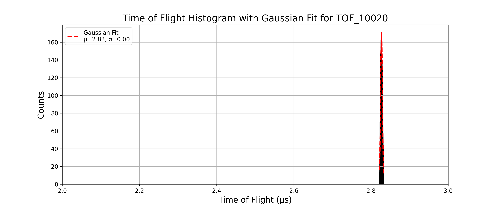

- Gaussian fit parameters and resolution:

```text
Mean (μ): 2.8272, Standard Deviation (σ): 0.0023 for TOF_10020
Resolution: M₀ = 608.6528 for TOF_10020
```
---

### TOF_10021.txt
- pusher voltage: -21V
- The histogram is given as:

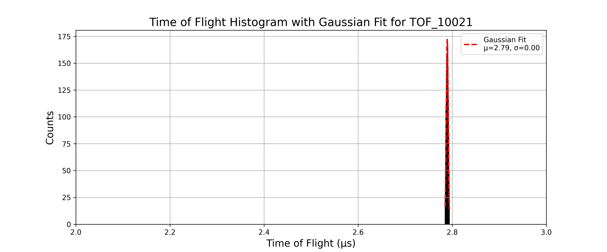

- Gaussian fit parameters and resolution:

```text
Mean (μ): 2.7894, Standard Deviation (σ): 0.0021 for TOF_10021
Resolution: M₀ = 677.9655 for TOF_10021
```
---

### TOF_10022.txt
- pusher voltage: -22V
- The histogram is given as:

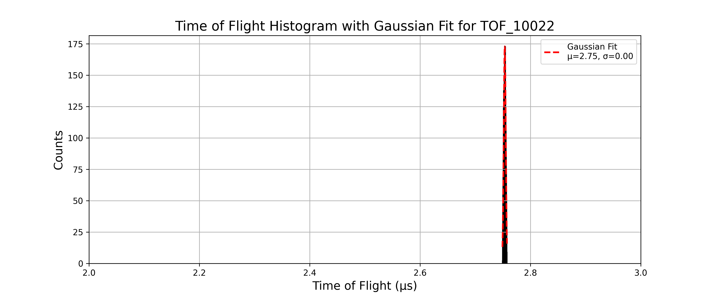

- Gaussian fit parameters and resolution:

```text
Mean (μ): 2.7535, Standard Deviation (σ): 0.0019 for TOF_10022
Resolution: M₀ = 738.5214 for TOF_10022
```
---

### TOF_10023.txt
- pusher voltage: -23V
- The histogram is given as:

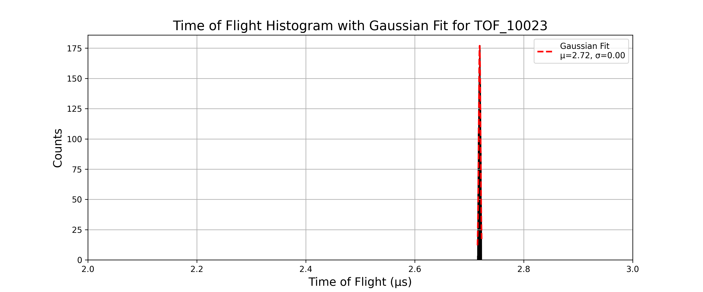

- Gaussian fit parameters and resolution:

```text
Mean (μ): 2.7191, Standard Deviation (σ): 0.0017 for TOF_10023
Resolution: M₀ = 804.4702 for TOF_10023
```
---

### TOF_10024.txt
- pusher voltage: -24V
- The histogram is given as:


- Gaussian fit parameters and resolution:

```text
Mean (μ): 2.6862, Standard Deviation (σ): 0.0016 for TOF_10024
Resolution: M₀ = 843.7715 for TOF_10024
```
---

### TOF_10025.txt
- pusher voltage: -25V
- The histogram is given as:

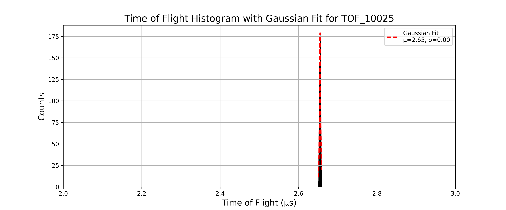

- Gaussian fit parameters and resolution:

```text
Mean (μ): 2.6549, Standard Deviation (σ): 0.0015 for TOF_10025
Resolution: M₀ = 869.7935 for TOF_10025
```
---

### TOF_10026.txt
- pusher voltage: -26V
- The histogram is given as:

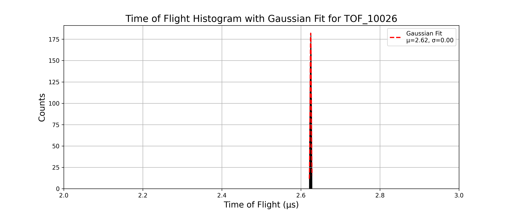

- Gaussian fit parameters and resolution:

```text
Mean (μ): 2.6248, Standard Deviation (σ): 0.0015 for TOF_10026
Resolution: M₀ = 879.3759 for TOF_10026
```
---

### TOF_10027.txt
- pusher voltage: -27V
- The histogram is given as:

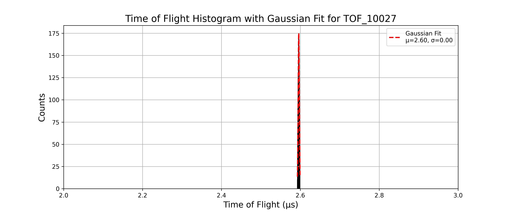

- Gaussian fit parameters and resolution:

```text
Mean (μ): 2.5960, Standard Deviation (σ): 0.0015 for TOF_10027
Resolution: M₀ = 855.2658 for TOF_10027
```
---

### TOF_10028.txt
- pusher voltage: -28V
- The histogram is given as:

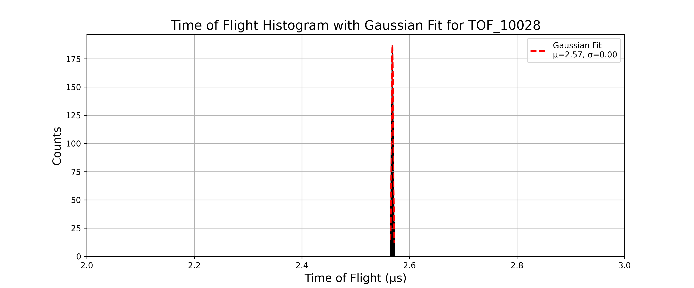

- Gaussian fit parameters and resolution:

```text
Mean (μ): 2.5683, Standard Deviation (σ): 0.0015 for TOF_10028
Resolution: M₀ = 829.6655 for TOF_10028
```
---

### TOF_10029.txt
- pusher voltage: -29V
- The histogram is given as:

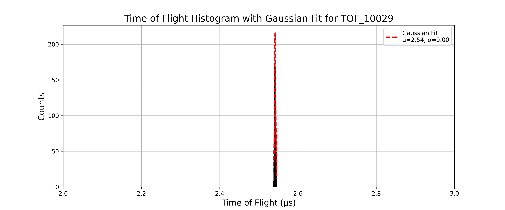

- Gaussian fit parameters and resolution:

```text
Mean (μ): 2.5416, Standard Deviation (σ): 0.0016 for TOF_10029
Resolution: M₀ = 786.9454 for TOF_10029
```
---

### TOF_10030.txt
- pusher voltage: -30V
- The histogram is given as:

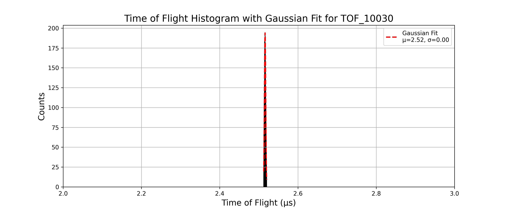

- Gaussian fit parameters and resolution:

```text
Mean (μ): 2.5160, Standard Deviation (σ): 0.0017 for TOF_10030
Resolution: M₀ = 747.5100 for TOF_10030
```
---

### TOF_10031.txt
- pusher voltage: -31V
- The histogram is given as:

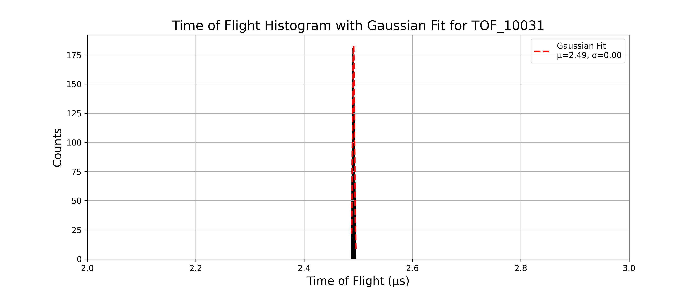

- Gaussian fit parameters and resolution:

```text
Mean (μ): 2.4912, Standard Deviation (σ): 0.0018 for TOF_10031
Resolution: M₀ = 703.3694 for TOF_10031
```
---

### TOF_10032.txt
- pusher voltage: -32V
- The histogram is given as:

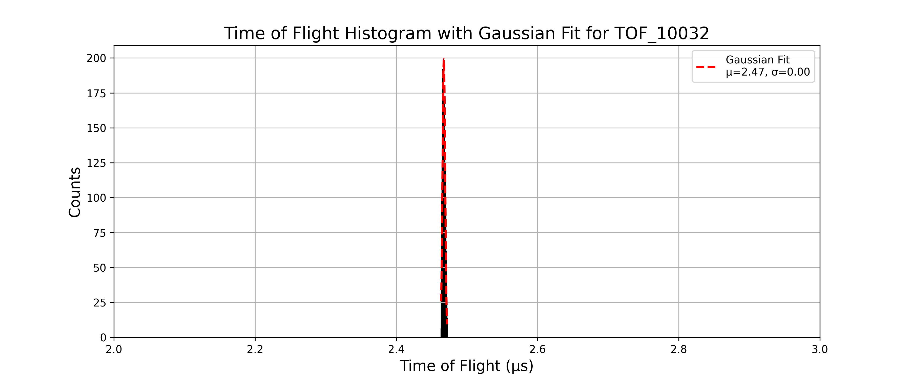

- Gaussian fit parameters and resolution:

```text
Mean (μ): 2.4674, Standard Deviation (σ): 0.0019 for TOF_10032
Resolution: M₀ = 665.8420 for TOF_10032
```
---

### TOF_10033.txt
- pusher voltage: -33V
- The histogram is given as:

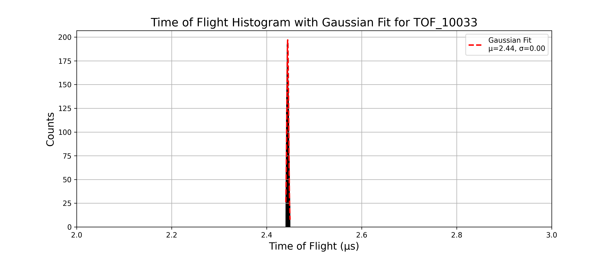

- Gaussian fit parameters and resolution:

```text
Mean (μ): 2.4443, Standard Deviation (σ): 0.0019 for TOF_10033
Resolution: M₀ = 630.0221 for TOF_10033
```
---

### TOF_10034.txt
- pusher voltage: -34V
- The histogram is given as:

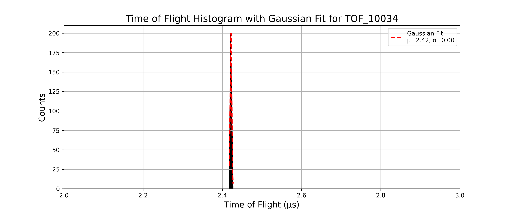

- Gaussian fit parameters and resolution:

```text
Mean (μ): 2.4220, Standard Deviation (σ): 0.0020 for TOF_10034
Resolution: M₀ = 602.3372 for TOF_10034
```
---

### TOF_10035.txt
- pusher voltage: -35V
- The histogram is given as:

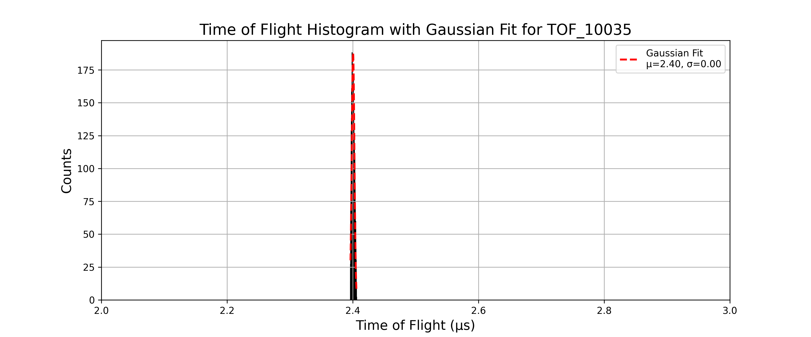

- Gaussian fit parameters and resolution:

```text
Mean (μ): 2.4004, Standard Deviation (σ): 0.0021 for TOF_10035
Resolution: M₀ = 561.7344 for TOF_10035
```
---

### TOF_10036.txt
- pusher voltage: -36V
- The histogram is given as:

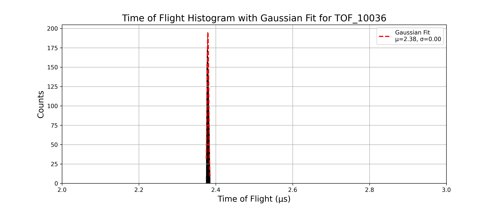

- Gaussian fit parameters and resolution:

```text
Mean (μ): 2.3796, Standard Deviation (σ): 0.0022 for TOF_10036
Resolution: M₀ = 541.2152 for TOF_10036
```
---

### TOF_10037.txt
- pusher voltage: -37V
- The histogram is given as:

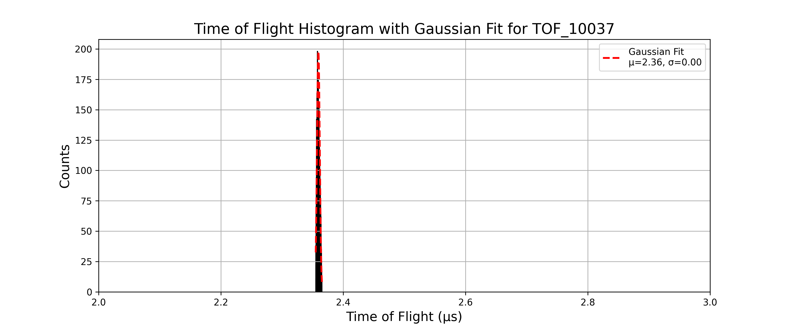

- Gaussian fit parameters and resolution:

```text
Mean (μ): 2.3594, Standard Deviation (σ): 0.0023 for TOF_10037
Resolution: M₀ = 515.9305 for TOF_10037
```
---

### TOF_10038.txt
- pusher voltage: -38V
- The histogram is given as:

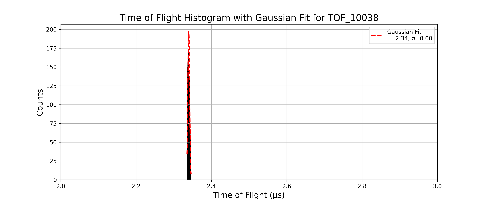

- Gaussian fit parameters and resolution:

```text
Mean (μ): 2.3398, Standard Deviation (σ): 0.0024 for TOF_10038
Resolution: M₀ = 491.5023 for TOF_10038
```
---

### TOF_10039.txt
- pusher voltage: -39V
- The histogram is given as:

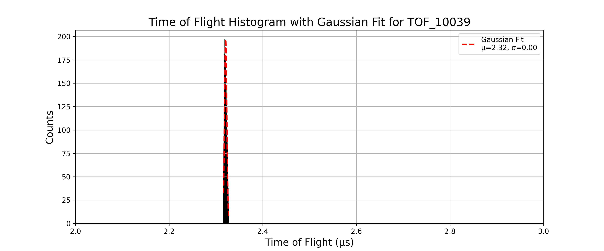

- Gaussian fit parameters and resolution:

```text
Mean (μ): 2.3207, Standard Deviation (σ): 0.0025 for TOF_10039
Resolution: M₀ = 469.8987 for TOF_10039
```
---

### TOF_10040.txt
- pusher voltage: -40V
- The histogram is given as:

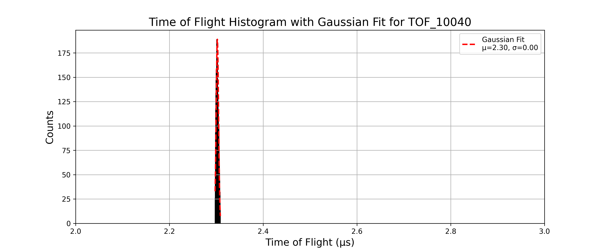

- Gaussian fit parameters and resolution:

```text
Mean (μ): 2.3023, Standard Deviation (σ): 0.0025 for TOF_10040
Resolution: M₀ = 454.1571 for TOF_10040
```
---

The resolution vs pusher voltage plot for this setup is:

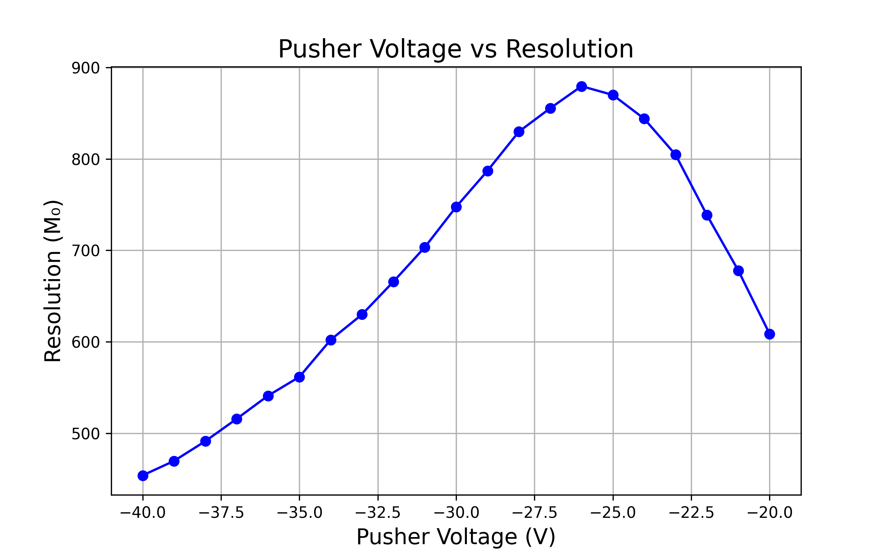

The maximum resolution 879.3759 occurs at pusher voltage -26V.
