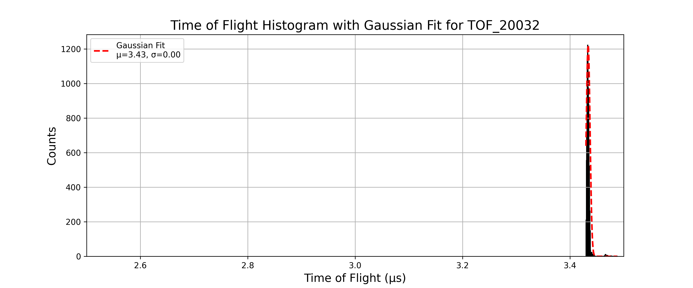
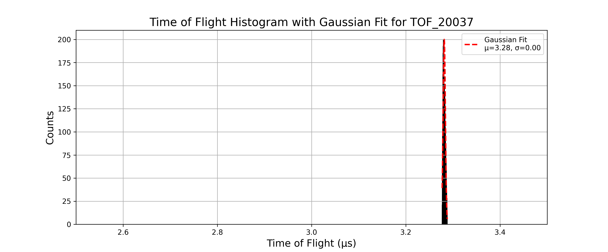
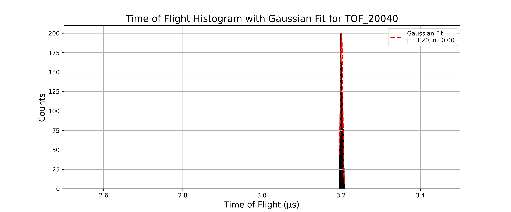
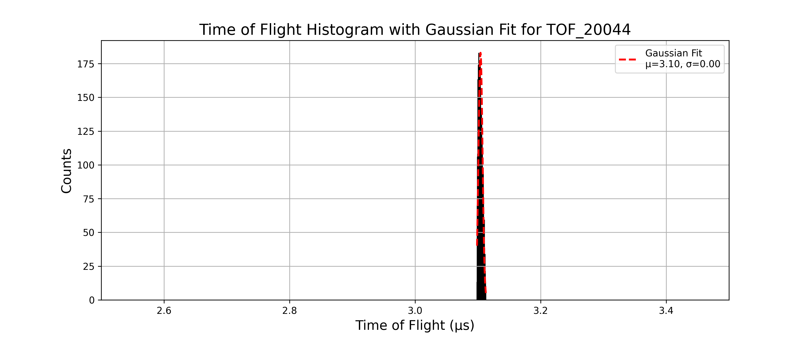
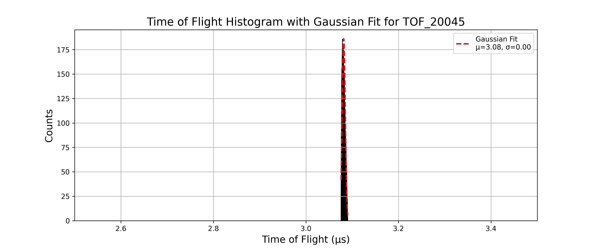
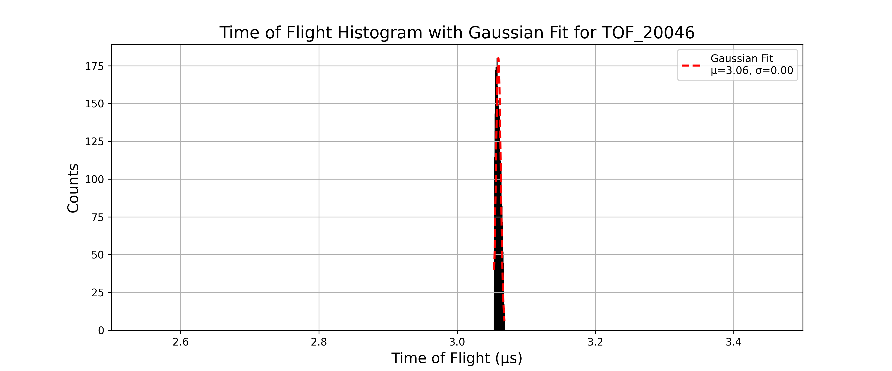
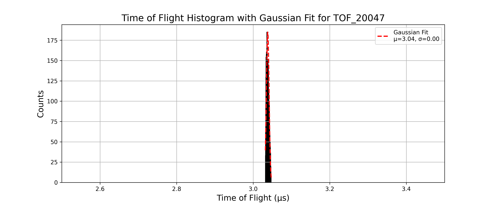
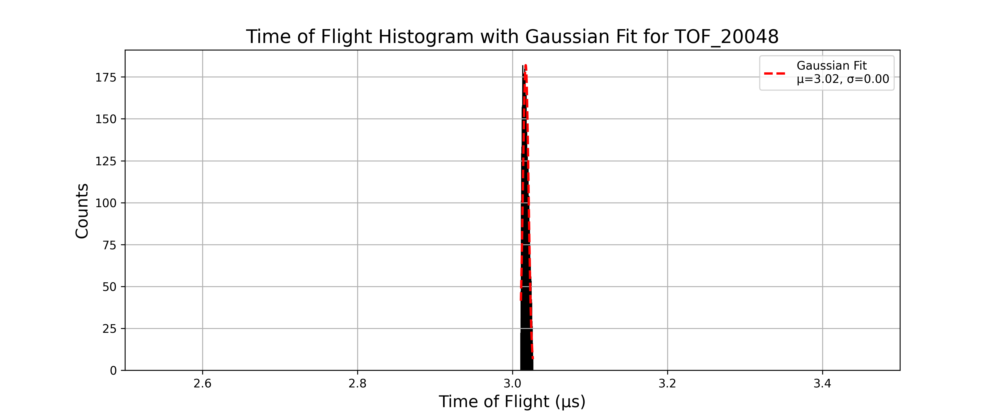

## Part 2
---
- For all the simulation in this part I use the structure 
    - Number of particles: 10,000  
    - Charge: -1  
    - Mass: 10 (single value)  
    - Source position: spherical distribution — center (23, 80, 80), radius = 1  
    - Azimuth: 0°, Elevation: 0°  
    - Kinetic Energy (KE): 3 eV  
    - Lens 1,2,3,4 and flight tube voltages: 0 V  
    - Magnetic Field: 50 G
    
### TOF_20030.txt
- pusher voltage: -30V
- The histogram is given as:


- Gaussian fit parameters and resolution:

```text
Mean (μ): 3.5054, Standard Deviation (σ): 0.0075 for TOF_20030
Resolution: M₀ = 234.0977 for TOF_20030
```
---

### TOF_20031.txt
- pusher voltage: -31V
- The histogram is given as:


- Gaussian fit parameters and resolution:

```text
Mean (μ): 3.4682, Standard Deviation (σ): 0.0040 for TOF_20031
Resolution: M₀ = 432.2605 for TOF_20031
```
---

### TOF_20032.txt
- pusher voltage: -32V
- The histogram is given as:



- Gaussian fit parameters and resolution:

```text
Mean (μ): 3.4338, Standard Deviation (σ): 0.0036 for TOF_20032
Resolution: M₀ = 481.2520 for TOF_20032
```
---

### TOF_20033.txt
- pusher voltage: -33V
- The histogram is given as:


- Gaussian fit parameters and resolution:

```text
Mean (μ): 3.4009, Standard Deviation (σ): 0.0019 for TOF_20033
Resolution: M₀ = 892.7769 for TOF_20033
```
---

### TOF_20034.txt
- pusher voltage: -34V
- The histogram is given as:


- Gaussian fit parameters and resolution:

```text
Mean (μ): 3.3696, Standard Deviation (σ): 0.0020 for TOF_20034
Resolution: M₀ = 822.3315 for TOF_20034
```
---

### TOF_20035.txt
- pusher voltage: -35V
- The histogram is given as:


- Gaussian fit parameters and resolution:

```text
Mean (μ): 3.3393, Standard Deviation (σ): 0.0022 for TOF_20035
Resolution: M₀ = 769.3506 for TOF_20035
```
---

### TOF_20036.txt
- pusher voltage: -36V
- The histogram is given as:


- Gaussian fit parameters and resolution:

```text
Mean (μ): 3.3099, Standard Deviation (σ): 0.0023 for TOF_20036
Resolution: M₀ = 718.8920 for TOF_20036
```
---

### TOF_20037.txt
- pusher voltage: -37V
- The histogram is given as:



- Gaussian fit parameters and resolution:

```text
Mean (μ): 3.2815, Standard Deviation (σ): 0.0024 for TOF_20037
Resolution: M₀ = 671.9421 for TOF_20037
```
---

### TOF_20038.txt
- pusher voltage: -38V
- The histogram is given as:


- Gaussian fit parameters and resolution:

```text
Mean (μ): 3.2539, Standard Deviation (σ): 0.0026 for TOF_20038
Resolution: M₀ = 636.3202 for TOF_20038
```
---

### TOF_20039.txt
- pusher voltage: -39V
- The histogram is given as:


- Gaussian fit parameters and resolution:

```text
Mean (μ): 3.2272, Standard Deviation (σ): 0.0027 for TOF_20039
Resolution: M₀ = 597.6553 for TOF_20039
```
---

### TOF_20040.txt
- pusher voltage: -40V
- The histogram is given as:



- Gaussian fit parameters and resolution:

```text
Mean (μ): 3.2011, Standard Deviation (σ): 0.0028 for TOF_20040
Resolution: M₀ = 574.9504 for TOF_20040
```
---

### TOF_20041.txt
- pusher voltage: -41V
- The histogram is given as:


- Gaussian fit parameters and resolution:

```text
Mean (μ): 3.1759, Standard Deviation (σ): 0.0029 for TOF_20041
Resolution: M₀ = 548.6625 for TOF_20041
```
---

### TOF_20042.txt
- pusher voltage: -42V
- The histogram is given as:


- Gaussian fit parameters and resolution:

```text
Mean (μ): 3.1514, Standard Deviation (σ): 0.0030 for TOF_20042
Resolution: M₀ = 521.3390 for TOF_20042
```
---

### TOF_20043.txt
- pusher voltage: -43V
- The histogram is given as:


- Gaussian fit parameters and resolution:

```text
Mean (μ): 3.1275, Standard Deviation (σ): 0.0031 for TOF_20043
Resolution: M₀ = 496.6563 for TOF_20043
```
---

### TOF_20044.txt
- pusher voltage: -44V
- The histogram is given as:



- Gaussian fit parameters and resolution:

```text
Mean (μ): 3.1042, Standard Deviation (σ): 0.0032 for TOF_20044
Resolution: M₀ = 487.1032 for TOF_20044
```
---

### TOF_20045.txt
- pusher voltage: -45V
- The histogram is given as:



- Gaussian fit parameters and resolution:

```text
Mean (μ): 3.0816, Standard Deviation (σ): 0.0033 for TOF_20045
Resolution: M₀ = 465.7599 for TOF_20045
```
---

### TOF_20046.txt
- pusher voltage: -46V
- The histogram is given as:



- Gaussian fit parameters and resolution:

```text
Mean (μ): 3.0596, Standard Deviation (σ): 0.0034 for TOF_20046
Resolution: M₀ = 446.6097 for TOF_20046
```
---

### TOF_20047.txt
- pusher voltage: -47V
- The histogram is given as:



- Gaussian fit parameters and resolution:

```text
Mean (μ): 3.0380, Standard Deviation (σ): 0.0035 for TOF_20047
Resolution: M₀ = 436.7901 for TOF_20047
```
---

### TOF_20048.txt
- pusher voltage: -48V
- The histogram is given as:



- Gaussian fit parameters and resolution:

```text
Mean (μ): 3.0170, Standard Deviation (σ): 0.0036 for TOF_20048
Resolution: M₀ = 419.2321 for TOF_20048
```
---

### TOF_20049.txt
- pusher voltage: -49V
- The histogram is given as:


- Gaussian fit parameters and resolution:

```text
Mean (μ): 2.9965, Standard Deviation (σ): 0.0036 for TOF_20049
Resolution: M₀ = 414.6145 for TOF_20049
```
---

### TOF_20050.txt
- pusher voltage: -50V
- The histogram is given as:


- Gaussian fit parameters and resolution:

```text
Mean (μ): 2.9766, Standard Deviation (σ): 0.0037 for TOF_20050
Resolution: M₀ = 398.9163 for TOF_20050
```
---

The resolution vs pusher voltage plot for this setup is:


The maximum resolution 892.7769 occurs at pusher voltage -33V.
