## Part 3
---
- For all the simulation in this part I use the structure 
    - Number of particles: 10,000  
    - Charge: -1  
    - Mass: 15 (single value)  
    - Source position: spherical distribution — center (23, 80, 80), radius = 1  
    - Azimuth: 0°, Elevation: 0°  
    - Kinetic Energy (KE): 3 eV  
    - Lens 1,2,3,4 and flight tube voltages: 0 V  
    - Magnetic Field: 50 G
    
### TOF_30050.txt
- pusher voltage: -50V
- The histogram is given as:

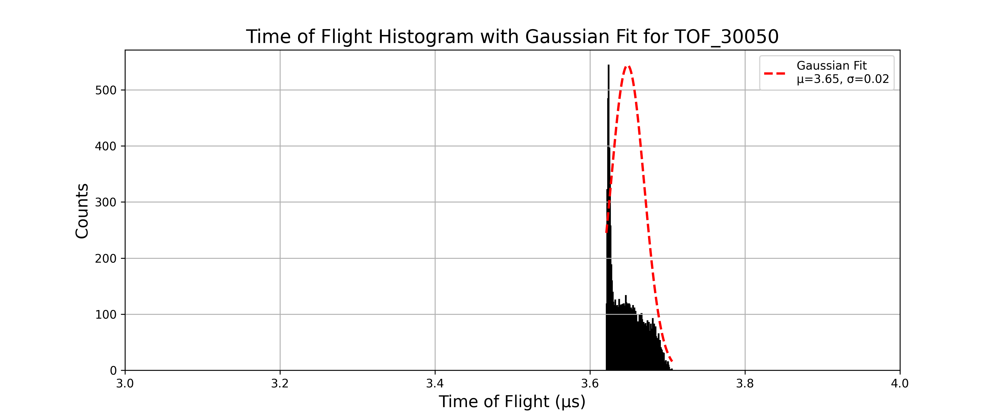

- Gaussian fit parameters and resolution:

```text
Mean (μ): 3.6484, Standard Deviation (σ): 0.0216 for TOF_30050
Resolution: M₀ = 84.3529 for TOF_30050
```
---

### TOF_30051.txt
- pusher voltage: -51V
- The histogram is given as:

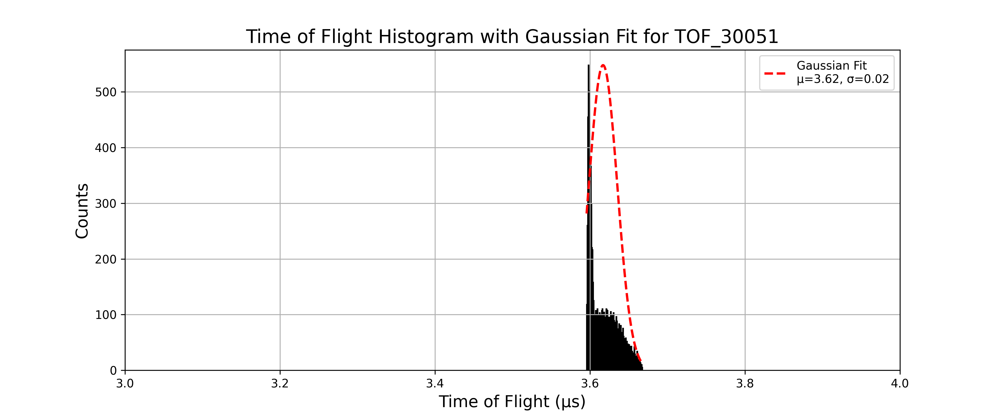

- Gaussian fit parameters and resolution:

```text
Mean (μ): 3.6168, Standard Deviation (σ): 0.0184 for TOF_30051
Resolution: M₀ = 98.3202 for TOF_30051
```
---

### TOF_30052.txt
- pusher voltage: -52V
- The histogram is given as:


- Gaussian fit parameters and resolution:

```text
Mean (μ): 3.5871, Standard Deviation (σ): 0.0157 for TOF_30052
Resolution: M₀ = 114.4004 for TOF_30052
```
---

### TOF_30053.txt
- pusher voltage: -53V
- The histogram is given as:

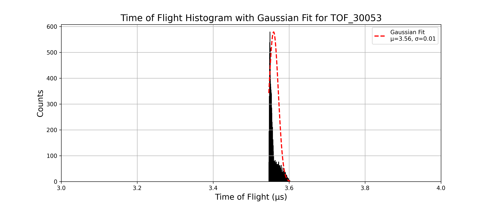

- Gaussian fit parameters and resolution:

```text
Mean (μ): 3.5592, Standard Deviation (σ): 0.0123 for TOF_30053
Resolution: M₀ = 144.2760 for TOF_30053
```
---

### TOF_30054.txt
- pusher voltage: -54V
- The histogram is given as:

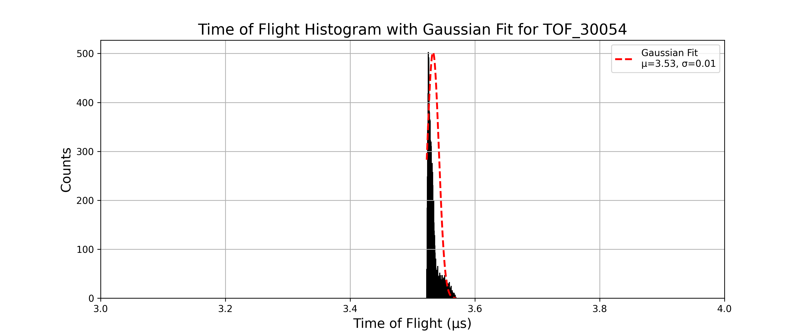

- Gaussian fit parameters and resolution:

```text
Mean (μ): 3.5328, Standard Deviation (σ): 0.0094 for TOF_30054
Resolution: M₀ = 188.7909 for TOF_30054
```
---

### TOF_30055.txt
- pusher voltage: -55V
- The histogram is given as:


- Gaussian fit parameters and resolution:

```text
Mean (μ): 3.5083, Standard Deviation (σ): 0.0070 for TOF_30055
Resolution: M₀ = 251.5495 for TOF_30055
```
---

### TOF_30056.txt
- pusher voltage: -56V
- The histogram is given as:


- Gaussian fit parameters and resolution:

```text
Mean (μ): 3.4846, Standard Deviation (σ): 0.0051 for TOF_30056
Resolution: M₀ = 342.8113 for TOF_30056
```
---

### TOF_30057.txt
- pusher voltage: -57V
- The histogram is given as:

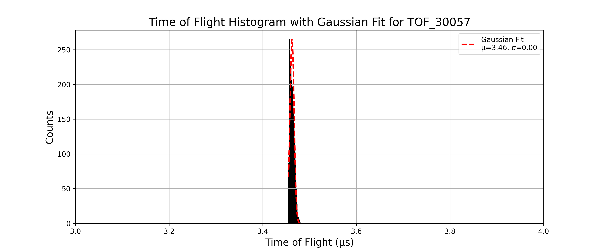

- Gaussian fit parameters and resolution:

```text
Mean (μ): 3.4626, Standard Deviation (σ): 0.0045 for TOF_30057
Resolution: M₀ = 384.5350 for TOF_30057
```
---

### TOF_30058.txt
- pusher voltage: -58V
- The histogram is given as:


- Gaussian fit parameters and resolution:

```text
Mean (μ): 3.4414, Standard Deviation (σ): 0.0046 for TOF_30058
Resolution: M₀ = 375.5634 for TOF_30058
```
---

### TOF_30059.txt
- pusher voltage: -59V
- The histogram is given as:


- Gaussian fit parameters and resolution:

```text
Mean (μ): 3.4210, Standard Deviation (σ): 0.0048 for TOF_30059
Resolution: M₀ = 356.6714 for TOF_30059
```
---

### TOF_30060.txt
- pusher voltage: -60V
- The histogram is given as:


- Gaussian fit parameters and resolution:

```text
Mean (μ): 3.4013, Standard Deviation (σ): 0.0049 for TOF_30060
Resolution: M₀ = 345.7805 for TOF_30060
```
---

### TOF_30061.txt
- pusher voltage: -61V
- The histogram is given as:

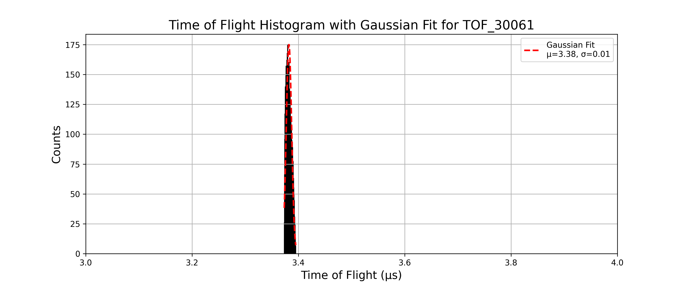

- Gaussian fit parameters and resolution:

```text
Mean (μ): 3.3822, Standard Deviation (σ): 0.0051 for TOF_30061
Resolution: M₀ = 334.5131 for TOF_30061
```
---

### TOF_30062.txt
- pusher voltage: -62V
- The histogram is given as:


- Gaussian fit parameters and resolution:

```text
Mean (μ): 3.3632, Standard Deviation (σ): 0.0050 for TOF_30062
Resolution: M₀ = 333.3564 for TOF_30062
```
---

### TOF_30063.txt
- pusher voltage: -63V
- The histogram is given as:


- Gaussian fit parameters and resolution:

```text
Mean (μ): 3.3447, Standard Deviation (σ): 0.0051 for TOF_30063
Resolution: M₀ = 326.5689 for TOF_30063
```
---

### TOF_30064.txt
- pusher voltage: -64V
- The histogram is given as:

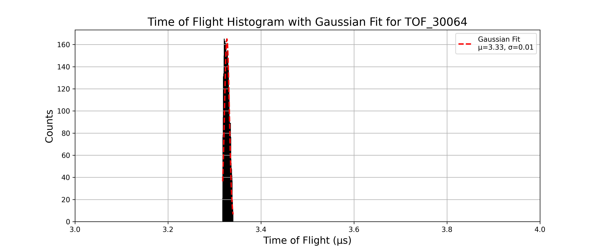

- Gaussian fit parameters and resolution:

```text
Mean (μ): 3.3267, Standard Deviation (σ): 0.0052 for TOF_30064
Resolution: M₀ = 319.4306 for TOF_30064
```
---

### TOF_30065.txt
- pusher voltage: -65V
- The histogram is given as:


- Gaussian fit parameters and resolution:

```text
Mean (μ): 3.3088, Standard Deviation (σ): 0.0052 for TOF_30065
Resolution: M₀ = 320.2183 for TOF_30065
```
---

### TOF_30066.txt
- pusher voltage: -66V
- The histogram is given as:

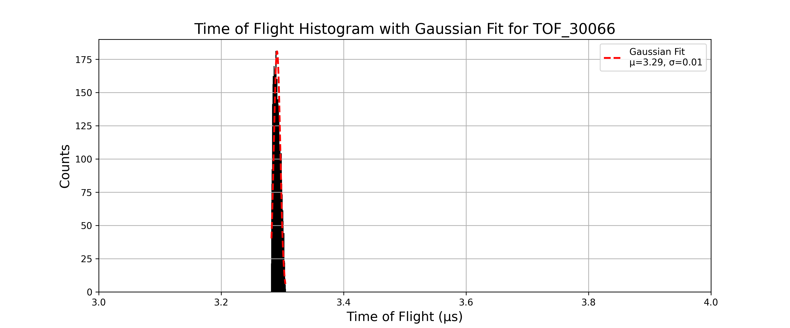

- Gaussian fit parameters and resolution:

```text
Mean (μ): 3.2912, Standard Deviation (σ): 0.0052 for TOF_30066
Resolution: M₀ = 313.7719 for TOF_30066
```
---

### TOF_30067.txt
- pusher voltage: -67V
- The histogram is given as:

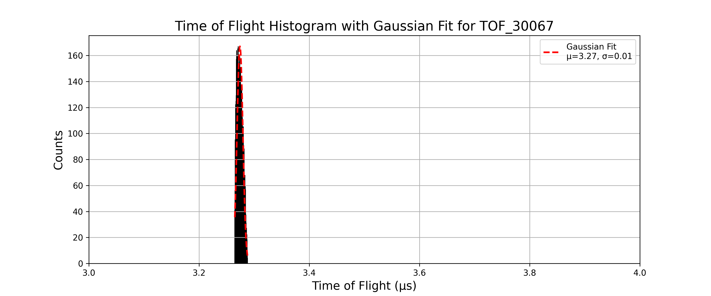

- Gaussian fit parameters and resolution:

```text
Mean (μ): 3.2742, Standard Deviation (σ): 0.0053 for TOF_30067
Resolution: M₀ = 308.3793 for TOF_30067
```
---

### TOF_30068.txt
- pusher voltage: -68V
- The histogram is given as:

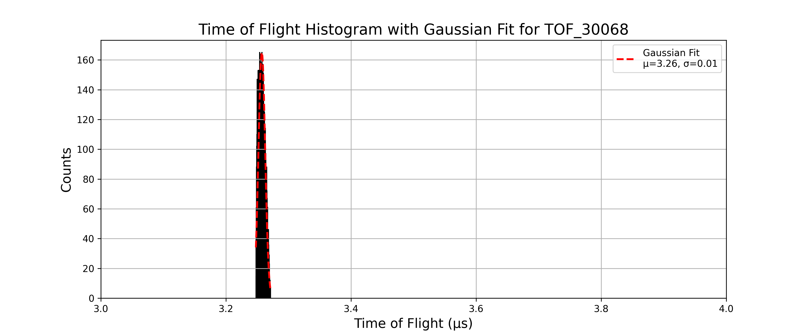

- Gaussian fit parameters and resolution:

```text
Mean (μ): 3.2573, Standard Deviation (σ): 0.0053 for TOF_30068
Resolution: M₀ = 304.7798 for TOF_30068
```
---

### TOF_30069.txt
- pusher voltage: -69V
- The histogram is given as:


- Gaussian fit parameters and resolution:

```text
Mean (μ): 3.2407, Standard Deviation (σ): 0.0054 for TOF_30069
Resolution: M₀ = 299.0490 for TOF_30069
```
---

### TOF_30070.txt
- pusher voltage: -70V
- The histogram is given as:

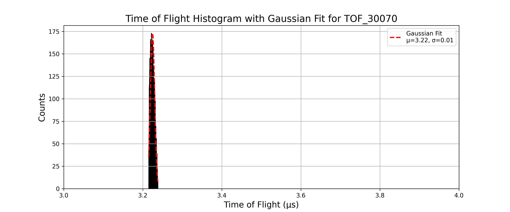

- Gaussian fit parameters and resolution:

```text
Mean (μ): 3.2246, Standard Deviation (σ): 0.0054 for TOF_30070
Resolution: M₀ = 298.2709 for TOF_30070
```
---

The resolution vs pusher voltage plot for this setup is:


The maximum resolution 384.5350 occurs at pusher voltage -57V.
