## Part 4
---
- For all the simulation in this part I use the structure 
    - Number of particles - 10,000
    - charge (-1)
    - mass -  single value - 5
    - source position - spherical distribution - center(23,80,80) radius(1)
    - Azimuth (0) , Elevation (0)
    - KE (3)
    - Lens 1,2,3,4 and flight tube voltage (00 V)
    - Magnetic Field - 50 G

### TOF_420.txt
- pusher voltage: -20V
- The histogram is given as:

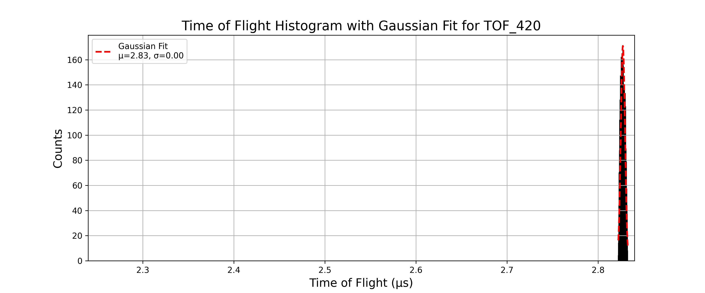

- Gaussian fit parameters and resolution:

```text
Mean (μ): 2.8272, Standard Deviation (σ): 0.0023 for TOF_420
Resolution: M₀ = 608.6528 for TOF_420
```
---

### TOF_421.txt
- pusher voltage: -21V
- The histogram is given as:

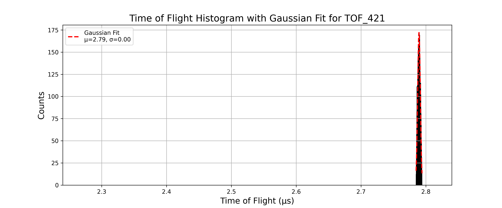

- Gaussian fit parameters and resolution:

```text
Mean (μ): 2.7894, Standard Deviation (σ): 0.0021 for TOF_421
Resolution: M₀ = 677.9655 for TOF_421
```
---

### TOF_422.txt
- pusher voltage: -22V
- The histogram is given as:

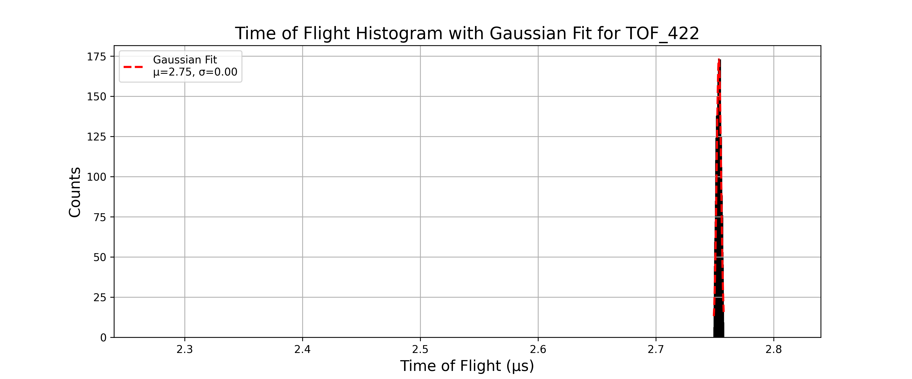

- Gaussian fit parameters and resolution:

```text
Mean (μ): 2.7535, Standard Deviation (σ): 0.0019 for TOF_422
Resolution: M₀ = 738.5214 for TOF_422
```
---

### TOF_423.txt
- pusher voltage: -23V
- The histogram is given as:

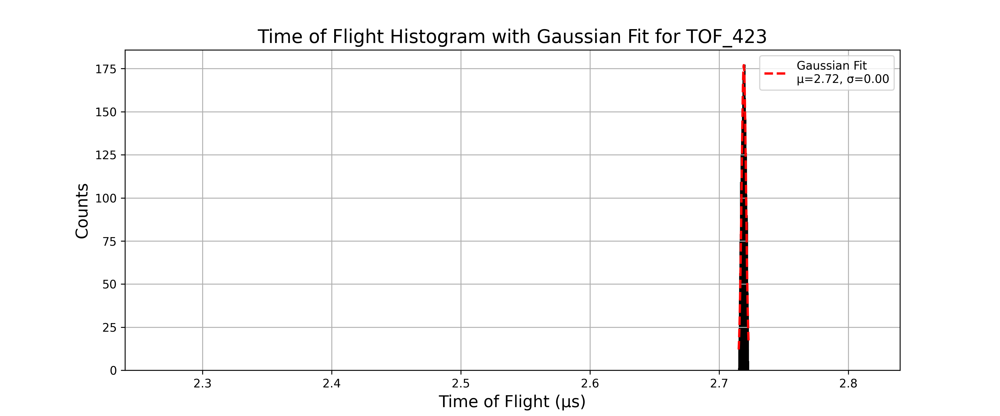

- Gaussian fit parameters and resolution:

```text
Mean (μ): 2.7191, Standard Deviation (σ): 0.0017 for TOF_423
Resolution: M₀ = 804.4702 for TOF_423
```
---

### TOF_424.txt
- pusher voltage: -24V
- The histogram is given as:

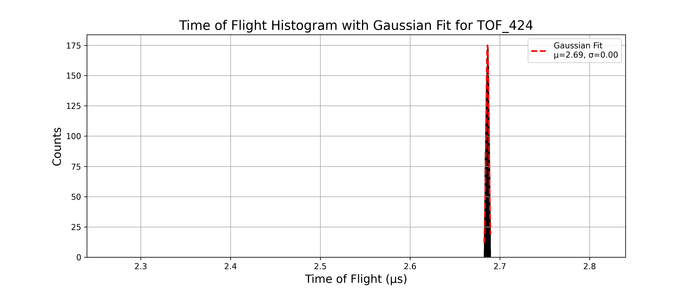

- Gaussian fit parameters and resolution:

```text
Mean (μ): 2.6862, Standard Deviation (σ): 0.0016 for TOF_424
Resolution: M₀ = 843.7715 for TOF_424
```
---

### TOF_425.txt
- pusher voltage: -25V
- The histogram is given as:

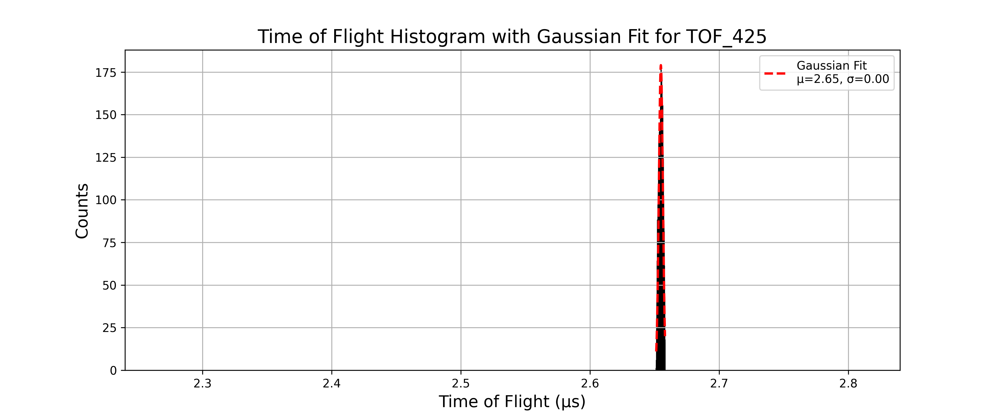

- Gaussian fit parameters and resolution:

```text
Mean (μ): 2.6549, Standard Deviation (σ): 0.0015 for TOF_425
Resolution: M₀ = 869.7935 for TOF_425
```
---

### TOF_426.txt
- pusher voltage: -26V
- The histogram is given as:

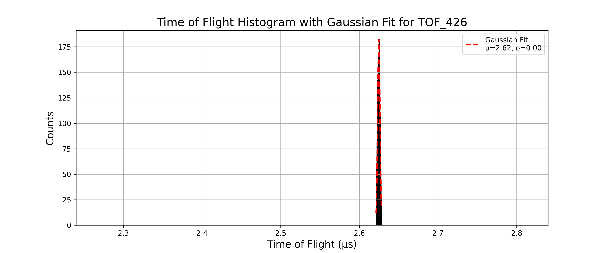

- Gaussian fit parameters and resolution:

```text
Mean (μ): 2.6248, Standard Deviation (σ): 0.0015 for TOF_426
Resolution: M₀ = 879.3759 for TOF_426
```
---

### TOF_427.txt
- pusher voltage: -27V
- The histogram is given as:

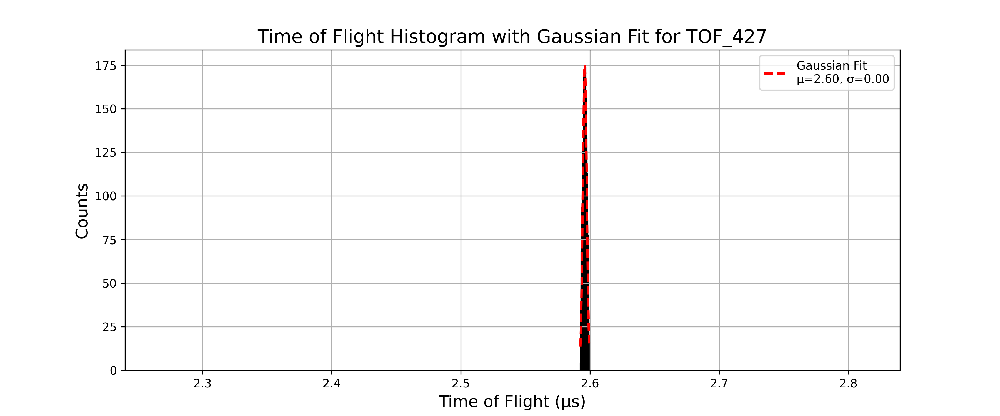

- Gaussian fit parameters and resolution:

```text
Mean (μ): 2.5960, Standard Deviation (σ): 0.0015 for TOF_427
Resolution: M₀ = 855.2658 for TOF_427
```
---

### TOF_428.txt
- pusher voltage: -28V
- The histogram is given as:

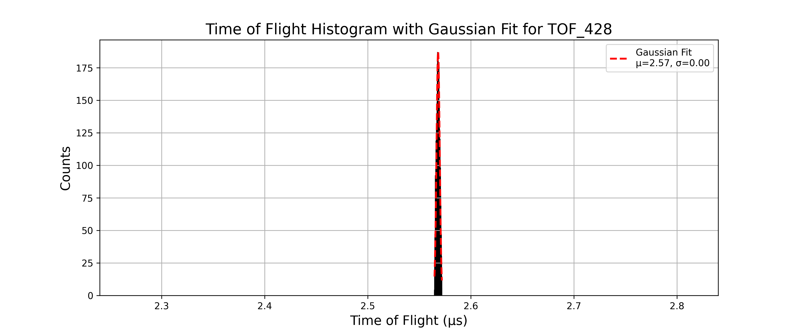

- Gaussian fit parameters and resolution:

```text
Mean (μ): 2.5683, Standard Deviation (σ): 0.0015 for TOF_428
Resolution: M₀ = 829.6655 for TOF_428
```
---

### TOF_429.txt
- pusher voltage: -29V
- The histogram is given as:

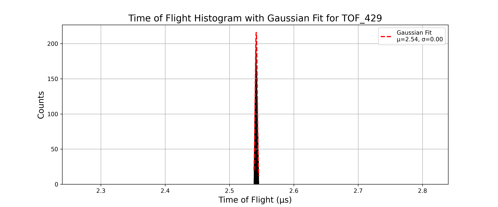

- Gaussian fit parameters and resolution:

```text
Mean (μ): 2.5416, Standard Deviation (σ): 0.0016 for TOF_429
Resolution: M₀ = 786.9454 for TOF_429
```
---

### TOF_430.txt
- pusher voltage: -30V
- The histogram is given as:

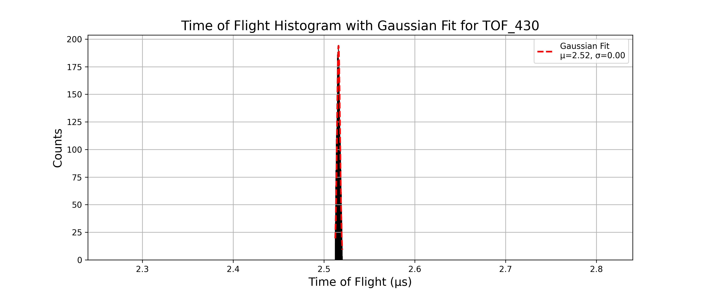

- Gaussian fit parameters and resolution:

```text
Mean (μ): 2.5160, Standard Deviation (σ): 0.0017 for TOF_430
Resolution: M₀ = 747.5100 for TOF_430
```
---

### TOF_431.txt
- pusher voltage: -31V
- The histogram is given as:

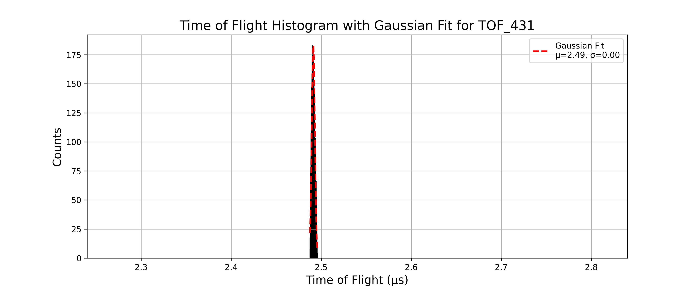

- Gaussian fit parameters and resolution:

```text
Mean (μ): 2.4912, Standard Deviation (σ): 0.0018 for TOF_431
Resolution: M₀ = 703.3694 for TOF_431
```
---

### TOF_432.txt
- pusher voltage: -32V
- The histogram is given as:

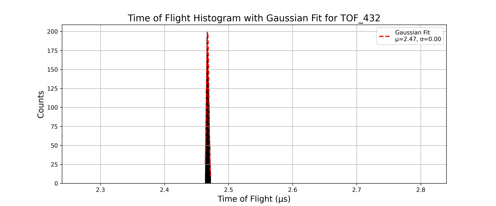

- Gaussian fit parameters and resolution:

```text
Mean (μ): 2.4674, Standard Deviation (σ): 0.0019 for TOF_432
Resolution: M₀ = 665.8420 for TOF_432
```
---

### TOF_433.txt
- pusher voltage: -33V
- The histogram is given as:

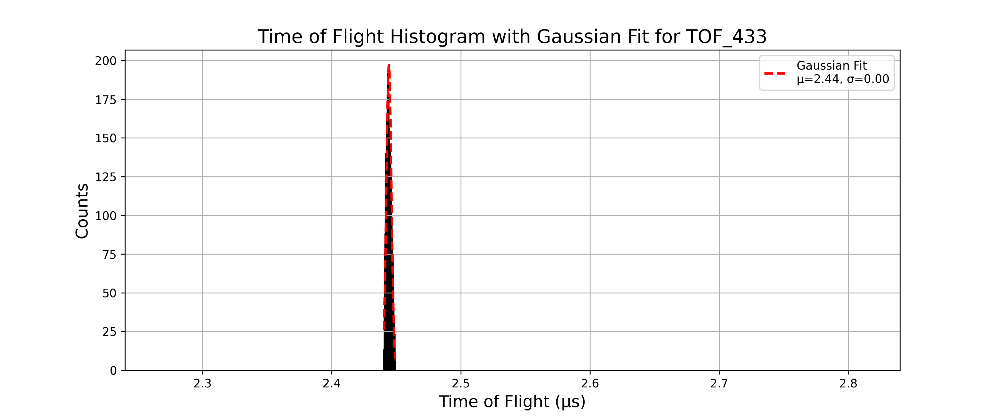

- Gaussian fit parameters and resolution:

```text
Mean (μ): 2.4443, Standard Deviation (σ): 0.0019 for TOF_433
Resolution: M₀ = 630.0221 for TOF_433
```
---

### TOF_434.txt
- pusher voltage: -34V
- The histogram is given as:

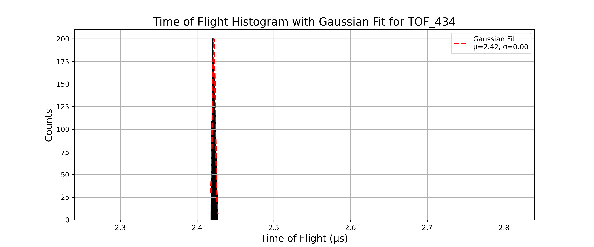

- Gaussian fit parameters and resolution:

```text
Mean (μ): 2.4220, Standard Deviation (σ): 0.0020 for TOF_434
Resolution: M₀ = 602.3372 for TOF_434
```
---

### TOF_435.txt
- pusher voltage: -35V
- The histogram is given as:

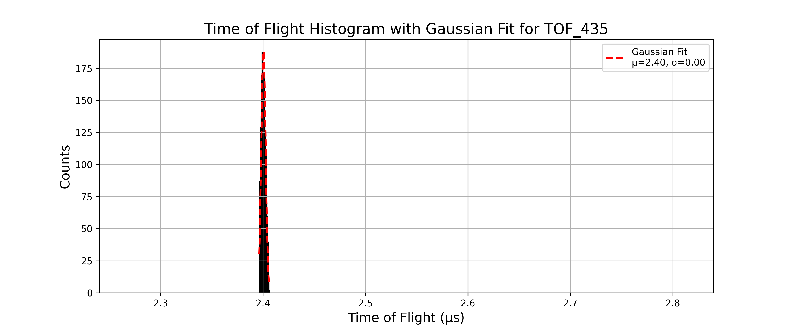

- Gaussian fit parameters and resolution:

```text
Mean (μ): 2.4004, Standard Deviation (σ): 0.0021 for TOF_435
Resolution: M₀ = 561.7344 for TOF_435
```
---

### TOF_436.txt
- pusher voltage: -36V
- The histogram is given as:

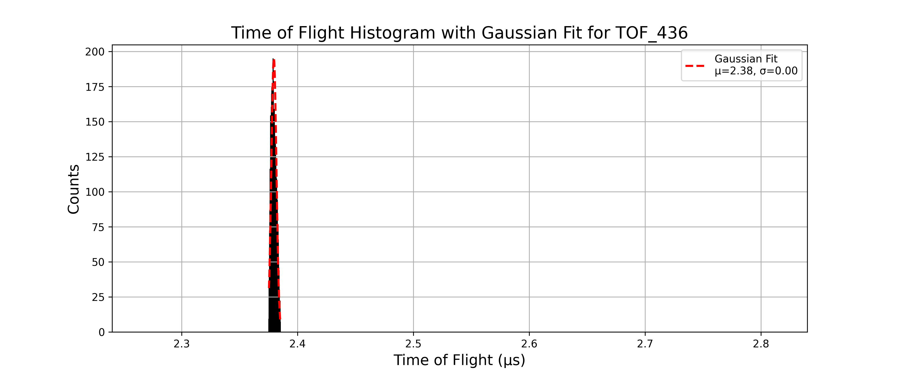

- Gaussian fit parameters and resolution:

```text
Mean (μ): 2.3796, Standard Deviation (σ): 0.0022 for TOF_436
Resolution: M₀ = 541.2152 for TOF_436
```
---

### TOF_437.txt
- pusher voltage: -37V
- The histogram is given as:

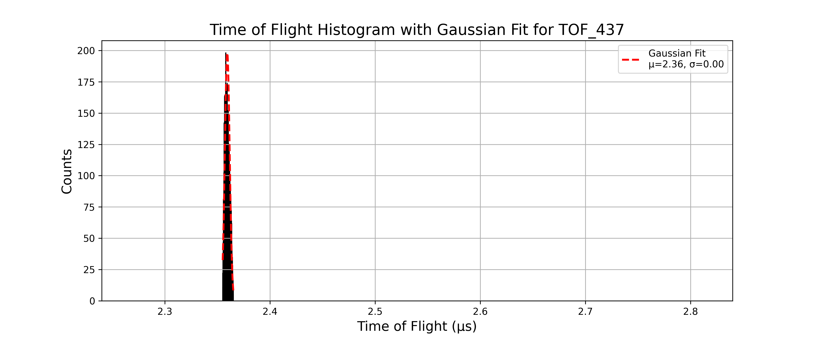

- Gaussian fit parameters and resolution:

```text
Mean (μ): 2.3594, Standard Deviation (σ): 0.0023 for TOF_437
Resolution: M₀ = 515.9305 for TOF_437
```
---

### TOF_438.txt
- pusher voltage: -38V
- The histogram is given as:

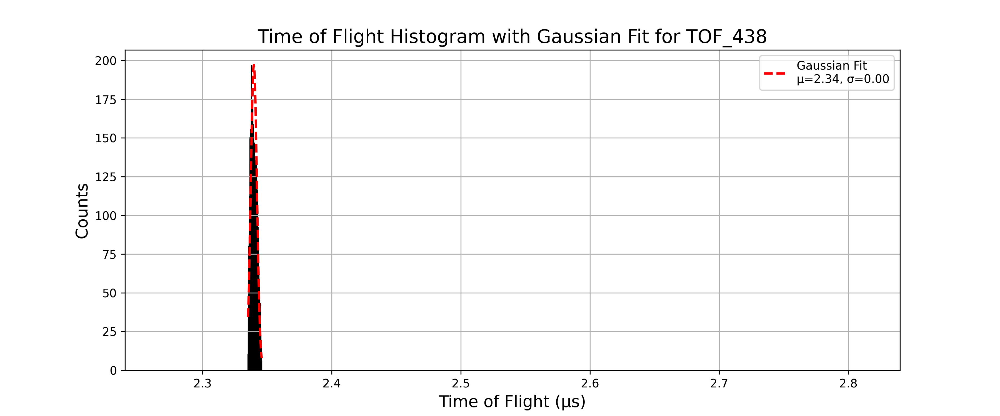

- Gaussian fit parameters and resolution:

```text
Mean (μ): 2.3398, Standard Deviation (σ): 0.0024 for TOF_438
Resolution: M₀ = 491.5023 for TOF_438
```
---

### TOF_439.txt
- pusher voltage: -39V
- The histogram is given as:

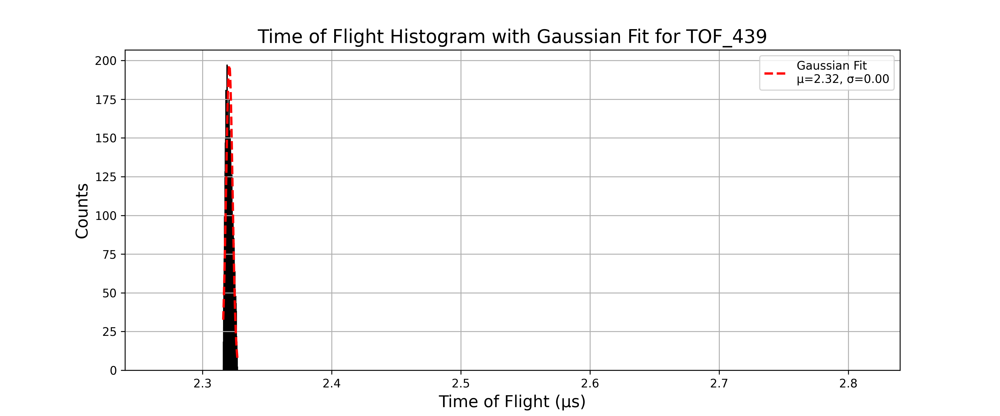

- Gaussian fit parameters and resolution:

```text
Mean (μ): 2.3207, Standard Deviation (σ): 0.0025 for TOF_439
Resolution: M₀ = 469.8987 for TOF_439
```
---

### TOF_440.txt
- pusher voltage: -40V
- The histogram is given as:

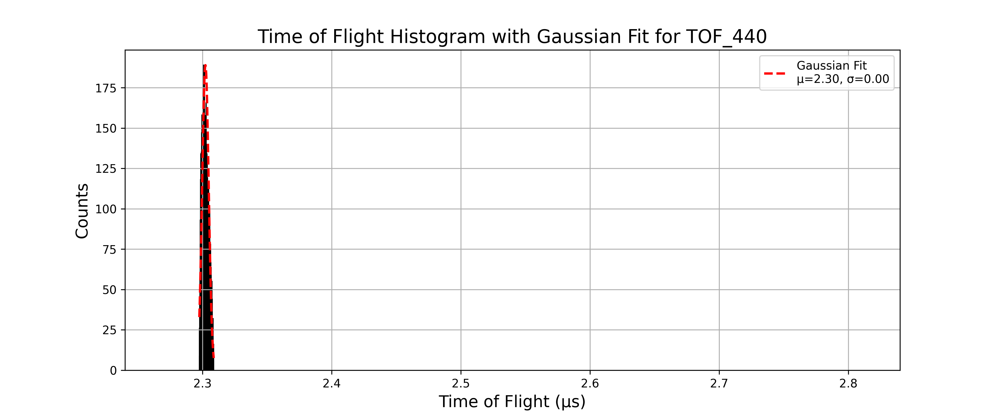

- Gaussian fit parameters and resolution:

```text
Mean (μ): 2.3023, Standard Deviation (σ): 0.0025 for TOF_440
Resolution: M₀ = 454.1571 for TOF_440
```
---

The resolution vs pusher voltage plot for this setup is:

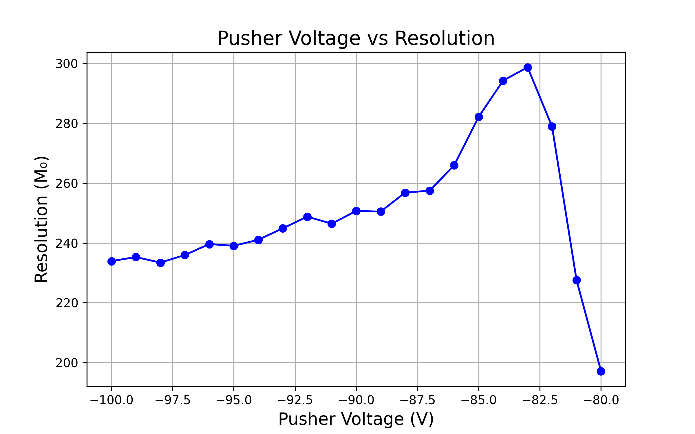
