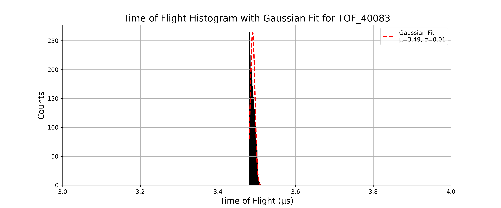
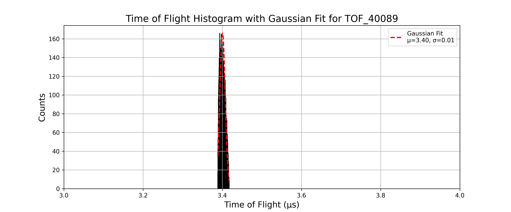
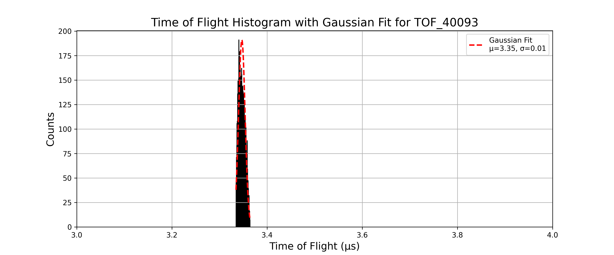
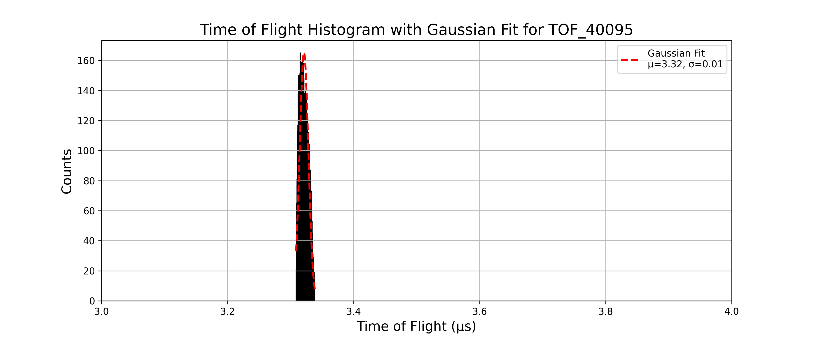
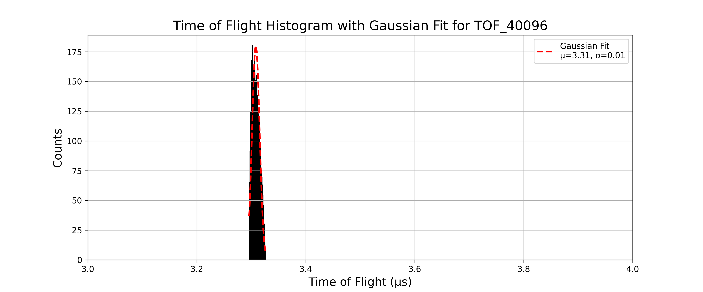
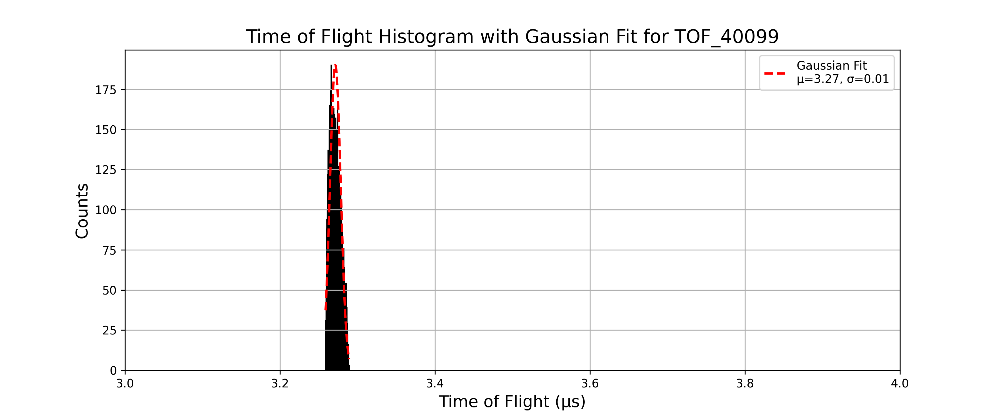
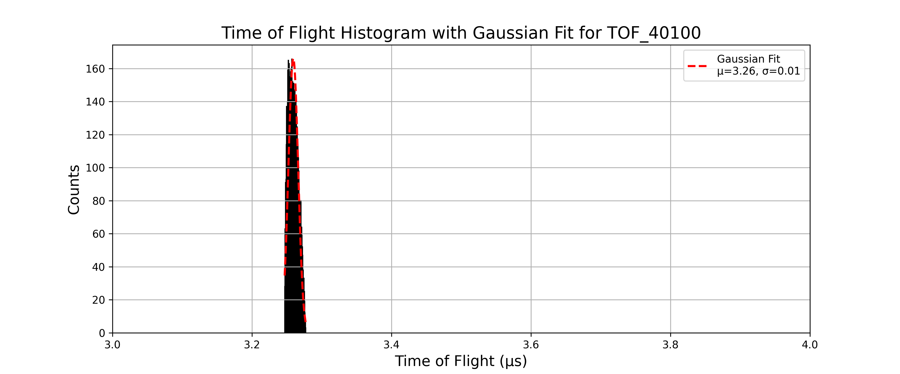

## Part 4
---
- For all the simulation in this part I use the structure 
    - Number of particles: 10,000  
    - Charge: -1  
    - Mass: 20 (single value)  
    - Source position: spherical distribution — center (23, 80, 80), radius = 1  
    - Azimuth: 0°, Elevation: 0°  
    - Kinetic Energy (KE): 3 eV  
    - Lens 1,2,3,4 and flight tube voltages: 0 V  
    - Magnetic Field: 50 G
    
### TOF_40080.txt
- pusher voltage: -80V
- The histogram is given as:


- Gaussian fit parameters and resolution:

```text
Mean (μ): 3.5413, Standard Deviation (σ): 0.0090 for TOF_40080
Resolution: M₀ = 197.1889 for TOF_40080
```
---

### TOF_40081.txt
- pusher voltage: -81V
- The histogram is given as:


- Gaussian fit parameters and resolution:

```text
Mean (μ): 3.5238, Standard Deviation (σ): 0.0077 for TOF_40081
Resolution: M₀ = 227.5923 for TOF_40081
```
---

### TOF_40082.txt
- pusher voltage: -82V
- The histogram is given as:


- Gaussian fit parameters and resolution:

```text
Mean (μ): 3.5059, Standard Deviation (σ): 0.0063 for TOF_40082
Resolution: M₀ = 278.8806 for TOF_40082
```
---

### TOF_40083.txt
- pusher voltage: -83V
- The histogram is given as:



- Gaussian fit parameters and resolution:

```text
Mean (μ): 3.4895, Standard Deviation (σ): 0.0058 for TOF_40083
Resolution: M₀ = 298.6782 for TOF_40083
```
---

### TOF_40084.txt
- pusher voltage: -84V
- The histogram is given as:


- Gaussian fit parameters and resolution:

```text
Mean (μ): 3.4733, Standard Deviation (σ): 0.0059 for TOF_40084
Resolution: M₀ = 294.2224 for TOF_40084
```
---

### TOF_40085.txt
- pusher voltage: -85V
- The histogram is given as:


- Gaussian fit parameters and resolution:

```text
Mean (μ): 3.4582, Standard Deviation (σ): 0.0061 for TOF_40085
Resolution: M₀ = 282.0743 for TOF_40085
```
---

### TOF_40086.txt
- pusher voltage: -86V
- The histogram is given as:


- Gaussian fit parameters and resolution:

```text
Mean (μ): 3.4433, Standard Deviation (σ): 0.0065 for TOF_40086
Resolution: M₀ = 265.9357 for TOF_40086
```
---

### TOF_40087.txt
- pusher voltage: -87V
- The histogram is given as:


- Gaussian fit parameters and resolution:

```text
Mean (μ): 3.4288, Standard Deviation (σ): 0.0067 for TOF_40087
Resolution: M₀ = 257.4361 for TOF_40087
```
---

### TOF_40088.txt
- pusher voltage: -88V
- The histogram is given as:


- Gaussian fit parameters and resolution:

```text
Mean (μ): 3.4145, Standard Deviation (σ): 0.0066 for TOF_40088
Resolution: M₀ = 256.8215 for TOF_40088
```
---

### TOF_40089.txt
- pusher voltage: -89V
- The histogram is given as:



- Gaussian fit parameters and resolution:

```text
Mean (μ): 3.4006, Standard Deviation (σ): 0.0068 for TOF_40089
Resolution: M₀ = 250.4545 for TOF_40089
```
---

### TOF_40090.txt
- pusher voltage: -90V
- The histogram is given as:


- Gaussian fit parameters and resolution:

```text
Mean (μ): 3.3870, Standard Deviation (σ): 0.0068 for TOF_40090
Resolution: M₀ = 250.6801 for TOF_40090
```
---

### TOF_40091.txt
- pusher voltage: -91V
- The histogram is given as:


- Gaussian fit parameters and resolution:

```text
Mean (μ): 3.3736, Standard Deviation (σ): 0.0068 for TOF_40091
Resolution: M₀ = 246.4283 for TOF_40091
```
---

### TOF_40092.txt
- pusher voltage: -92V
- The histogram is given as:


- Gaussian fit parameters and resolution:

```text
Mean (μ): 3.3600, Standard Deviation (σ): 0.0068 for TOF_40092
Resolution: M₀ = 248.7749 for TOF_40092
```
---

### TOF_40093.txt
- pusher voltage: -93V
- The histogram is given as:



- Gaussian fit parameters and resolution:

```text
Mean (μ): 3.3469, Standard Deviation (σ): 0.0068 for TOF_40093
Resolution: M₀ = 244.8790 for TOF_40093
```
---

### TOF_40094.txt
- pusher voltage: -94V
- The histogram is given as:


- Gaussian fit parameters and resolution:

```text
Mean (μ): 3.3338, Standard Deviation (σ): 0.0069 for TOF_40094
Resolution: M₀ = 241.0407 for TOF_40094
```
---

### TOF_40095.txt
- pusher voltage: -95V
- The histogram is given as:



- Gaussian fit parameters and resolution:

```text
Mean (μ): 3.3212, Standard Deviation (σ): 0.0069 for TOF_40095
Resolution: M₀ = 239.0383 for TOF_40095
```
---

### TOF_40096.txt
- pusher voltage: -96V
- The histogram is given as:



- Gaussian fit parameters and resolution:

```text
Mean (μ): 3.3083, Standard Deviation (σ): 0.0069 for TOF_40096
Resolution: M₀ = 239.6209 for TOF_40096
```
---

### TOF_40097.txt
- pusher voltage: -97V
- The histogram is given as:


- Gaussian fit parameters and resolution:

```text
Mean (μ): 3.2961, Standard Deviation (σ): 0.0070 for TOF_40097
Resolution: M₀ = 235.9598 for TOF_40097
```
---

### TOF_40098.txt
- pusher voltage: -98V
- The histogram is given as:


- Gaussian fit parameters and resolution:

```text
Mean (μ): 3.2837, Standard Deviation (σ): 0.0070 for TOF_40098
Resolution: M₀ = 233.4146 for TOF_40098
```
---

### TOF_40099.txt
- pusher voltage: -99V
- The histogram is given as:



- Gaussian fit parameters and resolution:

```text
Mean (μ): 3.2714, Standard Deviation (σ): 0.0070 for TOF_40099
Resolution: M₀ = 235.2853 for TOF_40099
```
---

### TOF_40100.txt
- pusher voltage: -100V
- The histogram is given as:



- Gaussian fit parameters and resolution:

```text
Mean (μ): 3.2592, Standard Deviation (σ): 0.0070 for TOF_40100
Resolution: M₀ = 233.9105 for TOF_40100
```
---

The resolution vs pusher voltage plot for this setup is:


The maximum resolution 298.6782 occurs at pusher voltage -83V.
