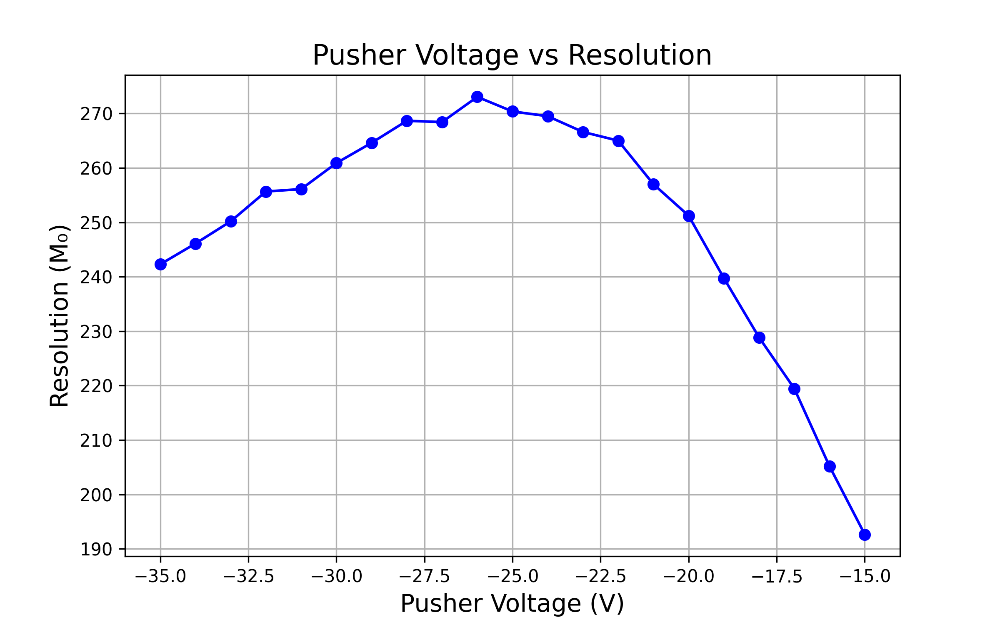

## Part 5
---
- For all the simulation in this part I use the structure 
    - Number of particles - 10,000
    - charge (-1)
    - mass -  single value - 15
    - source position - spherical distribution - center(23,80,80) radius(1)
    - Azimuth (0) , Elevation (0)
    - KE (3)
    - Lens 1,2,3,4 and flight tube voltage (00 V)
    - Magnetic Field - 50 G

### TOF_50040.txt
- pusher voltage: -40V
- The histogram is given as:


- Gaussian fit parameters and resolution:

```text
Mean (μ): 4.0324, Standard Deviation (σ): 0.0275 for TOF_50040
Resolution: M₀ = 73.3915 for TOF_50040
```
---

### TOF_50050.txt
- pusher voltage: -50V
- The histogram is given as:


- Gaussian fit parameters and resolution:

```text
Mean (μ): 3.6484, Standard Deviation (σ): 0.0216 for TOF_50050
Resolution: M₀ = 84.3529 for TOF_50050
```
---

### TOF_50051.txt
- pusher voltage: -51V
- The histogram is given as:


- Gaussian fit parameters and resolution:

```text
Mean (μ): 3.6168, Standard Deviation (σ): 0.0184 for TOF_50051
Resolution: M₀ = 98.3202 for TOF_50051
```
---

### TOF_50052.txt
- pusher voltage: -52V
- The histogram is given as:


- Gaussian fit parameters and resolution:

```text
Mean (μ): 3.5871, Standard Deviation (σ): 0.0157 for TOF_50052
Resolution: M₀ = 114.4004 for TOF_50052
```
---

### TOF_50053.txt
- pusher voltage: -53V
- The histogram is given as:


- Gaussian fit parameters and resolution:

```text
Mean (μ): 3.5592, Standard Deviation (σ): 0.0123 for TOF_50053
Resolution: M₀ = 144.2760 for TOF_50053
```
---

### TOF_50054.txt
- pusher voltage: -54V
- The histogram is given as:


- Gaussian fit parameters and resolution:

```text
Mean (μ): 3.5328, Standard Deviation (σ): 0.0094 for TOF_50054
Resolution: M₀ = 188.7909 for TOF_50054
```
---

### TOF_50055.txt
- pusher voltage: -55V
- The histogram is given as:


- Gaussian fit parameters and resolution:

```text
Mean (μ): 3.5083, Standard Deviation (σ): 0.0070 for TOF_50055
Resolution: M₀ = 251.5495 for TOF_50055
```
---

### TOF_50056.txt
- pusher voltage: -56V
- The histogram is given as:


- Gaussian fit parameters and resolution:

```text
Mean (μ): 3.4846, Standard Deviation (σ): 0.0051 for TOF_50056
Resolution: M₀ = 342.8113 for TOF_50056
```
---

### TOF_50057.txt
- pusher voltage: -57V
- The histogram is given as:


- Gaussian fit parameters and resolution:

```text
Mean (μ): 3.4626, Standard Deviation (σ): 0.0045 for TOF_50057
Resolution: M₀ = 384.5350 for TOF_50057
```
---

### TOF_50058.txt
- pusher voltage: -58V
- The histogram is given as:


- Gaussian fit parameters and resolution:

```text
Mean (μ): 3.4414, Standard Deviation (σ): 0.0046 for TOF_50058
Resolution: M₀ = 375.5634 for TOF_50058
```
---

### TOF_50059.txt
- pusher voltage: -59V
- The histogram is given as:


- Gaussian fit parameters and resolution:

```text
Mean (μ): 3.4210, Standard Deviation (σ): 0.0048 for TOF_50059
Resolution: M₀ = 356.6714 for TOF_50059
```
---

### TOF_50060.txt
- pusher voltage: -60V
- The histogram is given as:


- Gaussian fit parameters and resolution:

```text
Mean (μ): 3.4013, Standard Deviation (σ): 0.0049 for TOF_50060
Resolution: M₀ = 345.7805 for TOF_50060
```
---

### TOF_50061.txt
- pusher voltage: -61V
- The histogram is given as:


- Gaussian fit parameters and resolution:

```text
Mean (μ): 3.3822, Standard Deviation (σ): 0.0051 for TOF_50061
Resolution: M₀ = 334.5131 for TOF_50061
```
---

### TOF_50062.txt
- pusher voltage: -62V
- The histogram is given as:


- Gaussian fit parameters and resolution:

```text
Mean (μ): 3.3632, Standard Deviation (σ): 0.0050 for TOF_50062
Resolution: M₀ = 333.3564 for TOF_50062
```
---

### TOF_50063.txt
- pusher voltage: -63V
- The histogram is given as:


- Gaussian fit parameters and resolution:

```text
Mean (μ): 3.3447, Standard Deviation (σ): 0.0051 for TOF_50063
Resolution: M₀ = 326.5689 for TOF_50063
```
---

### TOF_50064.txt
- pusher voltage: -64V
- The histogram is given as:


- Gaussian fit parameters and resolution:

```text
Mean (μ): 3.3267, Standard Deviation (σ): 0.0052 for TOF_50064
Resolution: M₀ = 319.4306 for TOF_50064
```
---

### TOF_50065.txt
- pusher voltage: -65V
- The histogram is given as:


- Gaussian fit parameters and resolution:

```text
Mean (μ): 3.3088, Standard Deviation (σ): 0.0052 for TOF_50065
Resolution: M₀ = 320.2183 for TOF_50065
```
---

### TOF_50066.txt
- pusher voltage: -66V
- The histogram is given as:


- Gaussian fit parameters and resolution:

```text
Mean (μ): 3.2912, Standard Deviation (σ): 0.0052 for TOF_50066
Resolution: M₀ = 313.7719 for TOF_50066
```
---

### TOF_50067.txt
- pusher voltage: -67V
- The histogram is given as:


- Gaussian fit parameters and resolution:

```text
Mean (μ): 3.2742, Standard Deviation (σ): 0.0053 for TOF_50067
Resolution: M₀ = 308.3793 for TOF_50067
```
---

### TOF_50068.txt
- pusher voltage: -68V
- The histogram is given as:


- Gaussian fit parameters and resolution:

```text
Mean (μ): 3.2573, Standard Deviation (σ): 0.0053 for TOF_50068
Resolution: M₀ = 304.7798 for TOF_50068
```
---

### TOF_50069.txt
- pusher voltage: -69V
- The histogram is given as:


- Gaussian fit parameters and resolution:

```text
Mean (μ): 3.2407, Standard Deviation (σ): 0.0054 for TOF_50069
Resolution: M₀ = 299.0490 for TOF_50069
```
---

### TOF_50070.txt
- pusher voltage: -70V
- The histogram is given as:


- Gaussian fit parameters and resolution:

```text
Mean (μ): 3.2246, Standard Deviation (σ): 0.0054 for TOF_50070
Resolution: M₀ = 298.2709 for TOF_50070
```
---

### TOF_50080.txt
- pusher voltage: -80V
- The histogram is given as:


- Gaussian fit parameters and resolution:

```text
Mean (μ): 3.0762, Standard Deviation (σ): 0.0058 for TOF_50080
Resolution: M₀ = 265.0913 for TOF_50080
```
---

The resolution vs pusher voltage plot for this setup is:


