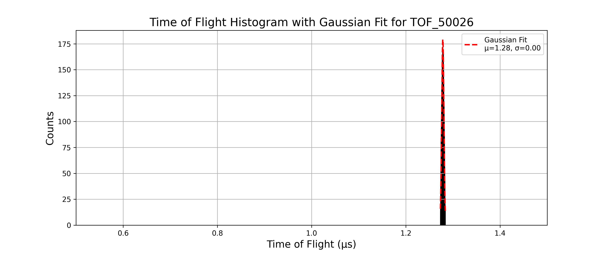
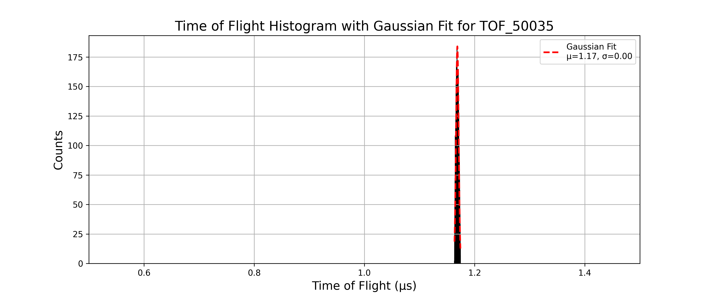

## Part 5
---
- For all the simulation in this part I use the structure 
    - Number of particles: 10,000  
    - Charge: -1  
    - Mass: _ (single value)  
    - Source position: spherical distribution — center (23, 80, 80), radius = 1  
    - Azimuth: 0°, Elevation: 0°  
    - Kinetic Energy (KE): 3 eV  
    - Lens 1,2,3,4 and flight tube voltages: 0 V  
    - Magnetic Field: 50 G
    
### TOF_50015.txt
- pusher voltage: -15V
- The histogram is given as:


- Gaussian fit parameters and resolution:

```text
Mean (μ): 1.4922, Standard Deviation (σ): 0.0039 for TOF_50015
Resolution: M₀ = 192.6521 for TOF_50015
```
---

### TOF_50016.txt
- pusher voltage: -16V
- The histogram is given as:


- Gaussian fit parameters and resolution:

```text
Mean (μ): 1.4668, Standard Deviation (σ): 0.0036 for TOF_50016
Resolution: M₀ = 205.1498 for TOF_50016
```
---

### TOF_50017.txt
- pusher voltage: -17V
- The histogram is given as:


- Gaussian fit parameters and resolution:

```text
Mean (μ): 1.4429, Standard Deviation (σ): 0.0033 for TOF_50017
Resolution: M₀ = 219.4446 for TOF_50017
```
---

### TOF_50018.txt
- pusher voltage: -18V
- The histogram is given as:


- Gaussian fit parameters and resolution:

```text
Mean (μ): 1.4204, Standard Deviation (σ): 0.0031 for TOF_50018
Resolution: M₀ = 228.8461 for TOF_50018
```
---

### TOF_50019.txt
- pusher voltage: -19V
- The histogram is given as:


- Gaussian fit parameters and resolution:

```text
Mean (μ): 1.3992, Standard Deviation (σ): 0.0029 for TOF_50019
Resolution: M₀ = 239.7471 for TOF_50019
```
---

### TOF_50020.txt
- pusher voltage: -20V
- The histogram is given as:


- Gaussian fit parameters and resolution:

```text
Mean (μ): 1.3792, Standard Deviation (σ): 0.0027 for TOF_50020
Resolution: M₀ = 251.2223 for TOF_50020
```
---

### TOF_50021.txt
- pusher voltage: -21V
- The histogram is given as:


- Gaussian fit parameters and resolution:

```text
Mean (μ): 1.3602, Standard Deviation (σ): 0.0026 for TOF_50021
Resolution: M₀ = 257.0203 for TOF_50021
```
---

### TOF_50022.txt
- pusher voltage: -22V
- The histogram is given as:


- Gaussian fit parameters and resolution:

```text
Mean (μ): 1.3423, Standard Deviation (σ): 0.0025 for TOF_50022
Resolution: M₀ = 265.0125 for TOF_50022
```
---

### TOF_50023.txt
- pusher voltage: -23V
- The histogram is given as:


- Gaussian fit parameters and resolution:

```text
Mean (μ): 1.3252, Standard Deviation (σ): 0.0025 for TOF_50023
Resolution: M₀ = 266.6146 for TOF_50023
```
---

### TOF_50024.txt
- pusher voltage: -24V
- The histogram is given as:


- Gaussian fit parameters and resolution:

```text
Mean (μ): 1.3089, Standard Deviation (σ): 0.0024 for TOF_50024
Resolution: M₀ = 269.5104 for TOF_50024
```
---

### TOF_50025.txt
- pusher voltage: -25V
- The histogram is given as:


- Gaussian fit parameters and resolution:

```text
Mean (μ): 1.2933, Standard Deviation (σ): 0.0024 for TOF_50025
Resolution: M₀ = 270.3854 for TOF_50025
```
---

### TOF_50026.txt
- pusher voltage: -26V
- The histogram is given as:



- Gaussian fit parameters and resolution:

```text
Mean (μ): 1.2785, Standard Deviation (σ): 0.0023 for TOF_50026
Resolution: M₀ = 273.0622 for TOF_50026
```
---

### TOF_50027.txt
- pusher voltage: -27V
- The histogram is given as:


- Gaussian fit parameters and resolution:

```text
Mean (μ): 1.2642, Standard Deviation (σ): 0.0024 for TOF_50027
Resolution: M₀ = 268.4335 for TOF_50027
```
---

### TOF_50028.txt
- pusher voltage: -28V
- The histogram is given as:


- Gaussian fit parameters and resolution:

```text
Mean (μ): 1.2506, Standard Deviation (σ): 0.0023 for TOF_50028
Resolution: M₀ = 268.6664 for TOF_50028
```
---

### TOF_50029.txt
- pusher voltage: -29V
- The histogram is given as:


- Gaussian fit parameters and resolution:

```text
Mean (μ): 1.2375, Standard Deviation (σ): 0.0023 for TOF_50029
Resolution: M₀ = 264.6127 for TOF_50029
```
---

### TOF_50030.txt
- pusher voltage: -30V
- The histogram is given as:


- Gaussian fit parameters and resolution:

```text
Mean (μ): 1.2250, Standard Deviation (σ): 0.0023 for TOF_50030
Resolution: M₀ = 260.8957 for TOF_50030
```
---

### TOF_50031.txt
- pusher voltage: -31V
- The histogram is given as:


- Gaussian fit parameters and resolution:

```text
Mean (μ): 1.2129, Standard Deviation (σ): 0.0024 for TOF_50031
Resolution: M₀ = 256.1107 for TOF_50031
```
---

### TOF_50032.txt
- pusher voltage: -32V
- The histogram is given as:


- Gaussian fit parameters and resolution:

```text
Mean (μ): 1.2012, Standard Deviation (σ): 0.0023 for TOF_50032
Resolution: M₀ = 255.6702 for TOF_50032
```
---

### TOF_50033.txt
- pusher voltage: -33V
- The histogram is given as:


- Gaussian fit parameters and resolution:

```text
Mean (μ): 1.1900, Standard Deviation (σ): 0.0024 for TOF_50033
Resolution: M₀ = 250.1831 for TOF_50033
```
---

### TOF_50034.txt
- pusher voltage: -34V
- The histogram is given as:


- Gaussian fit parameters and resolution:

```text
Mean (μ): 1.1792, Standard Deviation (σ): 0.0024 for TOF_50034
Resolution: M₀ = 246.1026 for TOF_50034
```
---

### TOF_50035.txt
- pusher voltage: -35V
- The histogram is given as:



- Gaussian fit parameters and resolution:

```text
Mean (μ): 1.1687, Standard Deviation (σ): 0.0024 for TOF_50035
Resolution: M₀ = 242.2876 for TOF_50035
```
---

The resolution vs pusher voltage plot for this setup is:


The maximum resolution 273.0622 occurs at pusher voltage -26V.
