# This is my logbook for my simulations run in SIMION

## Part 1
---
- For all the simulation in this part I use the structure 
    - Number of particles - 50,000
    - charge (-1)
    - mass -  single value - 10
    - source position - gaussian3d distribution - mean(23,80,80) std(1,1,1)
    - Azimuth (0) , Elevation (0)
    - KE (3)
    - Lens 1,2,3,4 and flight tube voltage (300 V)

### TOF11.txt
- pusher voltage -50V
- The histogram is given as 

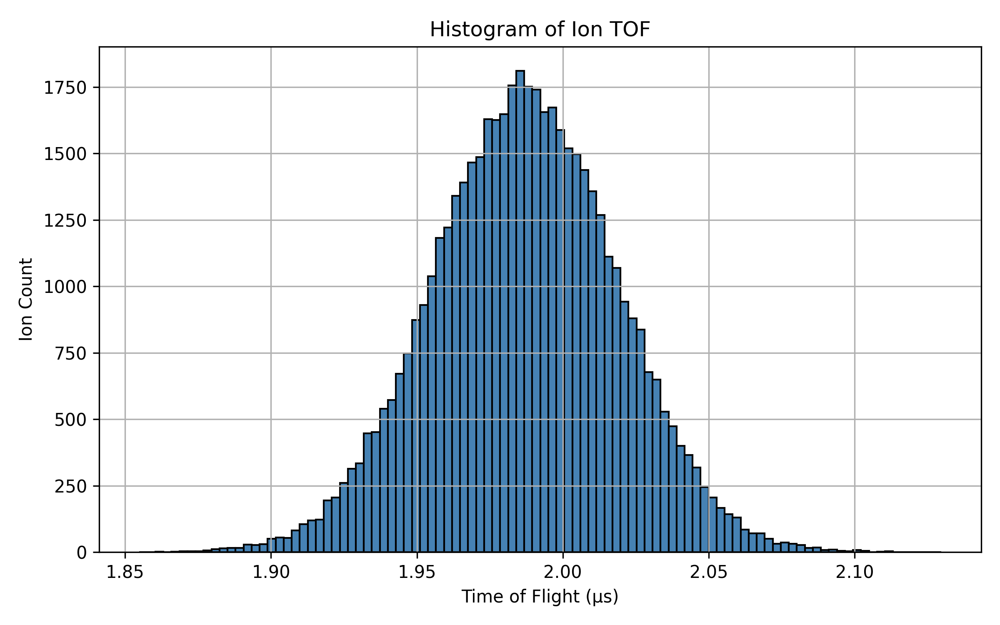

### TOF12.txt
- pusher voltage -100V
- The histogram is given as

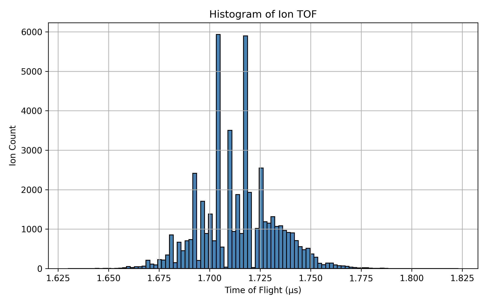

### TOF13.txt
- pusher voltage -200V
- The histogram is given as

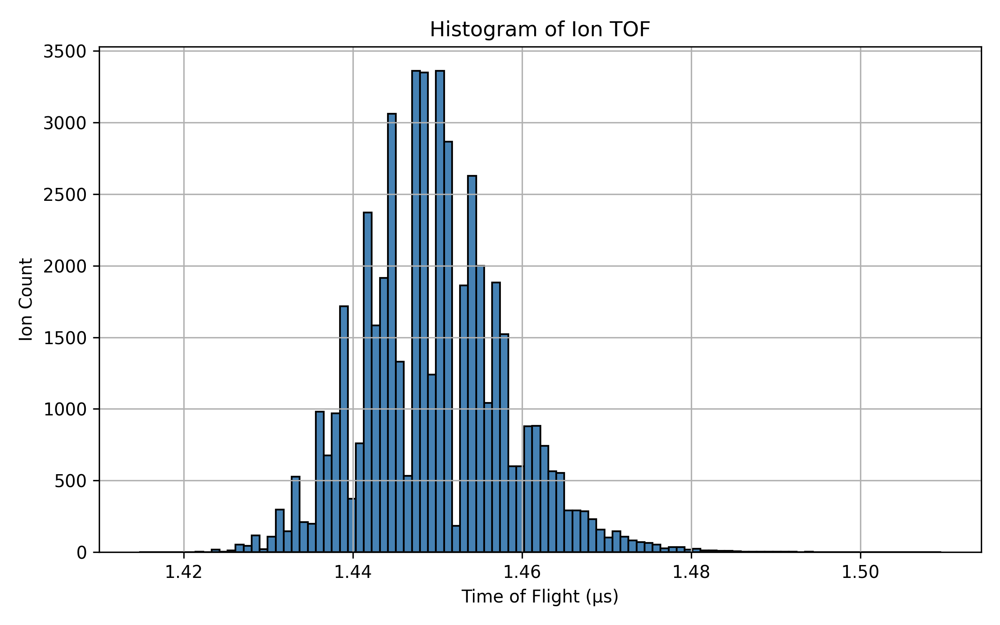

---

## Part 2
- For all the simulation in this part I use the structure 
    - Number of particles - 50,000
    - charge (-1)
    - mass - uniform distribution - min(1) and max(10)
    - source position - sphere distribution (23,80,80) radius (1) filled
    - Azimuth (0) , Elevation (0)
    - KE (3)
    - Lens 1,2,3,4 and flight tube voltage (300 V)

### TOF21.txt
- Pusher Voltage (-10)
- The histogram is given as 

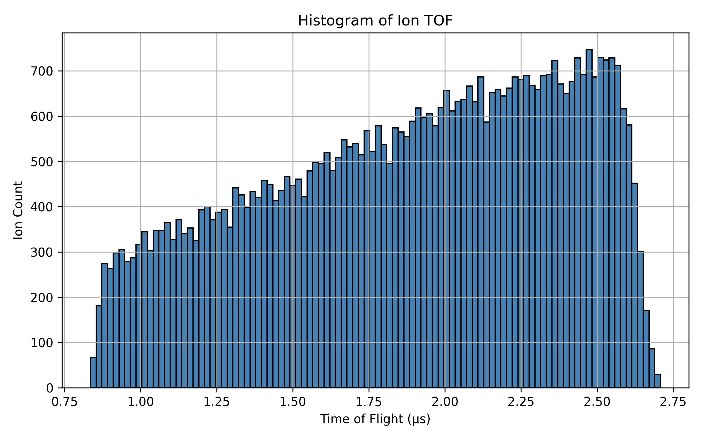

---

## Part 3
---
- For all the simulation in this part I use the structure 
    - Number of particles - 50,000
    - charge (-1)
    - mass - single value - 10
    - source position - sphere distribution (23,80,80) radius (1) filled
    - Azimuth (0) , Elevation (0)
    - KE (3)
    - Lens 1,2,3,4 and flight tube voltage (300 V)
---

### TOF30.txt
- with pusher voltage -03
- The histogram is given as

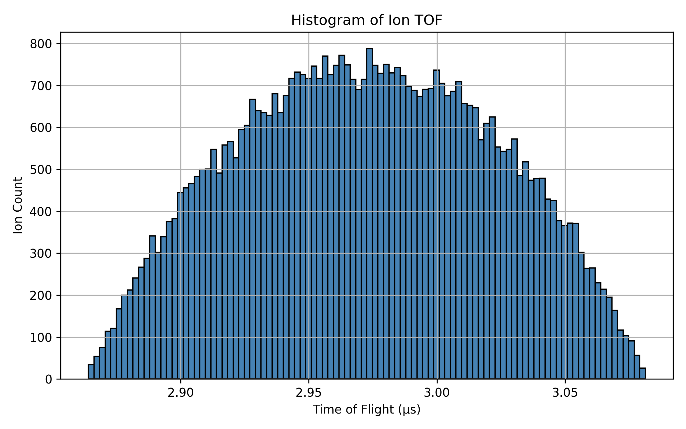

---

### TOF31.txt
- with pusher voltage -10
- The histogram is given as

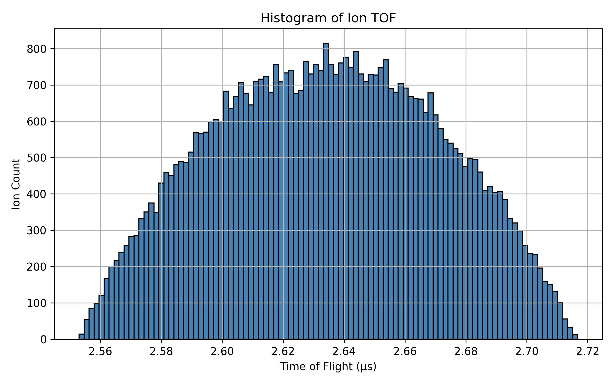

---

### TOF32.txt
- with pusher voltage -20
- The histogram is given as

---

### TOF33.txt
- with pusher voltage -30
- The histogram is given as

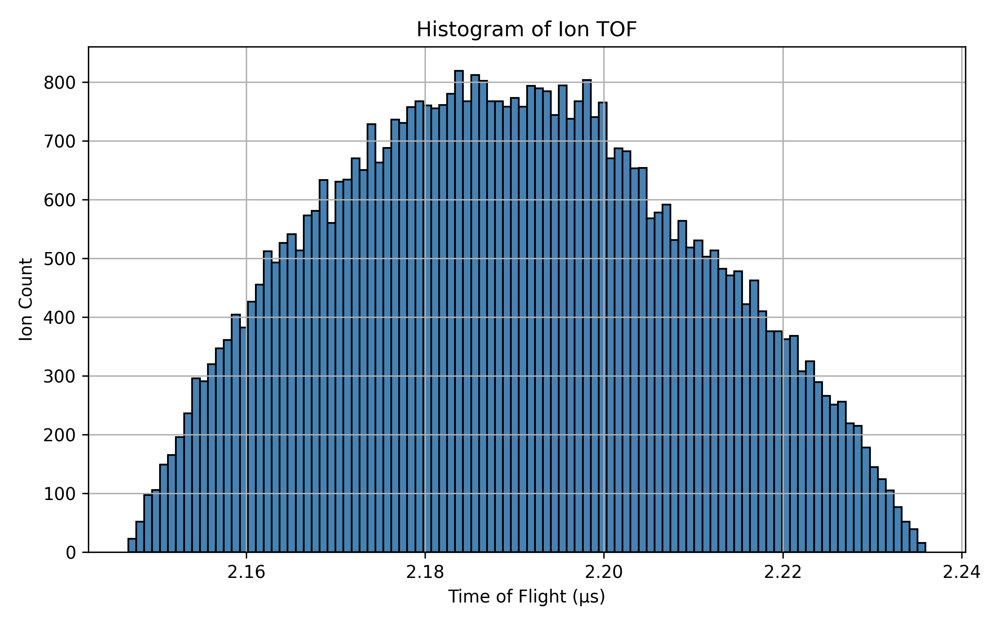

---

### TOF34.txt
- with pusher voltage -40
- The histogram is given as

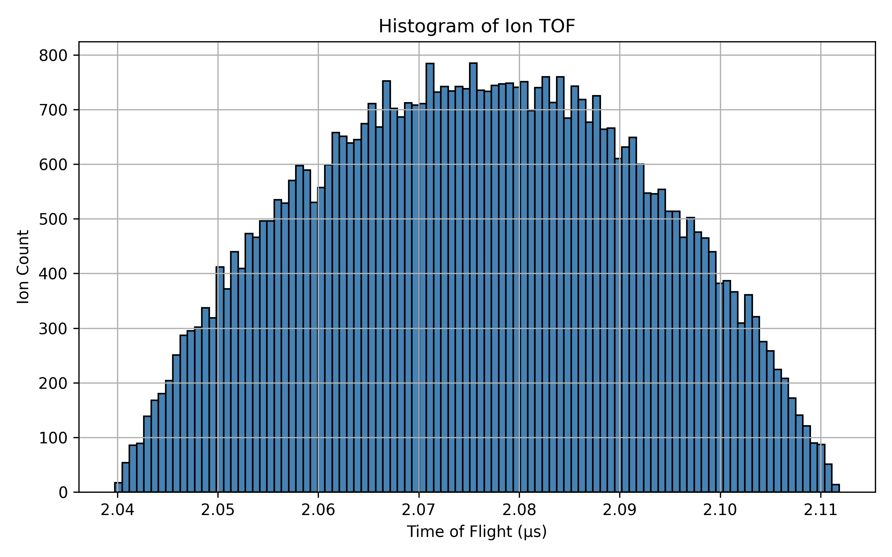

---

### TOF35.txt
- with pusher voltage -50
- The histogram is given as

---

### TOF36.txt
- with pusher voltage -60
- The histogram is given as

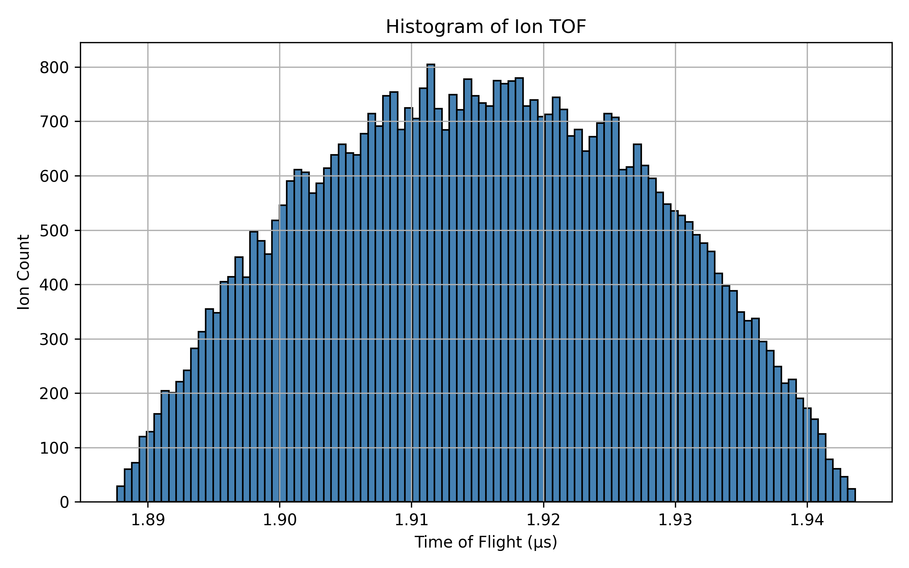

---

### TOF365.txt
- with pusher voltage -65
- The histogram is given as

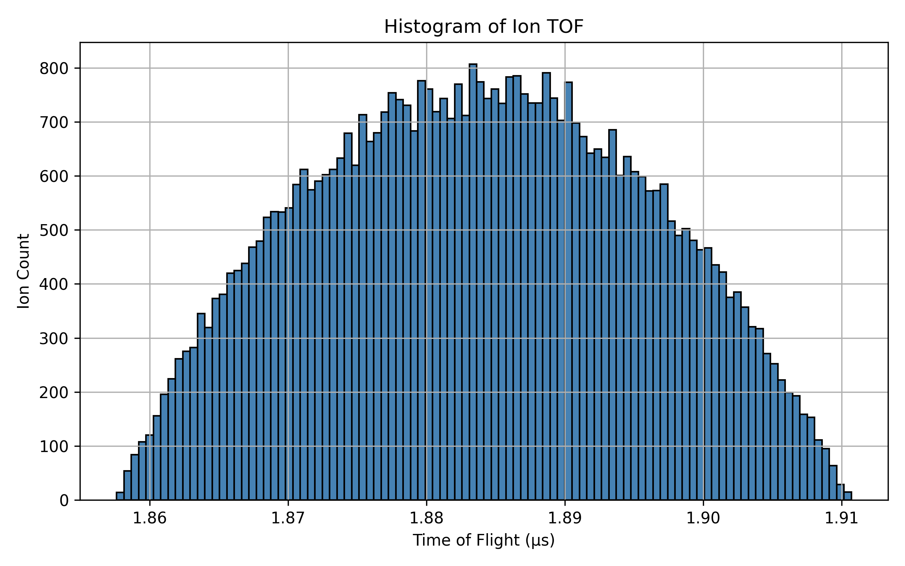

---

### TOF37.txt
- with pusher voltage -70
- The histogram is given as

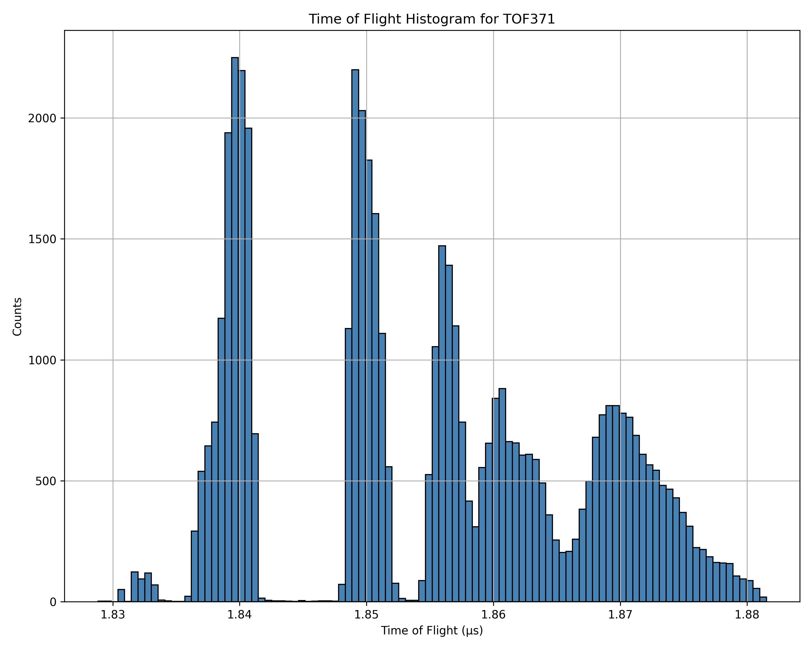

- Note: for the 3D visualization of the initial position of the particles open the file TOF_ritam/figures/TOF371_3D_pos.html with "Open with live server". 

---

### TOF38.txt
- with pusher voltage -80
- The histogram is given as

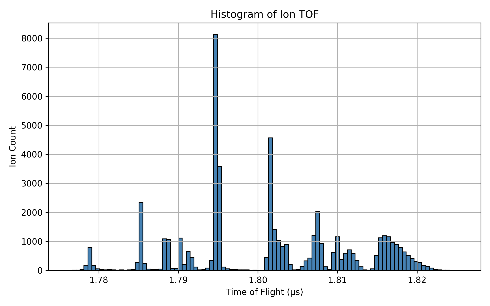

---